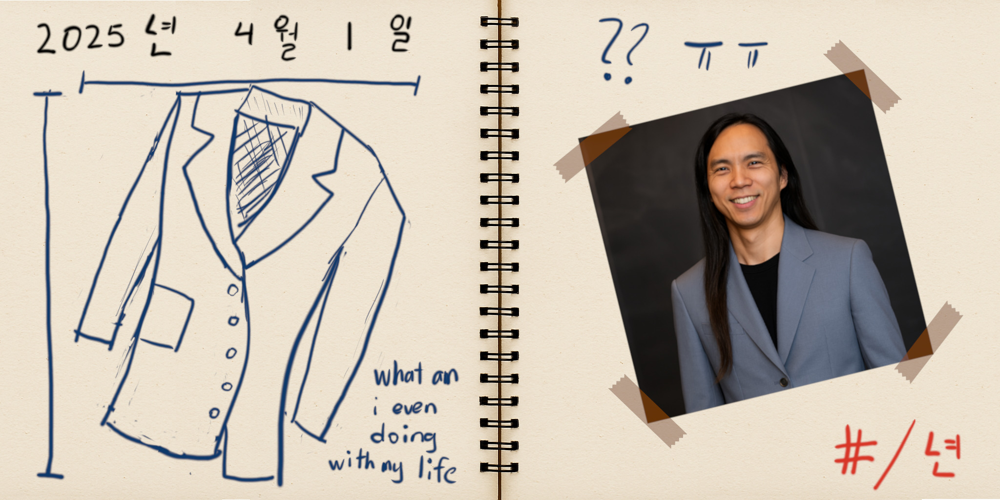

A lot of you have been asking me what comes after my PhD.
Continuing my post-OTIS entrepreneurial adventures
(see [BOATIS in 2023](/boatis) and [(EC)⁵ in 2024](/ec5)),
I'm happy to announce the next chapter:
I will be moving to Seoul later this year to start a career in fashion design!

New York would have been the obvious choice,
except [I hate New York](https://web.evanchen.cc/personal.html#misc),
and I thought it might be good to spend some time out of the country.
I'll be chilling in the fashionable 한남동, sketching ideas for blazers
(and calling it “gender-neutral epistemology” or whatever gets clicks).
I haven't decided on a name yet for my future brand, suggestions welcome.

Please buy my brand when it comes out!

### Korean translation

ㅎㅎㅎ 난 농담해.
이것은 번역이 아니야.
OTIS 수달을 위한 퍼즐 단서이야.

먼저 (EC)⁵가 발표된 날과 같은 날에 데뷔한 군을 찾아라.
그 군에 있는 원소의 수를 가져와.
이 숫자를 다른 힌트에 나온 약수랑 함께 써서 카리스마를 얻어라.
물론, 대답은 십육진수로 제출해.

만우절 축하드립니다!
