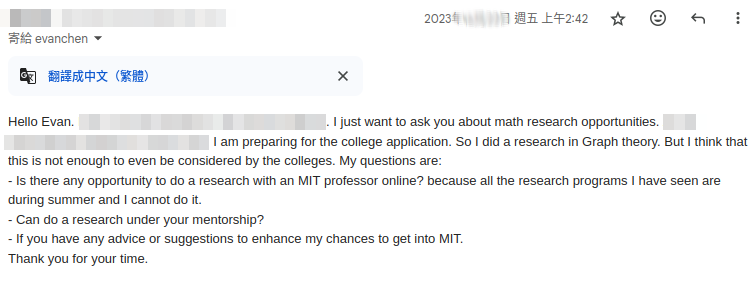
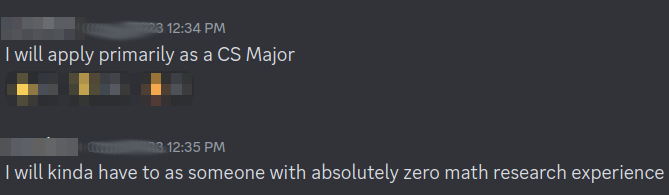
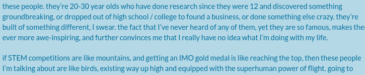
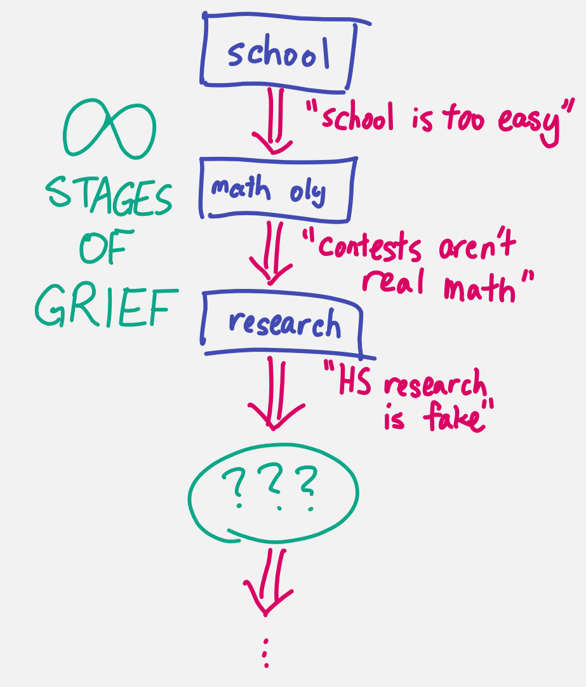

_Where do all the smart, curious, earnest kids go these days?_

One of my friends asked me this recently, and I wasn't sure what to say.
In the last ten years, something has changed.

If I had to summarize my concerns in one sentence, I would say this:
kids these days **no longer feel they're allowed to work on what they're
interested in or excited about**.
Instead, they feel obligated to work on **whatever happens to be considered
the most "important" (or "prestigious") thing possible**.[^ambition]

[^ambition]:
    It's for this reason I consider ambition as a double-edged sword.
    When ambition isn't accompanied by excitement, earnestness, curiosity,
    or interest, it doesn't usually end well.

But let me do a bit of story-telling.

## Hobbies

When I was kid, math contests were seen as a hobby, or sport, or game.
Those were the good old days.

Today, that's no longer true.

For example, at the end of MOP since 2011, we run a selection test called the TSTST,
which chooses the finalists for the subsequent year's IMO team.
When I took the TSTST as kid, the feeling in the air was "it's game day, GLHF!".
I didn't solve any problems at all my first year, and I still had a blast.

Whereas in 2023, I remember visiting the testing room on the first day of TSTST
to help with setting up folders and whatnot, and feeling like I was at a funeral.

The situation has gotten so bad that many students and staff
have suggested that we should remove the TSTST altogether from camp.
There are some operational reasons for why I don't think this is feasible,
but something about the whole story bothers me:

> Honestly, I also find it disappointing that we are trying to run a summer camp
> for math Olympiad, and apparently are unable to run a math Olympiad during
> this camp, because the students' egos are too fragile.

> The idea that we should cancel TSTST seems like putting a Band-Aid to treat
> the symptoms of a much larger underlying issue. Something is really wrong if
> our top students are unable to handle taking a contest that barely counts.

## Induction

It's easy to point at the contests and say, "haha, see, contests are toxic!".
But when you drill further, I think something much deeper and scarier is going on,
and the contests are just one link in a long chain.

For example, one of the reactions to people taking competition results too
seriously was [extensive propaganda about the uselessness of contests][mantra].
Everyone is always saying, contest scores are noisy and everyone has bad days.
Math contests are cringe and not real math. Competitions are one-dimensional.
Contest problems are super uncreative and just solved by a bunch of tricks.
There's more to life than academics. Yada yada yada.
The world gives reason after reason[^reason] why test scores aren't a good ruler.

[^reason]:
    For the record, I only agree with a proper subset of the reasons
    that people give. But the correctness is irrelevant to the rest of the post,
    and this happens to be a sensitive topic, so I won't delve further.

In an ideal world, you would hope the outcome of this messaging would
be to transform the contests back into a sport again that people stop
treating like their lives depend on it, because it's just a game, holy crap.

Do you know what happened instead?

It's like trying to comfort an anorexic by saying their bathroom scale
is an inaccurate mechanical scale.[^root]
This works up until they buy a digital scale and spend every morning
calibrating it, and now you're worse off than you started.

[^root]:
    There's a more general lesson here: treating symptoms instead of root causes
    is misguided at best and actively harmful at worst.

Eight years ago, when I wrote [the sentence][mantra]

> Changing the Golden Metric from olympiads to research seems to just make the
> world more egotistic than it already is.

it was still a hypothetical.[^research]
Now it's reality, and it's not stopping there.

[mantra]: https://blog.evanchen.cc/2016/08/13/against-the-research-vs-olympiads-mantra/

[^research]:
    I better spell out this implication fully, even though I think it's implied.
    The reason I'm so distrustful of the dramatic increase in demand for
    high school research is that I'm skeptical of the underlying motivation.
    If we were in a world where there were suddenly an army of smart
    high schoolers who were super excited about doing long-term math projects,
    then sure, wonderful, go do the thing you are excited about.
    However, based on what I actually see, I don't think this is true
    (I would love to be wrong about this).
