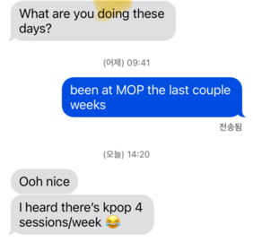

I had a student at MOP ask me something equivalent to
"how should I study while at MOP?"[^value]
For those of you that don't know, [MOP](https://web.evanchen.cc/mop.html)
is the three-week summer camp for the USA's team to the IMO.

At first I was going to just link my FAQ.
But then I thought about it a bit more, and I was surprised to find that
my answer was _not_ the same as the general how-to-study FAQ.
The additional condition "while at MOP" was enough to cause me to
stay up that night writing an entirely different answer.
That answer is this blog post.

[^value]:
    There is also a question about whether you should be studying much at MOP
    at all --- you could also spend a lot of time making new friends, for example.
    That's a value judgment that I think is better left to individuals
    and I won't comment on it further in this post.

## MOP is short

There's a misconception[^parents]
that MOP students are going to improve a ton by locking themselves in their room
and working intensely for the whole camp, and come away suddenly much stronger.

[^parents]: Often from the parents, actually.

There's a reason this can't possibly work: MOP is only 3 weeks long.
You cannot just put a sudden spike in intensity for that short of a period of
time and expect to suddenly go up several levels.
If you tried to do math for 17 hours a day over three weeks,
you'd still be spending fewer hours than if you just did 1 hour of math
a day over the year. The numbers are just not there.

Indeed, one of the most common things I hear from first-time MOPpers
is surprise that there is _less_ scheduled math than expected:
there's "only" one full-length (4.5 hour) exam every two days, not daily.[^grading]
We actually had more K-pop rehearsals scheduled this year than tests (11 vs 8).

[^grading]:
    To be fair, I'm not sure we could have more exams even if we wanted to.
    The practice exams get graded on turnarounds of about 30 hours.
    So we can have exams every 48 hours, but not every 24.

But there _is_ something at MOP not normally available:
living on campus with students and instructors.
And there's something really valuable there.

Unfortunately, "learning from others" is a cliché.
So to make this post actually useful,
I want to distill this into two specific ideas:

1.  Seek out moments where teachers or classmates **do things you didn't expect**.
2.  Use this to inform yourself **later on in the year**
    rather than trying to master everything right away.

Overall my thesis is going to be that watching experts
should carry much more information than just "wow, this person is really orz".
In chess, telling you that "it's possible to have a FIDE rating of 2800"
might be inspirational but is otherwise useless for actually improving.
But actually watching a grandmaster game --- down to the individual moves ---
and seeing a piece moved that you totally didn't expect
should give you a lot to think about.

Now let me drill down with some specific mathematical examples.

## Moments of surprise

### Taiwan 2000/4

One thing a lot of people will do at MOP is to work in-person with peers
(I believe this generation uses the term "group-solving").
This is a good time to learn from your peers.

A specific example I remember when I was growing up was when I was working on
[Taiwan 2000/4](https://aops.com/community/c6h354902) with a classmate way back in 2011,
We got to the equation $5^{\text{odd}} \equiv 1 \pmod p$.
And then (while I was trying some random fruitless factorizations)
my classmate said, oh, now if you multiply both sides by $5$,
you get $5$ is a quadratic residue mod $p$
and now you have a lot of information about $p \bmod 5$.

Growing up I would absolutely never have thought quadratic reciprocity
could be used in this way. I still remember that problem almost 15 years later.

### TSTST 2016/4

Here's another story: while working on [TSTST 2016/4](https://aops.com/community/p6580534),
a lot of students (in the real exam) tried to prove the optimistic claim
that $\varphi(n) \ge \frac n3$ for all $n \ge 1$.
But any expert could tell you just by looking there is no way this is true.
By loading $n$ with lots of prime factors, $\varphi(n)/n$ should take on
arbitrarily small values.

So this is something I'd do differently if I was teaching a class:
I would actually interrupt the student and tell them they're making a mistake.
In this case, I am not _just_ telling the student that the claim is wrong.
I want to signal that you also _could_ know right away from experience
that the claim is false (and why).

There's a school of thought that maybe you should let the students make
their own mistakes, and realize for themselves in an hour or two that the claim
is false. I have mixed feelings about this.
But during MOP, I'm _definitely_ okay with breaking that guideline and
being a lot more heavy-handed, exactly to make a point.

## Seeing the vision

Zooming out a bit more, learning perspectives is generally powerful.[^geo]
I think this is often what instructors are trying to do when they structure
their classes --- these days, MOP classes are often no longer about
providing a list of important theorems,
but instead about trying to showcase some particular idea or perspective.

[^geo]:
    This is particularly true in Euclidean geometry.
    Even now it's still surprising to me how differently people see geometry problems
    and how stylistic their solutions are.

I'd say then the goal of each class is not to master the theme,
because that's impossible: wisdom is not acquired in 90-minute sessions.
Instead, the goal for the student is see that a certain style
or philosophy _exists at all_,
complete with enough examples for concreteness.
This sort of gives you a mental [map][town] that you can use to
guide yourself later on during the school year.

[town]: /town

You could try to ask for wisdom directly.
For example, this year I had a student ask me how I thought about complex numbers.
I said a few bits of general wisdom like

- how you want to eventually be able to judge the execution time of a setup just by looking at it;
- how small changes in the setup can affect the time a lot;
- how I think the best geometers think about making progress about the problem
  using all methods simultaneously rather than committing to one.

And then I gave a specific example problem[^g7] to showcase this
because this kind of advice is worthless without examples.

[^g7]:
    [Shortlist 2011 G7](https://aops.com/community/p2739339), if you're curious,
    the same one I used at MOP way back in 2017.

But my point is that, even with a fully worked example for illustration,
none of this advice will change anyone overnight.
However, over the next 3 or 6 or 12 months it could tell you where you're trying to go.
My hope is for a moment or two later down the line where you say to yourself,
"oh, that's what Evan was talking about when he said so-and-so".

> “Knowledge,” said the Alchemist, “is harder to transmit than anyone
> appreciates. One can write down the structure of a certain arch, or the
> tactical considerations behind a certain strategy. But above those are higher
> skills, skills we cannot name or appreciate. Caesar could glance at a
> battlefield and know precisely which lines were reliable and which were about
> to break. Vitruvius could see a great basilica in his mind’s eye, every wall
> and column snapping into place. We call this wisdom. It is not unteachable,
> but neither can it be taught. Do you understand?”
