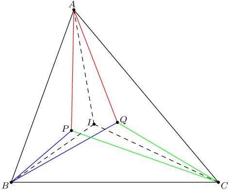
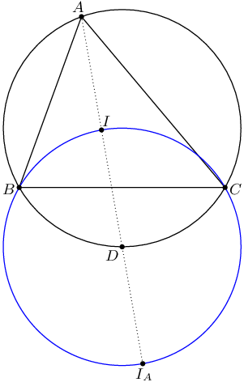
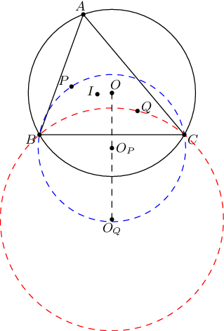
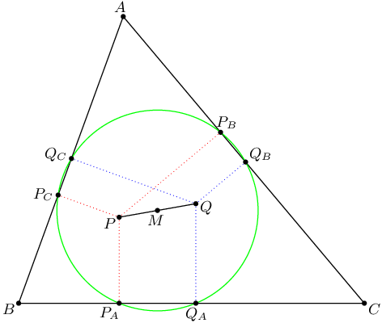
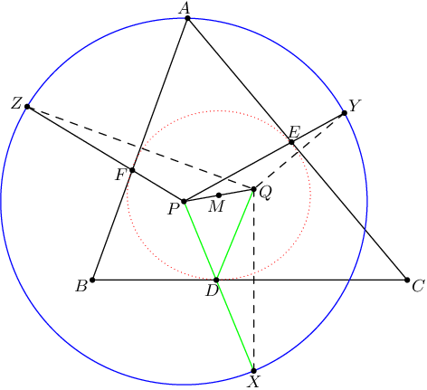
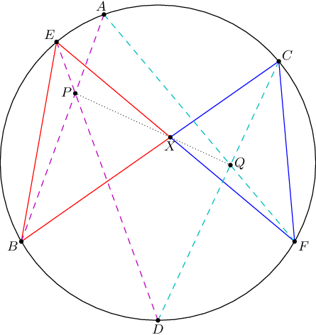

In this post I'll cover three properties of isogonal conjugates which were only recently made known to me.
These properties are generalization of some well-known lemmas,
such as the incenter/excenter lemma and the nine-point circle.

## 1. Definitions

Let $ABC$ be a triangle with [incenter](http://mathworld.wolfram.com/Incenter.html) $I$,
and let $P$ be any point in the interior of $ABC$. Then we obtain three lines $AP$, $BP$, $CP$.
Then the reflections of these lines across lines $AI$, $BI$,
$CI$ always concur at a point $Q$ which is called the **isogonal conjugate** of $P$.
(The proof of this concurrence follows from readily from [Trig
Ceva](http://www.cut-the-knot.org/triangle/TrigCeva.shtml).) When $P$ lies inside $ABC$,
then $Q$ is the point for which $\angle BAP = \angle CAQ$ and so on.

The isogonal conjugate of $P$ is sometimes denoted $P^\ast$. Note that $(P^\ast)^\ast = P$.

**Examples** of pairs of isogonal conjugates include the following.

1.  The incenter is its own isogonal conjugate. Similarly, each excenter is also its own isogonal conjugate.
2.  The isogonal conjugate of the [circumcenter](http://mathworld.wolfram.com/Circumcenter.html) is the [orthocenter](http://mathworld.wolfram.com/Orthocenter.html).
3.  The isogonal conjugate of the [centroid](http://mathworld.wolfram.com/Centroid.html) is the [symmedian point](http://mathworld.wolfram.com/SymmedianPoint.html).
4.  The isogonal conjugate of the [Nagel
    point](http://mathworld.wolfram.com/NagelPoint.html) is the point of concurrence of $AT_A$, $BT_B$,
    $CT_C$, where $T_A$ is the contact point of the $A$-[mixtilinear
    incircle](http://mathworld.wolfram.com/MixtilinearIncircles.html).
    The proof of this result was essentially given as Problem 5 of the [European
    Girl's Math Olympiad](https://www.egmo.org/egmos/egmo2/).

## 2. Inverses and circumcircles

You may already be aware of the famous result (which I always affectionately
call "Fact 5") that the circumcenter of $BIC$ is the midpoint of arc $BC$ of the circumcircle of $ABC$.
Indeed, so is the circumcenter of triangle $BI_AC$, where $I_A$ is the $A$-excenter.

In fact, it turns out that we can generalize this result for arbitrary isogonal conjugates as follows.

> **Theorem 1.** Let $P$ and $Q$ be isogonal conjugates.
> Then the circumcenters of $\triangle BPC$ and $\triangle BQC$ are inverses
> with respect to the circumcircle of $\triangle ABC$.

_Proof:_ This is just angle chasing. Let $O_P$ and $O_Q$ be the desired circumcenters.
It's clear that both $O_P$ and $O_Q$ lie on the perpendicular bisector of $\overline{BC}$.
Angle chasing allows us to compute that
$$\angle BO_PO = \frac 12 \angle BO_PC = 180^{\circ} - \angle BPC.$$
Similarly, $\angle BO_QO = 180^{\circ} - \angle BQC$.
But the reader can check that $\angle BPC + \angle BQC = 180^{\circ} + A$.
Using this we can show that $\angle OBO_Q = \angle BO_PO$, so $\triangle OBO_P \sim \triangle OO_QB$,
as needed. $\Box$

When we take $P$ and $Q$ to be $I$ (or $I_A$), we recover the Fact 5 we mentioned above.
When we take $P$ to be the orthocenter and $Q$ to be the circumcenter,
we find that the circumcenter of $BHC$ is the inverse of the circumcenter of $BOC$.
But the inverse of the circumcenter of $BOC$ is the reflection of $O$ over $\overline{BC}$.
Thus we derive that $\triangle BHC$ and $\triangle BOC$ have circumcircles which
are just reflections over $\overline{BC}$.

## 3. Pedal circles

You may already be aware of the nine-point circle,
which passes through the midpoints and feet of the altitudes of $ABC$.
In fact, we can obtain such a circle for any pair of isogonal conjugates.

> **Theorem 2.** Let $P$ and $Q$ be isogonal conjugates in the interior of $\triangle ABC$.
> The pedal triangles of $P$ and $Q$ share a circumcircle.
> Moreover, the center of this circle is the midpoint $M$ of $\overline{PQ}$.

Upon taking $P=H$ and $Q=O$ we recover the nine-point circle.
Of course, the incircle is the special case $P=Q=I$!

_Proof:_ Let $\triangle P_AP_BP_C$ and $\triangle Q_AQ_BQ_C$ be the pedal triangles.
We leave the reader to check that
$$AP_C \cdot AQ_C = AP \cdot AQ \cdot \cos \angle BAP \cdot \cos \angle BAQ = AP_B \cdot AQ_B.$$
Consequently, the points $P_C$, $Q_C$, $P_B$, $Q_B$ are concyclic.
The circumcenter of these four points is the intersection of the perpendicular
bisectors of segments $\overline{P_CQ_C}$ and $\overline{P_BQ_B}$, which is precisely $M$. Thus
$$MP_C = MQ_C = MP_B = MQ_B.$$
Similarly work with the other vertices shows that $M$ is indeed the desired circumcenter. $\Box$

There is a second way to phrase this theorem by taking a homothety at $Q$.

> **Corollary.** If the point $Q$ is reflected about the sides $\overline{AB}$, $\overline{BC}$,
> and $\overline{CA}$, then the resulting triangle has circumcenter $P$.

## 4. Ellipses

We can actually derive the following remarkable result from the above theorem.

> **Theorem 3.** An ellipse $\mathcal E$ is inscribed in triangle $ABC$.
> Then the foci $P$ and $Q$ are isogonal conjugates.

Of course, the incircle is just the special case when the ellipse is a circle.

]

_Proof:_ We will deduce this from the corollary. Let the ellipse be tangent at points $D$, $E$, $F$.
Moreover, let the reflection of $Q$ about the sides of $\triangle ABC$ be points $X$, $Y$, $Z$.
By definition, there is a common sum $s$ with
$$s = PD + DQ = PE + EQ + PF + FQ.$$
Because of the tangency condition, the points $P$, $D$, $X$ are collinear. But now
$$PX = PD+DX = PD+DQ = s$$
and we deduce
$$PX = PY = PZ = s.$$
So $P$ is the circumcenter of $\triangle XYZ$. Hence $P$ is the isogonal conjugate of $Q$. $\Box$

The converse of this theorem is also true;
given isogonal conjugates $P$ and $Q$ inside $ABC$ we can construct a suitable ellipse.
Moreover, it's worth noting that the lines $AD$, $BE$, $CF$ are also concurrent;
one proof is to take a projective transformation which sends the ellipse to a circle.

Using this theorem, we can give a "morally correct" solution to the following problem,
which is [IMO Shortlist 2000, Problem G3](http://www.aops.com/Forum/viewtopic.php?p=1218966).

> **Problem.** Let $O$ be the circumcenter and $H$ the orthocenter of an acute triangle $ABC$.
> Show that there exist points $D$, $E$, and $F$ on sides $BC$, $CA$, and $AB$ respectively such that
>
> $$OD + DH = OE + EH = OF + FH$$
>
> and the lines $AD$, $BE$, and $CF$ are concurrent.

_Proof:_ Because $O$ and $H$ are isogonal conjugates we can construct an ellipse tangent to the sides at $D$,
$E$, $F$ from which both conditions follow. $\Box$

## 5. Pascal's theorem

For more on isogonal conjugates, see e.g. [Darij Grinberg](http://web.mit.edu/~darij/www/Isogonal.zip).
I'll just leave off with one more nice application of isogonal conjugates,
communicated to me by M Kural last August.

> **Theorem 4 (Pascal).** Let $AEBDFC$ by a cyclic hexagon, as shown.
> Suppose $P = \overline{AB} \cap \overline{DE}$ $Q = \overline{CD} \cap \overline{FA}$,
> and $X = \overline{BC} \cap \overline{EF}$. Then points $P$, $X$, $Q$ are collinear.

_Proof:_ Notice that $\triangle XEB \sim \triangle XCF$, though the triangles have opposite orientations.
Because $\angle BEP = \angle BED = \angle BCD = \angle XCQ$, and so on,
the points $P$ and $Q$ correspond to isogonal conjugates.
Hence $\angle EXP = \angle QXF$, which gives the collinearity. $\Box$

_Thanks to R Alweiss and heron1618 for pointing out a few typos,
and_ <cite class="fn">Daniel Paleka for noticing a careless application of Brianchon's theorem.</cite>
