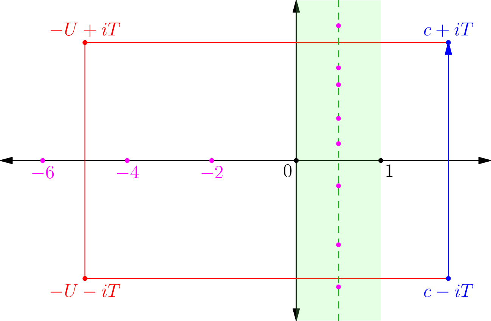

In this post I will sketch a proof Dirichlet Theorem's in the following form:

> **Theorem 1** **(Dirichlet's Theorem on Arithmetic Progression)**
>
> Let
> $$\psi(x;q,a) = \sum_{\substack{n \le x \\ n \equiv a \mod q}} \Lambda(n).$$
> Let $N$ be a positive constant.
> Then for some constant $C(N) > 0$ depending on $N$, we have for any $q$ such that $q \le (\log x)^N$ we have
> $$\psi(x;q,a) = \frac{1}{\phi(q)} x + O\left( x\exp\left(-C(N) \sqrt{\log x}\right) \right)$$
> uniformly in $q$.

Prerequisites: complex analysis, [previous two posts](/zeta-2),
possibly also [Dirichlet characters](http://en.wikipedia.org/wiki/Dirichlet_character).
It is probably also advisable to read [the last chapter of Hildebrand first](http://www.math.uiuc.edu/~hildebr/ant/),
since this contains a much more thorough version of an easier version in which the zeros of $L$-functions are less involved.

Warning: I _really_ don't understand what I am saying.
It is at least 50% likely that this post contains a major error,
and 90% likely that there will be multiple minor errors.
Please kindly point out any screw-ups of mine; thanks!

Throughout this post: $s = \sigma + it$ and $\rho = \beta + i \gamma$, as always.
All $O$-estimates have absolute constants unless noted otherwise, and $A \ll B$ means $A = O(B)$,
$A \asymp B$ means $A \ll B \ll A$.
By abuse of notation, $\mathcal L$ will be short for either
$\log q \left( \left\lvert t \right\rvert + 2 \right)$ or
$\log q \left( \left\lvert T \right\rvert + 2 \right)$, depending on context.

## 1. Outline

Here are the main steps:

1. We introduce **Dirichlet character**
   $\chi : \mathbb N \rightarrow \mathbb C$ which will serves as a roots of unity filter,
   extracting terms $\equiv a \pmod q$.
   We will see that this reduces the problem to estimating the function
   $\psi(x,\chi) = \sum_{n \le x} \chi(n) \Lambda(n)$.

- Introduce the $L$-function $L(s, \chi)$, the generalization of $\zeta$ for arithmetic progressions.
  Establish a functional equation in terms of $\xi(\chi,s)$, much like with $\zeta$,
  and use it to extend $L(s,\chi)$ to a meromorphic function in the entire complex plane.

- We will use a variation on the Perron transformation in order to transform
  this sum into an integral involving an $L$-function $L(\chi,s)$.
  We truncate this integral to $[c-iT, c+iT]$;
  this introduces an error $E_{\text{truncate}}$ that can be computed immediately,
  though in this presentation we delay its computation until later.

- We do a contour as in the proof of the Prime Number Theorem in order to
  estimate the above integral in terms of the zeros of $L(\chi, s)$.
  The main term emerges as a residue,
  so we want to show that the integral $E_{\text{contour}}$ along this integral goes to zero.
  Moreover, we get some residues $\sum_\rho \frac{x^\rho}{\rho}$ related to the zeros of the $L$-function.

- By using Hadamard's Theorem on $\xi(\chi,s)$ which is entire,
  we can write $\frac{L'}{L}(s,\chi)$ in terms of its zeros. This has three consequences:
  1. We can use the previous to get bounds on $\frac{L'}{L}(s, \chi)$.
  2. Using a 3-4-1 trick, this gives us information on the horizontal distribution of $\rho$;
     the dreaded Siegel zeros appear here.
  3. We can get an expression which lets us estimate the vertical distribution
     of the zeros in the critical strip (specifically the number of zeros with $\gamma \in [T-1, T+1]$).

  The first and third points let us compute $E_{\text{contour}}$.

- The horizontal zero-free region gives us an estimate of $\sum_\rho \frac{x^\rho}{\rho}$,
  which along with $E_{\text{contour}}$ and $E_{\text{truncate}}$ gives us the value of $\psi(x,\chi)$.

- We use Siegel's Theorem to handle the potential Siegel zero that might arise.

Possibly helpful diagram:

The pink dots denote zeros; we think the nontrivial ones all lie on the
half-line by the Generalized Riemann Hypothesis but they could actually be anywhere in the green strip.

## 2. Dirichlet Characters

### 2.1. Definitions

Recall that a **Dirichlet character $\chi$ modulo $q$** is a completely
multiplicative function $\chi : \mathbb N \rightarrow \mathbb C$ which is also periodic modulo $q$,
and vanishes for all $n$ with $\gcd(n,q) > 1$.
The **trivial character** (denoted $\chi_0$) is defined by $\chi_0(n) = 1$ when
$\gcd(n,q)=1$ and $\chi_0(n) = 0$ otherwise.

In particular, $\chi(1)=1$ and thus each nonzero $\chi$ value is a $\phi(q)$-th primitive root of unity;
there are also exactly $\phi(q)$ Dirichlet characters modulo $q$.
Observe that $\chi(-1)^2 = \chi(1) = 1$, so $\chi(-1) = \pm 1$.
We shall call $\chi$ **even** if $\chi(1) = +1$ and **odd** otherwise.

If $\tilde q \mid q$, then a character $\tilde\chi$ modulo $\tilde q$
**induces** a character $\chi$ modulo $q$ in a natural way:
let $\chi = \tilde\chi$ except at the points where $\gcd(n,q)>1$ but $\gcd(n,\tilde q)=1$,
letting $\chi$ be zero at these points instead.
(In effect, we are throwing away information about $\tilde\chi$.) A character
$\chi$ not induced by any smaller character is called **primitive**.

### 2.2. Orthogonality

The key fact about Dirichlet characters which will enable us to prove the theorem is the following trick:

> **Theorem 2** **(Orthogonality of Dirichlet Characters)**
>
> We have
>
> $$
> \sum_{\chi \mod q} \chi(a) \overline{\chi}(b) = \begin{cases} \phi(q) & \text{ if } a \equiv b \pmod q,
> \gcd(a,q) = 1 \\ 0 & \text{otherwise}. \end{cases}
> $$
>
> (Here $\overline{\chi}$ is the conjugate of $\chi$, which is essentially a multiplicative inverse.)

This is in some senses a slightly fancier form of the old [roots of unity
filter](http://web.mit.edu/~akessler/www/lectures/complex.pdf).
Specifically, it is not too hard to show that $\sum_{\chi} \chi(n)$ vanishes
for $n \not\equiv 1 \pmod q$ while it is equal to $\phi(q)$ for $n \equiv 1 \pmod q$.

### 2.3. Dirichlet $L$-Functions

Now we can define the associated $L$-function by
$$L(\chi, s) = \sum_{n \ge 1} \chi(n) n^{-s} = \prod_p \left( 1-\chi(p) p^{-s} \right)^{-1}.$$
The properties of these $L$-functions are that

> **Theorem 3.** Let $\chi$ be a Dirichlet character modulo $q$. Then
>
> 1. If $\chi \ne \chi_0$, $L(\chi, s)$ can be extended to a holomorphic function on $\sigma > 0$.
> 2. If $\chi = \chi_0$, $L(\chi, s)$ can be extended to a meromorphic function on $\sigma > 0$,
>     with a single simple pole at $s=1$ of residue $\phi(q) / q$.

The proof is pretty much the same as for zeta.

Observe that if $q=1$, then $L(\chi, s) = \zeta(s)$.

### 2.4. The Functional Equation for Dirichlet $L$-Functions

While I won't prove it here, one can show the following analog of the functional
equation for Dirichlet $L$-functions.

> **Theorem 4** **(The Functional Equation of Dirichlet $L$-Functions)**
>
> Assume that $\chi$ is a character modulo $q$, possibly trivial or imprimitive.
> Let $a=0$ if $\chi$ is even and $a=1$ if $\chi$ is odd. Let
> $$\xi(s,\chi) = q^{\frac{1}{2}(s+a)} \gamma(s,\chi) L(s,\chi) \left[ s(1-s) \right]^{\delta(x)}$$
> where
> $$\gamma(s,\chi) = \pi^{-\frac{1}{2}(s+a)} \Gamma\left( \frac{s+a}{2} \right)$$
> and $\delta(\chi) = 1$ if $\chi = \chi_0$ and zero otherwise. Then
>
> 1. $\xi$ is entire.
> 2. If $\chi$ is primitive, then $\xi(s,\chi) = W(\chi)\xi(1-s, \overline{\chi})$ for some complex number $\left\lvert
>     W(\chi) \right\rvert = 1$.

Unlike the $\zeta$ case, the $W(\chi)$ is nastier to describe;
computing it involves some Gauss sums that would be too involved for this post.
However, I should point out that it is the Gauss sum here that requires $\chi$ to be primitive.
As before, $\xi$ gives us an meromorphic continuation of $L(\chi, s)$ in the entire complex plane.
We obtain **trivial zeros** of $L(\chi, s)$ as follows:

- For $\chi$ even, we get zeros at $-2$, $-4$, $-6$ and so on.
- For $\chi \neq \chi_0$ even, we get zeros at $0$, $-2$, $-4$,
  $-6$ and so on (since the pole of $\Gamma(\frac{1}{2} s)$ at $s=0$ is no longer canceled).
- For $\chi$ odd, we get zeros at $-1$, $-3$, $-5$ and so on.

## 3. Obtaining the Contour Integral

### 3.1. Orthogonality

Using the trick of orthogonality, we may write

$$
\begin{aligned}
  \psi(x;q,a)
    &= \sum_{n \le x} \frac{1}{\phi(q)} \sum_{\chi \mod q} \chi(n)\overline{\chi}(a) \Lambda(n) \\
    &= \frac{1}{\phi(q)} \sum_{\chi \mod q} \overline{\chi}(a)
       \left( \sum_{n \le x} \chi(n) \Lambda(n) \right).
\end{aligned}
$$

To do this we have to estimate the sum $\sum_{n \le x} \chi(n) \Lambda(n)$.

### 3.2. Introducing the Logarithmic Derivative of the $L$-Function

First, we realize $\chi(n) \Lambda(n)$ as the coefficients of a Dirichlet series.
Recall last time we saw that $-\frac{\zeta'}{\zeta}$ gave $\Lambda$ as coefficients.
We can do the same thing with $L$-functions: put
$$\log L(s, \chi) = -\sum_p \log \left( 1 - \chi(p) p^{-s} \right).$$
Taking the derivative, we obtain

> **Theorem 5.** For any $\chi$ (possibly trivial or imprimitive) we have
> $$-\frac{L'}{L}(s, \chi) = \sum_{n \ge 1} \Lambda(n) \chi(n) n^{-s}.$$

_Proof:_

$$
\begin{aligned}
  -\frac{L'}{L}(s, \chi)
    &= \sum_p \frac{\log p}{1-\chi(p) p^{-s}} \\
    &= \sum_p \log p \cdot \sum_{m \ge 1} \chi(p^m) (p^m)^{-s} \\
    &= \sum_{n \ge 1} \Lambda(n) \chi(n) n^{-s}
\end{aligned}
$$

as desired. $\Box$

### 3.3. The Truncation Trick

Now, we unveil the trick at the heart of the proof of Perron's Formula in the last post.
I will give a more precise statement this time, by stating where this integral comes from:

> **Lemma 6** **(Truncated Version of Perron Lemma)**
>
> For any $c,y,T > 0$ define
> $$I(y,T) = \frac{1}{2\pi i} \int_{c-iT}^{c+iT} \frac{y^s}{s} ds$$
> Then $I(y,T) = \delta(y) + E(y,T)$ where $\delta(y)$ is the indicator function defined by
> $$\delta(y) = \begin{cases} 0 & 0 < y < 1 \\ \frac{1}{2} & y=1 \\ 1 & y > 1 \end{cases}$$
> and the error term $E(y,T)$ is given by
>
> $$
> \left\lvert E(y,T) \right\rvert < \begin{cases} y^c \min \left\{ 1,
> \frac{1}{T \left\lvert \log y \right\rvert} \right\} & y \neq 1 \\ cT^{-1} & y=1. \end{cases}
> $$
>
> In particular, $I(y,\infty) = \delta(y)$.

In effect, the integral from $c-iT$ to $c+iT$ is intended to mimic an indicator function.
We can use it to extract the terms of the Dirichlet series of
$-\frac{L'}{L}(s, \chi)$ which happen to have $n \le x$, by simply appealing to $\delta(x/n)$.
Unfortunately, we cannot take $T = \infty$ because later on this would introduce
a sum which is not absolutely convergent,
meaning we will have to live with the error term introduced by picking a particular finite value of $T$.

### 3.4. Applying the Truncation

Let's do so: define
$$\psi(x;\chi) = \sum_{n \ge 1} \delta\left( x/n \right) \Lambda(n) \chi(n)$$
which is almost the same as $\sum_{n \le x} \Lambda(n) \chi(n)$,
except that if $x$ is actually an integer then $\Lambda(x)\chi(x)$ should be
halved (since $\delta(\frac{1}{2}) = \frac{1}{2}$).
Now, we can substitute in our integral representation, and obtain

$$
\begin{aligned}
  \psi(x;\chi)
    &= \sum_{n \ge 1} \Lambda(n) \chi(n) \cdot \left(
       E(x/n,T) + \int_{c-iT}^{c+iT} \frac{(x/n)^s}{s} ds \right) \\
    &= \sum_{n \ge 1} \Lambda(n) \chi(n) \cdot E(x/n, T)
       + \int_{c-iT}^{c+iT} \sum_{n \ge 1} \left( \Lambda(n)\chi(n) n^{-s} \right) \frac{x^s}{s} ds \\
    &= E_{\text{truncate}} + \int_{c-iT}^{c+iT} -\frac{L'}{L}(s, \chi) \frac{x^s}{s} ds
\end{aligned}
$$

where
$$E_{\text{truncate}} = \sum_{n \ge 1} \Lambda(n) \chi(n) \cdot E(x/n, T).$$
Estimating this is quite ugly, so we defer it to later.

## 4. Applying the Residue Theorem

### 4.1. Primitive Characters

Exactly like before, we are going to use a contour to estimate the value of
$$\int_{c-iT}^{c+iT} -\frac{L'}{L}(s, \chi) \frac{x^s}{s} ds.$$
Let $U$ be a large half-integer (so no zeros of $L(\chi,s)$ with
$\operatorname{Re} s = U$).
We then re-route the integration path along the contour integral
$$c-iT \rightarrow -U-iT \rightarrow -U+iT \rightarrow c+iT.$$
During this process we pick up residues, which are the interesting terms.

First, assume that $\chi$ is primitive,
so the functional equation applies and we get the information we want about zeros.

- If $\chi = \chi_0$, then so we pick up a residue of $+x$ corresponding to

  $$(-1) \cdot -x^1/1 = +x.$$
  This is the "main term". Per laziness, $\delta(\chi) x$ it is.

- Depending on whether $\chi$ is odd or even, we detect the trivial zeros, which we can express succinctly by

  $$\sum_{m \ge 1} \frac{x^{a-2m}}{2m-a}$$
  Actually, I really ought to truncate this at $U$,
  but since I'm going to let $U \rightarrow \infty$ in a moment I really don't
  want to take the time to do so; the difference is negligible.

- We obtain a residue of $-\frac{L'}{L}(s, \chi)$ at $s = 0$, which we denote $b(\chi)$, for $s=0$.
  Observe that if $\chi$ is even,
  this is the constant term of $-\frac{L'}{L}(s, \chi)$ near $s=0$ (but there
  is a pole of the whole function at $s=0$);
  otherwise it equals the value of $-\frac{L'}{L}(0, \chi)$ straight-out.

- If $\chi \ne \chi_0$ is even then $L(s, \chi)$ itself has a zero, so we are in worse shape. We recall that

  $$\frac{L'}{L}(s, \chi) = \frac 1 s + b(\chi) + \dots$$
  and notice that

  $$\frac{x^s}{s} = \frac 1s + \log x + \dots$$
  so we pick up an extra residue of $-\log x$. So, call this a bonus of $-(1-a) \log x$

- Finally, the hard-to-understand zeros in the strip $0 < \sigma < 1$.
  If $\rho = \beta+i\gamma$ is a zero, then it contributes a residue of $-\frac{x^\rho}{\rho}$.
  We only pick up the zeros with $\left\lvert \gamma \right\rvert < T$ in our rectangle, so we get a term

  $$-\sum_{\rho, \left\lvert \gamma \right\rvert < T} \frac{x^\rho}{\rho}.$$
  Letting $U \rightarrow \infty$ we derive that

  $$
  \begin{aligned} &\phantom= \int_{c-iT}^{c+iT} -\frac{L'}{L}(s,
  \chi) \frac{x^s}{s} ds \\ &= \delta(\chi) x + E_{\text{contour}} + \sum_{m \ge
  1} \frac{x^{a-2m}}{2m-a} - b(\chi) - (1-a) \log x - \sum_{\rho,
  \left\lvert \gamma \right\rvert < T} \frac{x^\rho}{\rho} \end{aligned}
  $$

  at least for primitive characters.
  Note that the sum over the zeros is not absolutely convergent without the
  restriction to $\left\lvert \gamma \right\rvert < T$ (with it, the sum becomes a finite one).

### 4.2. Transition to nonprimitive characters

The next step is to notice that if $\chi$ modulo $q$ happens to be not primitive,
and is induced by $\tilde\chi$ with modulus $\tilde q$,
then actually $\psi(x,\chi)$ and $\psi(x,\tilde\chi)$ are not so different.
Specifically, they differ by at most

$$
\begin{aligned}
  \left\lvert \psi(x,\chi)-\psi(x,\tilde\chi) \right\rvert
    &\le \sum_{\substack{\gcd(n,\tilde q)=1 \\ \gcd(n,q) > 1 \\ n \le x}} \Lambda(n) \\
    &\le \sum_{\substack{\gcd(n,q) > 1 \\ n \le x}} \Lambda(n) \\
    &\le \sum_{p \mid q} \sum_{\substack{p^k \le x}} \log p \\
    &\le \sum_{p \mid q} \log x \\
    &\le (\log q)(\log x)
\end{aligned}
$$

and so our above formula in fact holds for any character $\chi$,
if we are willing to add an error term of $(\log q)(\log x)$.
This works even if $\chi$ is trivial, and also $\tilde q \le q$,
so we will just simplify notation by omitting the tilde's.

Anyways $(\log q)(\log x)$ is piddling compared to all the other error terms in the problem,
and we can swallow a lot of the boring residues into a new term, say
$$E_{\text{tiny}} \le (\log q + 1)(\log x) + 2.$$
Thus we have

$$
\psi(x, \chi) = \delta(\chi) x + E_{\text{contour}} + E_{\text{truncate}}
  + E_{\text{tiny}} - b(\chi) - \sum_{\rho, \left\lvert \gamma \right\rvert < T} \frac{x^\rho}{\rho}.
$$

Unfortunately, the constant $b(\chi)$ depends on $\chi$ and cannot be absorbed.
We will also estimate $E_{\text{contour}}$ in the error term party.

## 5. Distribution of Zeros

In order to estimate
$$\sum_{\rho, \left\lvert \gamma \right\rvert < T} \frac{x^\rho}{\rho}$$
we will need information on both the vertical and horizontal distribution of the zeros.
Also, it turns out this will help us compute $E_{\text{contour}}$.

### 5.1. Applying Hadamard's Theorem

Let $\chi$ be primitive modulo $q$. As we saw,

$$
\xi(s,\chi) = (q/\pi)^{\frac{1}{2} s + \frac{1}{2} a}
  \Gamma\left( \frac{s+a}{2} \right) L(s, \chi) \left( s(1-s) \right)^{\delta(\chi)}
$$

is entire. It also is easily seen to have order $1$,
since no term grows much more than exponentially in $s$ (using Stirling to handle the $\Gamma$ factor).
Thus by Hadamard, we may put
$$\xi(s, \chi) = e^{A(\chi)+B(\chi)z} \prod_\rho \left( 1-\frac{z}{\rho} \right) e^{\frac{z}{\rho}}.$$
Taking a logarithmic derivative and cleaning up, we derive the following lemma.

> **Lemma 7** **(Hadamard Expansion of Logarithmic Derivative)**
>
> For any primitive character $\chi$ (possibly trivial) we have
>
> $$
> \begin{aligned} -\frac{L'}{L}(s, \chi)
> &= \frac{1}{2} \log\frac{q}{\pi}
> + \frac{1}{2}\frac{\Gamma'(\frac{1}{2} s + \frac{1}{2} a)}{\Gamma(\frac{1}{2} s + \frac{1}{2} a)} \\
> &- B(\chi) - \sum_{\rho} \left( \frac{1}{s-\rho} + \frac{1}{\rho} \right)
> + \delta(\chi) \cdot \left( \frac{1}{s-1} + \frac 1s \right).
> \end{aligned}
> $$

_Proof:_ On one hand, we have

$$
\log \xi(s, \chi) = A(\chi) + B(\chi) s
  + \sum_\rho \left( \log \left( 1-\frac{s}{\rho} \right) + \frac{s}{\rho} \right).
$$

On the other hand

$$
\log \xi(s, \chi) = \frac{s+a}{2} \cdot \log \frac{q}{\pi}
  + \log \Gamma\left( \frac{s+a}{2} \right)
  + \log L(s, \chi) + \delta\chi(\log s + \log (1-s)).
$$

Taking the derivative of both sides and setting them equal: we have on the left side

$$
B(\chi) + \sum_{\rho} \left( \frac{1}{1-\frac{s}{\rho}} \cdot \frac{1}{-\rho} + \frac{1}{\rho} \right)
  = B(\chi) + \sum_\rho \left( \frac{1}{s-\rho} + \frac{1}{\rho} \right)
$$

and on the right-hand side

$$
\frac{1}{2} \log\frac{q}{\pi} + \frac{1}{2}\frac{\Gamma'}{\Gamma}\left( \frac{s+a}{2} \right)
  + \frac{L'}{L} (s, \chi) + \delta_\chi \left( \frac 1s + \frac{1}{s-1} \right).
$$

Equating these gives the desired result. $\Box$

This will be useful in controlling things later.
The $B(\chi)$ is a constant that turns out to be surprisingly annoying;
it is tied to $b(\chi)$ from the contour, so we will need to deal with it.

### 5.2. A Bound on the Logarithmic Derivative

Frequently we will take the real part of this. Using Stirling, the short version of this is:

> **Lemma 8** **(Logarithmic Derivative Bound)**
>
> Let $\sigma \ge 1$ and $\chi$ be primitive (possibly trivial). Then
>
> $$
> \operatorname{Re} \left[ -\frac{L'(\sigma+it, \chi)}{L(\sigma+it, \chi)} \right] = \begin{cases}
> O(\mathcal L) - \operatorname{Re} \sum_\rho \frac{1}{s-\rho} + \operatorname{Re} \frac{\delta(\chi)}{s-1}
> & 1 \le \sigma \le 2 \\
> O(\mathcal L) - \operatorname{Re} \sum_\rho \frac{1}{s-\rho}
> & 1 \le \sigma \le 2, \left\lvert t \right\rvert \ge 2 \\
> O(1) & \sigma \ge 2.
> \end{cases}
> $$

_Proof:_ The claim is obvious for $\sigma \ge 2$,
since we can then bound the quantity by
$\frac{\zeta'(\sigma)}{\zeta(\sigma)} \le \frac{\zeta'(2)}{\zeta(2)}$ due to the
fact that the series representation is valid in that range.
The second part with $\left\lvert t \right\rvert \ge 2$ follows from the first line,
by noting that $\operatorname{Re} \frac{1}{s-1} < 1$. So it just suffices to show that
$$O(\mathcal L) - \operatorname{Re} \sum_\rho \frac{1}{s-\rho} + \operatorname{Re} \frac{\delta(\chi)}{s-1}$$
where $1 \le \sigma \le 2$ and $\chi$ is primitive.

First, we claim that $\operatorname{Re} B(\chi) = - \operatorname{Re} \sum \frac{1}{\rho}$. We use the following trick:

$$
B(\chi) = \frac{\xi'(0,\chi)}{\xi(0,\chi)}
  = -\frac{\xi'(1,\overline{\chi})}{\xi(1,\overline{\chi})}
  = \overline{B(\chi)} - \sum_{\overline{\rho}}
    \left( \frac{1}{1-\overline{\rho}} + \frac{1}{\overline{\rho}} \right) + \frac{\delta(\chi)}{s-1}
$$

where the ends come from taking the logarithmic derivative directly.
By switching $1-\overline{\rho}$ with $\rho$, the claim follows.

Then, the lemma follows rather directly;
the $\operatorname{Re} \sum_\rho \frac{1}{\rho}$ has miraculously canceled with $\operatorname{Re} B(\chi)$.
To be explicit, we now have

$$
- \operatorname{Re} \frac{L'(s, \chi)}{L(s, \chi)}
  = \frac{1}{2} \log\frac{q}{\pi}
    + \frac{1}{2} \operatorname{Re} \frac{\Gamma'(\frac{1}{2} s + \frac{1}{2} a)}{\Gamma(\frac{1}{2} s + \frac{1}{2} a)}
    - \sum_{\rho} \operatorname{Re} \frac{1}{s-\rho} + \frac{\delta(\chi)}{s} + \frac{\delta(\chi)}{s-1}
$$

and the first two terms contribute $\log q$ and $\log t$, respectively;
meanwhile the term $\frac{\delta(\chi)}{s}$ is at most $1$, so it is absorbed. $\Box$

Short version: our functional equation lets us relate $L(s, \chi)$ to
$L(1-s, \chi)$ for $\sigma \le 0$ (in fact it's all we have!) so this gives the
following corresponding estimate:

> **Lemma 9** **(Far-Left Estimate of Log Derivative)**
>
> If $\sigma \le -1$ and $t \ge 2$ we have
> $$\frac{L'(s, \chi)}{L(s, \chi)} = O\left( \log q\left\lvert s \right\rvert \right).$$

_Proof:_ We have

$$
L(1-s, \chi) = W(\chi) 2^{1-s} \pi^{-s} q^{s-\frac{1}{2}}
  \cos \frac{1}{2} \pi (s-a) \Gamma(s) L(s, \overline{\chi})
$$

(the unsymmetric functional equation, which can be obtained from Legendre's duplication formula).
Taking a logarithmic derivative yields

$$
\frac{L'}{L}(s, \chi) = \log \frac{q}{2\pi} - \frac{1}{2} \pi \tan \frac{1}{2} \pi(1-s-a)
  + \frac{\Gamma'}{\Gamma}(1-s) + \frac{L'}{L}(1-s, \overline{\chi}).
$$

Because we assumed $\left\lvert t \right\rvert \ge 2$,
the tangent function is bounded as $s$ is sufficiently far from any of its poles along the real axis.
Also since $\operatorname{Re}(1-s) \ge 2$ implies the $\frac{L'}{L}$ term is bounded.
Finally, the logarithmic derivative of $\Gamma$ contributes
$\log \left\lvert s \right\rvert$ according to Stirling.
So, total error is $O(\log q) + O(1) + O(\log \left\lvert s \right\rvert) + O(1)$ and this gives the conclusion.
$\Box$

### 5.3. Horizontal Distribution

I claim that:

> **Theorem 10** **(Horizontal Distribution Bound)**
>
> Let $\chi$ be a character, possibly trivial or imprimitive.
> There exists an absolute constant $c_1$ with the following properties:
>
> 1. If $\chi$ is complex, then no zeros are in the region $\sigma \ge 1 - \frac{c_1}{\mathcal L}$.
> 2. If $\chi$ is real, there are no zeros in the region $\sigma \ge 1 - \frac{c_1}{\mathcal L}$,
>     with at most one exception; this zero must be real and simple.

Such bad zeros are called **Siegel zeros**, and I will denote them $\beta_S$.
The important part about this estimate is that it does not depend on $\chi$ but rather on $q$.
We need the relaxation to non-primitive characters, since we will use them in the proof of Landau's Theorem.

_Proof:_ First, assume $\chi$ is both primitive and nontrivial.

By the 3-4-1 lemma on $\log L(\chi, s)$ we derive that

$$
3 \operatorname{Re} \left[ -\frac{L'(\sigma, \chi_0)}{L(\sigma, \chi_0)} \right]
  + 4 \operatorname{Re} \left[ -\frac{L'(\sigma+it, \chi)}{L(\sigma+it, \chi)} \right]
  + \operatorname{Re} \left[ -\frac{L'(\sigma+2it, \chi^2)}{L(\sigma+2it, \chi^2)} \right] \ge 0.
$$

This is cool because we already know that

$$
\operatorname{Re} \left[ -\frac{L'(\sigma+it, \chi)}{L(\sigma+it, \chi)} \right]
  < O(\mathcal L) - \operatorname{Re} \sum_\rho \frac{1}{s-\rho}
$$

We now assume $\sigma > 1$.

In particular, we now have (since $\operatorname{Re} \rho < 1$ for any zero $\rho$)
$$\operatorname{Re} \frac{1}{s-\rho} > 0.$$
So we are free to throw out as many terms as we want.

If $\chi^2$ is primitive, then everything is clear. Let $\rho = \beta + i \gamma$ be a zero. Then

$$
\begin{aligned}
  \operatorname{Re} \left[ -\frac{L'(\sigma, \chi_0)}{L(\sigma, \chi_0)} \right]
    &\le \frac{1}{\sigma-1} + O(1) \\
  \operatorname{Re} \left[ -\frac{L'(\sigma+it, \chi)}{L(\sigma+it, \chi)} \right]
    &\le O(\mathcal L) - \frac{1}{s-\rho} \\
  \operatorname{Re} \left[ -\frac{L'(\sigma+2it, \chi^2)}{L(\sigma+2it, \chi^2)} \right]
    &\le O(\mathcal L)
\end{aligned}
$$

where we have dropped all but one term for the second line, and all terms for the third line.
If $\chi^2$ is not primitive but at least is not $\chi_0$,
then we can replace $\chi^2$ with the inducing $\tilde\chi_2$ for a penalty of at most

$$
\begin{aligned}
  \operatorname{Re} \frac{L'}{L}(s, \tilde\chi) - \operatorname{Re} \frac{L'}{L}(s, \chi^2)
    &< \operatorname{Re} \sum_{p^k \mid q} \tilde\chi(p^k) \log p \cdot \operatorname{Re} (p^k)^{-s} \\
    &< \sum_{p \mid q} \log p \cdot (p^{-\sigma} + p^{-2\sigma} + \dots) \\
    &< \sum_{p \mid q} \log p \cdot 1 \\
    &\le \log q
\end{aligned}
$$

just like earlier: $\Lambda$ is usually zero, so we just look at the differing terms!
The Dirichlet series really are practically the same.
(Here we have also used the fact that $\sigma > 1$, and $p \ge 2$.)

Consequently, we derive using $3-4-1$ that
$$\frac{3}{\sigma-1} - \frac{4}{s-\rho} + O(\mathcal L) \ge 0.$$
Selecting $s = \sigma + i \gamma$ so that $s - \rho = \sigma-\beta$, we thus obtain
$$\frac{4}{\sigma-\beta} \le \frac{3}{\sigma-1} + O(\mathcal L).$$
If we select $\sigma = 1 + \frac{\varepsilon}{\mathcal L}$, we get
$$\frac{4}{1 + \frac{\varepsilon}{\mathcal L} - \beta} \le O(\mathcal L)$$
so
$$\beta < 1 - \frac{c_2}{\mathcal L}$$
for some constant $c_2$, initially only for primitive $\chi$.

But because the Euler product of the $L$-function of an imprimitive character
versus its primitive inducing character differ by a finite number of zeros on
the line $\sigma=0$ it follows that this holds for all nontrivial complex characters.

Unfortunately, if we are unlucky enough that $\tilde\chi_2$ is trivial,
then replacing $\chi^2$ causes all hell to break loose.
(In particular, $\chi$ is real in this case!) The problem comes in that our new
penalty has an extra $\frac{1}{s-1}$, so

$$
\left\lvert \operatorname{Re} \frac{L'}{L}(s, \chi^2) - \operatorname{Re} \frac{\zeta'}{\zeta}(s) \right\rvert
  < \frac{1}{s-1} + \log q
$$

Applied with $s = \sigma + 2it$, we get the weaker
$$\frac{3}{\sigma-1} - \frac{4}{s-\rho} + O(\mathcal L) + \frac{1}{\sigma - 1 + 2it} \ge 0.$$
If $\left\lvert t \right\rvert > \frac{\delta}{\log q}$ for some $\delta$ then
the $\frac{1}{\sigma-1+2it}$ term will be at most
$\frac{\log q}{\delta} = O(\mathcal L)$ and we live to see another day.
In other words, we have unconditionally established a zero-free region of the form

$$
\sigma > 1 - \frac{c(\delta)}{\mathcal L}
  \quad\text{and}\quad \left\lvert t \right\rvert > \frac{\delta}{\log q}
$$

for any $\delta > 0$.

Now let's examine $\left\lvert t \right\rvert < \frac{\delta}{\log q}$.
We don't have the facilities to prove that there are no bad zeros,
but let's at least prove that the zero must be simple and real. By Hadamard at $t=0$, we have
$$-\frac{L'(\sigma, \chi)}{L(\sigma, \chi)} < O(\mathcal L) - \sum_\rho \frac{1}{\sigma-\rho}$$
where we no longer need the real parts since $\chi$ is real,
and in particular the roots of $L(s,\chi)$ come in conjugate pairs.
The left-hand side can be stupidly bounded below by

$$
-\frac{L'(\sigma, \chi)}{L(\sigma, \chi)}
  \ge - \sum_{n \ge 1} (-1) \cdot \log n \cdot n^{-\sigma}
  = \frac{\zeta'(\sigma)}{\zeta(\sigma)} > -\frac{1}{\sigma-1} - O(1).
$$

So
$$-\frac{1}{\sigma-1} < O(\mathcal L) - \sum_\rho \frac{1}{\sigma-\rho}.$$
In other words,

$$
\sum_\rho \operatorname{Re} \frac{\sigma-\rho}{\left\lvert \sigma-\rho \right\rvert^2}
  < \frac{1}{\sigma-1} + O(\mathcal L).
$$

Then, let $\sigma = 1 + \frac{2\delta}{\log q}$, so

$$
\sum_\rho \operatorname{Re} \frac{\sigma-\rho}{\left\lvert \sigma-\rho \right\rvert^2}
  < \frac{\log q}{2\delta} + O(\mathcal L).
$$

The rest is arithmetic; basically one finds that there can be at most one Siegel zero.
In particular, since complex zeros come in conjugate pairs, that zero must be real.

It remains to handle the case that $\chi = \chi_0$ is the constant function giving $1$.
For this, we observe that the $L$-function in question is just $\zeta$.
Thus, we can decrease the constant $c_2$ to some $c_1$ in such a way that the result holds true for $\zeta$,
which completes the proof. $\Box$

### 5.4. Vertical Distribution

We have the following lemma:

> **Lemma 11** **(Sum of Zeros Lemma)**
>
> For all real $t$ and primitive characters $\chi$ (possibly trivial), we have
> $$\sum_\rho \frac{1}{4+(t-\gamma)^2} = O(\mathcal L).$$

_Proof:_ We already have that
$$\operatorname{Re} -\frac{L'}{L}(s, \chi) = O(\mathcal L) - \sum_\rho \operatorname{Re} \frac{1}{s-\rho}$$
and we take $s = 2 + it$, noting that the left-hand side is bounded by a
constant $\frac{\zeta'}{\zeta}(2) = -0.569961$.
On the other hand,
$\operatorname{Re} \frac{1}{2+it-\rho} = \frac{\operatorname{Re}(2+it-\rho)}{\left\lvert (2-\beta) + (t-\gamma)i
\right\rvert^2} = \frac{2-\beta}{(2-\beta)^2+(t-\gamma)^2}$ and
$$\frac{1}{4+(t-\gamma)^2} \le \frac{2-\beta}{(2-\beta)^2+(t-\gamma)^2} \le \frac{2}{1+(t-\gamma)^2}$$
as needed. $\Box$

From this we may deduce that

> **Lemma 12** **(Number of Zeros Nearby $T$)**
>
> For all real $t$ and primitive characters $\chi$ (possibly trivial),
> the number of zeros $\rho$ with $\gamma \in [t-1, t+1]$ is $O(\mathcal L)$.
>
> In particular, we may perturb any given $T$ by $\le 2$ so that the distance
> between it and the nearest zero is at least $c_0 \mathcal L^{-1}$, for some absolute constant $c_0$.

From this, using an argument principle we can actually also obtain the following:
For a real number $T > 0$,
we have $N(T, \chi) = \frac{T}{\pi} \log \frac{qT}{2\pi e} + O(\mathcal L)$
is the number of zeros of $L(s, \chi)$ with imaginary part $\gamma \in [-T, T]$.
However, we will not need this fact.

## 6. Error Term Party

Up to now, $c$ has been arbitrary. Assume now $x \ge 6$; thus we can now follow the tradition
$$c = 1 + \frac{1}{\log x} < 2$$
so $c$ is just to the right of the critical line. This causes $x^c = ex$.
We assume also for convenience that $T \ge 2$.

### 6.1. Estimating the Truncation Error

Recall that

$$
\left\lvert E(y,T) \right\rvert < \begin{cases} y^c \min \left\{ 1,
\frac{1}{T \left\lvert \log y \right\rvert} \right\} & y \neq 1 \\ cT^{-1} & y=1. \end{cases}
$$

We need to bound the right-hand side of

$$
\left\lvert E_{\text{truncate}} \right\rvert
  \le \sum_{n \ge 1} \left\lvert \Lambda(n) \chi(n) \cdot E(x/n, T) \right\rvert
  = \sum_{n \ge 1} \Lambda(n) \left\lvert E(x/n, T) \right\rvert.
$$

If $\frac34 x \le n \le \frac 54x$, the log part is small, and this is bad.
We have to split into three cases: $\frac34 x \le n < x$, $n = x$, and $x < n \le \frac 54x$.
This is necessary because in the event that $\Lambda(x) \neq 0$ ($x$ is a prime power),
then $E(x/n,T) = E(1,T)$ needs to be handled differently.

We let $x_{\text{left}}$ and $x_{\text{right}}$ be the nearest prime powers to $x$ other than $x$ itself.
Thus this breaks our region to conquer into
$$\frac 34 x \le x_{\text{left}} < x < x_{\text{right}} \le \frac 54 x.$$
So we have possibly a center term (if $x$ is a prime power, we have a term $n=x$),
plus the far left interval and the far right interval.
Let $d = \min\left\{ x-x_{\text{left}}, x_{\text{right}}-x \right\}$ for convenience.

- In the easy case, if $n = x$ we have a contribution of $E(1,T) \log x < \frac{c}{T}\log x$,
  which is piddling (less than $\log x$).

- Suppose $\frac 34x \le n \le x_{\text{left}} - 1$.
  If $n = x_{\text{left}} - a$ for some integer $1 \le a \le \frac 14x$, then

  $$
  \log \frac xn \ge \log \frac{x_{\text{left}}}{x_{\text{left}}-a} =
  -\log\left( 1 - \frac{a}{x_{\text{left}}} \right) \ge \frac{a}{x_{\text{left}}}
  $$

  by using the silly inequality $-\log(1-t) \ge t$ for $t < 1$. So the contribution in total is at most

  $$
  \begin{aligned} \sum_{1 \le a \le \frac 14 x} \Lambda(n) \cdot (x/n)^c \cdot
  \frac{1}{T \cdot \frac{a}{x_{\text{left}}}} &\le \frac{x_{\text{left}}}{T}
  \sum_{1 \le a \le \frac 14 x} \Lambda(n) \cdot \left( \frac 43 \right)^2 \frac
  1a \\ &\le \frac{16}{9} \frac{x_{\text{left}}}{T} \log x \sum_{1 \le a \le
  \frac 14 x} \frac 1a \\ &\le \frac{16}{9} \frac{(x-1) (\log x)(\log \frac 14 x
  + 2)}{T} \\ &\le \frac{1.9x (\log x)^2}{T} \end{aligned}
  $$

  provided $x \ge 7391$.

- If $n = x_{\text{left}}$, we have

  $$\log \frac xn = -\log\left( 1 - \frac{x-x_{\text{left}}}{x} \right) > \frac{d}{x}$$
  Hence in this case, we get an error at most

  $$
  \begin{aligned} \Lambda(x_{\text{left}}) \left( \frac{x}{x_{\text{left}}} \right)^c \min \left\{ 1,
  \frac{x}{Td} \right\} &< \Lambda(x_{\text{left}}) \left( \frac 43 \right)^2 \min \left\{ 1,
  \frac{x}{Td} \right\} \\ &\le \frac{16}{9} \log x \min \left\{ 1, \frac{x}{Td} \right\}. \end{aligned}
  $$

- The cases $n = x_{\text{right}}$ and
  $x_{\text{right}} + 1 \le n < \frac 54x$ give the same bounds as above, in the same way.

Finally, if for $x$ outside the interval mentioned above,
we in fact have $\left\lvert \log x/n \right\rvert > \frac{1}{5}$, say, and so all terms contribute at most

$$
\begin{aligned}
  \sum_n \Lambda(n) \cdot (x/n)^c \cdot \frac{1}{T \log \left\lvert x/n \right\rvert}
    &\le \frac{5x^c}{T} \sum_n \Lambda(n) \cdot n^{-c} \\
    &= \frac{5ex}{T} \cdot \left\lvert -\frac{\zeta'}{\zeta} (c) \right\rvert \\
    &< \frac{5ex}{T} \cdot \left( \frac{1}{c-1} + 0.5773 \right) \\
    &\le \frac{14x \log x}{T}.
\end{aligned}
$$

(Recall $\zeta'/\zeta$ had a simple pole at $s=1$, so near $s=1$ it behaves like $\frac{1}{s-1}$.)

The sum of everything is $\le \frac{3.8x(\log x)^2+14x\log x}{T} + \frac{32}{9} \log x \min \left\{ 1, \frac{x}{Td}
\right\}$. Hence, the grand total across all these terms is the horrible
$$\boxed{ E_{\text{truncate}} \le \frac{5x(\log x)^2}{T} + 3.6\log x \min \left\{ 1, \frac{x}{Td} \right\}}$$
provided $x \ge 1.2 \cdot 10^5$.

### 6.2. Estimating the Contour Error

We now need to measure the error along the contour, taken from $U \rightarrow \infty$.
Throughout assume $U \ge 3$. Naturally, to estimate the integral, we seek good estimates on
$$\left\lvert \frac{L'}{L}(\sigma) \right\rvert.$$
For this we appeal to the Hadamard expansion. We break into a couple cases.

- First, let's look at the integral when $-1 \le \sigma \le 2$, so $s = \sigma \pm iT$ with $T$ large.
  We bound the horizontal integral along these regions; by symmetry let's consider just the top

  $$\int_{-1+iT}^{c+iT} -\frac{L'}{L}(s, \chi) \frac{x^s}{s} ds.$$
  Thus we want an estimate of $-\frac{L'}{L}$.

  > **Lemma 13**.
  > Let $s$ be such that $-1 \le \sigma \le 2$, $\left\lvert t \right\rvert \ge 2$.
  > Assume $\chi$ is primitive (possibly trivial),
  > and that $t$ is not within $c_0\mathcal L^{-1}$ of any zeros of $L(s, \chi)$. Then
  > $$\frac{L'(s, \chi)}{L(s, \chi)} = O(\mathcal L^2).$$

  _Proof:_ Since we assumed that $T \ge 2$ we need not worry about
  $\frac{\delta(\chi)}{s-1}$ and so we obtain

  $$
  \frac{L'(s, \chi)}{L(s, \chi)} = -\frac{1}{2} \log\frac{q}{\pi} -
  \frac{1}{2}\frac{\Gamma'(\frac{1}{2} s + \frac{1}{2} a)}{\Gamma(\frac{1}{2} s
  + \frac{1}{2} a)} + B(\chi) + \sum_{\rho} \left( \frac{1}{s-\rho} + \frac{1}{\rho} \right).
  $$

  and we eliminate $B(\chi)$ by computing

  $$
  \frac{L'(\sigma+it, \chi)}{L(\sigma+it, \chi)} - \frac{L'(2+it, \chi)}{L(2+it,
  \chi)} = E_{\text{gamma}} + \sum_{\rho} \left( \frac{1}{\sigma+it-\rho} - \frac{1}{2+it-\rho} \right).
  $$

  where

  $$
  E_{\text{gamma}} = \frac{1}{2}\frac{\Gamma'(\frac{1}{2} (2+it) + \frac{1}{2}
  a)}{\Gamma(\frac{1}{2} (2+it) + \frac{1}{2} a)} -
  \frac{1}{2}\frac{\Gamma'(\frac{1}{2} (\sigma+it) + \frac{1}{2}
  a)}{\Gamma(\frac{1}{2} (\sigma+it) + \frac{1}{2} a)} \ll \log T
  $$

  by Stirling (here we use the fact that $-1 \le \sigma \le 2$).
  For the terms where $\gamma \notin [t-1, t+1]$ we see that

  $$
  \begin{aligned} \left\lvert \frac{1}{\sigma+it-\rho} - \frac{1}{2+it-\rho}
  \right\rvert &= \frac{2-\sigma}{\left\lvert \sigma+it-\rho \right\rvert
  \left\lvert 2+it-\rho \right\rvert} \\ &\le \frac{2-\sigma}{\left\lvert
  \gamma-t \right\rvert^2} \le \frac{3}{\left\lvert \gamma-t \right\rvert^2} \\
  &\le \frac{6}{\left\lvert \gamma-t \right\rvert^2+1}. \end{aligned}
  $$

  So the contribution of the sum for $\left\lvert \gamma-t \right\rvert \ge 1$
  can be bounded by $O(\mathcal L)$, via the vertical sum lemma.

  As for the zeros with smaller imaginary part,
  we at least have $\left\lvert 2+it-\rho \right\rvert = \left\lvert 2-\beta \right\rvert > 1$ and thus we can
  reduce the sum to just

  $$
  \frac{L'(\sigma+it, \chi)}{L(\sigma+it, \chi)} - \frac{L'(2+it, \chi)}{L(2+it,
  \chi)} = \sum_{\gamma\in[t-1,t+1]} \frac{1}{\sigma+it-\rho} + O(\mathcal L).
  $$

  Now by the assumption that $\left\lvert \gamma-t \right\rvert \ge c\mathcal L^{-1}$;
  so the terms of the sum are all at most $O(\mathcal L)$.
  Also, there are $O(\mathcal L)$ zeros with imaginary part in that range.
  Finally, we recall that $\frac{L'(2+it, \chi)}{L(2+it, \chi)}$ is bounded;
  we can write it using its (convergent) Dirichlet series and then note it is at
  most $\frac{\zeta'(2+it)}{\zeta(2+it)} \le \frac{\zeta'(2)}{\zeta(2)}$. $\Box$
  At this point, we perturb $T$ as described in vertical distribution so that the lemma applies,
  and use can then compute

  $$
  \begin{aligned} \left\lvert \int_{-1+iT}^{c+iT} -\frac{L'}{L}(s,
  \chi) \frac{x^s}{s} ds \right\rvert &< O(\mathcal L^2) \cdot
  \int_{-1+iT}^{c+iT} \left\lvert \frac{x^s}{s} \right\rvert ds \\ &< O(\mathcal
  L^2) \int_{-1}^c \frac{x^\sigma}{2T} d\sigma \\ &< O(\mathcal L^2) \cdot
  \frac{x^{c+1}-1}{T \log x} \\ &< O\left(\frac{\mathcal L^2 x}{T \log x}\right). \end{aligned}
  $$

- Next, for the integral $-U \le \sigma \le 1$, we use the "far-left" estimate to obtain

  $$
  \begin{aligned} \left\lvert \int_{-U+iT}^{-1+iT} -\frac{L'}{L}(s,
  \chi) \frac{x^s}{s} ds \right\rvert &\ll \int_{-\infty+iT}^{-1+iT} \left\lvert
  \frac{x^s}{s} \right\rvert \cdot \log q \left\lvert s \right\rvert ds \\ &\ll
  \int_{-\infty+iT}^{-1+iT} \left\lvert \frac{x^s}{s} \right\rvert \cdot \log q
  \left\lvert s \right\rvert ds \\ &\ll \log q \int_{-\infty+iT}^{-1+iT}
  \left\lvert \frac{x^s}{s} \right\rvert ds + \int_{-\infty+iT}^{-1+iT}
  \left\lvert \frac{x^s \log \left\lvert s \right\rvert}{s} \right\rvert ds \\
  &< \log q \int_{-\infty+iT}^{-1+iT} \left\lvert \frac{x^s}{T} \right\rvert ds
  + \int_{-\infty}^{-1} \left\lvert \frac{x^s \log T}{T} \right\rvert ds \\ &\ll
  \frac{\log q}{T} \int_{-\infty}^{-1} x^\sigma d\sigma + \frac{\log T}{T}
  \int_{-\infty}^{-1} x^\sigma d\sigma \\ &< \frac{\mathcal L}{T} \left(
  \frac{x^{-1}}{\log x} \right) = \frac{\mathcal L}{T x \log x}. \end{aligned}
  $$

  So the contribution in this case is $O\left( \frac{\mathcal L}{T x \log x} \right)$.

- Along the horizontal integral, we can use the same bound

  $$
  \begin{aligned} \left\lvert \int_{-U-iT}^{-U+iT} -\frac{L'}{L}(s,
  \chi) \frac{x^s}{s} ds \right\rvert &\ll \int_{-U-iT}^{-U+iT} \left\lvert
  \frac{x^s}{s} \right\rvert \cdot \log q \left\lvert s \right\rvert ds \\ &=
  x^{-U} \cdot \int_{-U-iT}^{-U+iT} \frac{\log q \left\lvert s
  \right\rvert}{\left\lvert s \right\rvert} ds \\ &= x^{-U} \cdot
  \int_{-U-iT}^{-U+iT} \frac{\log q + \log U}{U} ds \\ &= \frac{2T(\log q + \log U)}{Ux^U} \end{aligned}
  $$

  which vanishes as $U \rightarrow \infty$.

So we only have two error terms,
$O\left( \frac{\mathcal L^2 x}{T \log x} \right)$ and $O\left( \frac{\mathcal L}{Tx\log x} \right)$.
The first is clearly larger, so we end with
$$\boxed{E_{\text{contour}} \ll \frac{\mathcal L^2x}{T \log x}}.$$

### 6.3. The term $b(\chi)$

We can estimate $b(\chi)$ as follows:

> **Lemma 14.** For primitive $\chi$. we have
> $$b(\chi) = O(\log q) - \sum_{\left\lvert \gamma \right\rvert < 1} \frac{1}{\rho}$$
> _Proof:_ The idea is to look at $\frac{L'}{L}(s,\chi)-\frac{L'}{L}(2,\chi)$. By subtraction, we obtain

$$
\begin{aligned}
  \frac{L'}{L}(s, \chi) -\frac{L'}{L}(2, \chi)
    &= - \frac{\Gamma'}{\Gamma} \left( \frac{s+a}{2} \right)
       + \frac{\Gamma'}{\Gamma} \left( \frac{2+a}{2} \right) \\
    &- \frac rs - \frac r{s-1} + \frac r2 + \frac r1 \\
    &+ \sum_\rho \left( \frac{1}{s-\rho} - \frac{1}{2-\rho} \right)
\end{aligned}
$$

Then at $s=0$ (eliminating the poles), we have
$$\frac{L'}{L}(s, \chi) = O(1) - \sum_{\rho} \left( \frac{1}{\rho}+\frac{1}{2-\rho} \right)$$
where the $O(1)$ is $\frac{L'}{L}(2,\chi) + \frac r2 + \gamma + \frac{\Gamma'}{\Gamma}(1)$
if $a=0$ and $\frac{L'}{L}(2,\chi) - \frac r2 - \frac{\Gamma'}{\Gamma}(\frac{1}{2}) + \frac{\Gamma'}{\Gamma}(\frac32)$ for $a=1$.
Furthermore,

$$
\sum_{\rho, \left\lvert \gamma \right\rvert > 1} \left(
\frac{1}{\rho}+\frac{1}{2-\rho} \right) \le \sum_{\rho,
\left\lvert \gamma \right\rvert > 1} \frac{2}{\left\lvert \rho(2-\rho) \right\rvert} < 2 \sum_{\rho,
\left\lvert \gamma \right\rvert > 1} \frac{1}{\left\lvert 2-\rho \right\rvert^2}
$$

which is $O(\log q)$ by our vertical distribution results, and similarly
$$\sum_{\rho, \left\lvert \gamma \right\rvert < 1} \frac{1}{2-\rho} = O(\log q).$$
This completes the proof. $\Box$

Let $\beta_1$ be a Siegel zero, if any; for all the other zeros,
we have that $\left\lvert \frac{1}{\rho} \right\rvert = \frac{1}{\beta^2+\gamma^2}$. We now have two cases.

- $\overline{\chi} \neq \chi$.
  Then $\overline{\chi}$ is complex and thus has no exceptional zeros;
  hence each of its zeros has $\beta < 1 - \frac{c}{\log q}$;
  since $\overline{\rho}$ is a zero of $\overline{\chi}$ if and only if $1-\rho$ is a zero of $\chi$,
  it follows that all zeros of $\chi$ are have $\left\lvert \frac{1}{\rho} \right\rvert < O(\log q)$.
  Moreover, in the range $\gamma \in [-1,1]$ there are $O(\log q)$ zeros
  (putting $T=0$ in our earlier lemma on vertical distribution).

  Thus, total contribution of the sum is $O\left( (\log q)^2 \right)$.

- If $\overline{\chi} = \chi$, then $\chi$ is real.
  The above argument goes through, except that we may have an extra Siegel zero at $\beta_S$;
  hence there will also be a special zero at $1 - \beta_S$. We pull these terms out separately.

Consequently,
$$\boxed{b(\chi) = O\left( (\log q)^2 \right) - \frac{1}{\beta_S} - \frac{1}{1-\beta_S}}.$$
By adjusting the constant, we may assume $\beta_S > \frac{2014}{2015}$ if it exists.

## 7. Computing $\psi(x,\chi)$ and $\psi(x;q,a)$

### 7.1. Summing the Error Terms

We now have, for any $T \ge 2$, $x \ge 6$, and $\chi$ modulo $q$ possibly primitive or trivial, the equality

$$
\psi(x, \chi) = \delta(\chi) x + E_{\text{contour}} + E_{\text{truncate}} +
E_{\text{tiny}} - b(\chi) - \sum_{\rho, \left\lvert \gamma \right\rvert < T} \frac{x^\rho}{\rho}.
$$

where

$$
\begin{aligned} E_{\text{contour}} &\ll \frac{x(\log x)^2}{T} + \log x \min \left\{ 1,
\frac{x}{Td} \right\} \\ E_{\text{truncate}} &\ll \frac{\mathcal L^2 x}{T \log
x} \\ E_{\text{tiny}} &\ll \log x \log q \\ b(\chi) &= O\left( (\log q)^2
\right) - \frac{1}{\beta_S} - \frac{1}{1-\beta_S}. \end{aligned}
$$

Assume now that $T \le x$, and $x$ is an integer (hence $d \ge 1$). Then aggregating all the errors gives

$$
\psi(x, \chi) = \delta(\chi) x - \sum_{\rho,
\left\lvert \gamma \right\rvert < T} \frac{x^\rho}{\rho} -
\frac{x^{\beta_S}-1}{\beta_S} - \frac{x^{1-\beta_S}-1}{1-\beta_S} + O\left(
\frac{x (\log qx)^2}{T} \right).
$$

where the sum over $\rho$ now excludes the Siegel zero.
We can omit the terms $\beta_S^{-1} < \frac{2015}{2014} = O(1)$, and also

$$\frac{x^{1-\beta_S}-1}{1-\beta_S} < x^{\frac{1}{2015}} \log x.$$
Absorbing things into the error term,

$$
\psi(x, \chi) = \delta(\chi) x - \frac{x^{\beta_S}}{\beta_S} - \sum_{\rho,
\left\lvert \gamma \right\rvert < T} \frac{x^\rho}{\rho} + O\left( \frac{x
(\log qx)^2}{T} + x^{\frac{1}{2015}} \log x \right).
$$

### 7.2. Estimating the Sum Over Zeros

Now we want to estimate

$$\sum_{\rho, \left\lvert \gamma \right\rvert < T} \left\lvert \frac{x^\rho}{\rho} \right\rvert.$$
We do this is the dumbest way possible: putting a bound on $x^\rho$ and pulling it out.

For any non-Siegel zero, we have a zero-free region $\beta < 1 - \frac{c_1}{\mathcal L}$, whence

$$
\left\lvert x^\rho \right\rvert < x^{\beta} = x \cdot x^{\beta-1} = x
\exp\left( \frac{-c_1 \log x}{\mathcal L} \right).
$$

Pulling this out, we can then estimate the reciprocals by using our differential:

$$
\begin{aligned} \sum_{\rho,
\left\lvert \gamma \right\rvert < T} \left\lvert \frac{1}{\rho} \right\rvert < \sum_{\rho,
\left\lvert \gamma \right\rvert < T} \frac{1}{\gamma} < \sum_{t=1}^T
\frac{\log q(t+2)}{t} \ll (\log qT)^2 \le (\log qx)^2. \end{aligned}
$$

Hence,

$$
\psi(x, \chi) = \delta(\chi) x - \frac{x^{\beta_S}}{\beta_S} + O\left(
\frac{x (\log qx)^2}{T} + x^{\frac{1}{2015}} \log x + (\log qx)^2 \cdot x
\exp\left( \frac{-c_1 \log x}{\mathcal L} \right) \right).
$$

We select

$$T = \exp\left(c_3 \sqrt{\log x}\right)$$
for some constant $c_3$, and moreover assume $q \le T$, then we obtain

$$
\psi(x, \chi) = \delta(\chi) x - \frac{x^{\beta_S}}{\beta_S} + O\left( x
\exp\left( -c_4 \sqrt{\log x} \right) \right).
$$

### 7.3. Summing Up

We would like to sum over all characters $\chi$.
However, we're worried that there might be lots of Siegel zeros across characters.
A result of Landau tells us this is not the case:

> **Theorem 15** **(Landau)**
>
> If $\chi_1$ and $\chi_2$ are real nontrivial primitive characters modulo $q_1$ and $q_2$,
> then for any zeros $\beta_1$ and $\beta_2$ we have
>
> $$\min \left\{ \beta_1, \beta_2 \right\} < 1 - \frac{c_5}{\log q_1q_2}$$
> for some fixed absolute $c_5$.
> In particular, for any fixed $q$, there is at most one $\chi \mod q$ with a Siegel zero.

_Proof:_ The character $\chi_1\chi_2$ is not trivial, so we can put

$$
\begin{aligned}
  -\frac{\zeta'}{\zeta}(\sigma) &= \frac{1}{\sigma-1} + O(1) \\
  -\frac{L'}{L}(\sigma, \chi_1\chi_2) &= O(\log q_1q_2) \\
  -\frac{L'}{L}(\sigma, \chi_1) &= O(\log q_1) - \frac{1}{\sigma-\beta_i} \\
  -\frac{L'}{L}(\sigma, \chi_2) &= O(\log q_2) - \frac{2}{\sigma-\beta_i}.
\end{aligned}
$$

Now we use a silly trick:

$$
0 \le -\frac{\zeta'}{\zeta}(\sigma) -\frac{L'}{L}(\sigma, \chi_1)
  -\frac{L'}{L}(\sigma, \chi_2) -\frac{L'}{L}(\sigma, \chi_1\chi_2)
$$

by "Simon's Favorite Factoring Trick" (we use the deep fact that $(1+\chi_1)(1+\chi_2) \ge 0$,
the analog of $3-4-1$). The upper bounds give now

$$\frac{1}{\sigma-\beta_1} + \frac{1}{\sigma-\beta_2} < \frac{1}{\sigma-1} + O(\log q_1 \log q_2).$$
and one may deduce the conclusion from here. $\Box$

We now sum over all characters $\chi$ as before to obtain

$$
\psi(x; q, a) = \frac{1}{\phi(q)} x - \frac{\chi_S(a)}{\phi(q)}
\frac{x^{\beta_S}}{\beta_S} + O \left( x \exp\left(-c_6 \sqrt{\log x}\right) \right)
$$

where $\chi_S = \overline{\chi}_S$ is the character with a Siegel zero, if it exists.

## 8. Siegel's Theorem, and Finishing Off

The term with $x^{\beta_S} / \beta_S$ is bad, and we need some way to get rid of it.
We now appeal to Siegel's Theorem:

> **Theorem 16** **(Siegel's Theorem)**
>
> For any $\varepsilon > 0$ there is a $C_1(\varepsilon) > 0$ such that any Siegel zero $\beta_S$ satisfies
>
> $$\beta_S < 1-C_1(\varepsilon) q^{-\varepsilon}.$$

Thus for a positive constant $N$, assuming $q \le (\log x)^N$,
letting $\varepsilon = (2N)^{-1}$ means $q^{-\varepsilon} > \frac{1}{\sqrt{\log x}}$, so we obtain

$$
x^{\beta_S} < x \exp\left( -C_1(\varepsilon) \log x q^{-\varepsilon} \right)
< x \exp\left( -C_1(\varepsilon) \sqrt{\log x} \right).
$$

Then

$$
\begin{aligned}
  \psi(x; q, a)
    &= \frac{1}{\phi(q)} x - \frac{\chi_S(a)}{\phi(q)} \frac{x^{\beta_S}}{\beta_S}
       + O \left( x \exp\left(-c_6 \sqrt{\log x}\right) \right) \\
    &\le \frac{1}{\phi(q)} x + O\left( x \exp\left( -C_1(\varepsilon) \sqrt{\log x} \right) \right)
       + O \left( x \exp\left(-c_6 \sqrt{\log x}\right) \right) \\
    &\le \frac{1}{\phi(q)} x + O\left( x \exp\left( -C(N) \sqrt{\log x} \right) \right)
\end{aligned}
$$

where $C(N) = \min \left\{ C_1(\varepsilon), c_6 \right\}$. This completes the proof of Dirichlet's Theorem.
