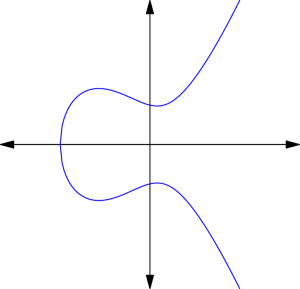
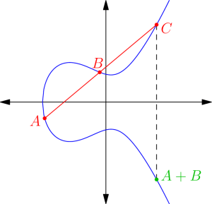

Here I talk about my [first project at the Emory REU](http://arxiv.org/abs/1506.09170).
Prerequisites for this post: some familiarity with number fields.

## 1. Motivation: Arithmetic Progressions

Given a property $P$ about primes, there's two questions we can ask:

1.  How many primes $\le x$ are there with this property?
2.  What's the least prime with this property?

As an example, consider an arithmetic progression $a$, $a+d$, …, with $a < d$ and $\gcd(a,d) = 1$.
The strong form of Dirichlet's Theorem tells us that basically,
the number of primes $\equiv a \pmod d$ is $\frac 1d$ the total number of primes.
Moreover, the celebrated **[Linnik's
Theorem](https://en.wikipedia.org/wiki/Linnik's_theorem)** tells us that the
first prime is $O(d^L)$ for a fixed $L$, with record $L = 5$.

As I talked about [last time on my
blog](https://blog.evanchen.cc/2015/06/12/proof-of-dircihlets-theorem-on-arithmetic-progressions/),
the key ingredients were:

- Introducing Dirichlet characters $\chi$, which are periodic functions modulo $q$.
  One uses this to get the mod $q$ into the problem.
- Introducing an $L$-function $L(s, \chi)$ attached to $\chi$.
- Using complex analysis (Cauchy's Residue Theorem) to boil the proof down to
  properties of the zeros of $L(s, \chi)$.

With that said, we now move to the object of interest: elliptic curves.

## 2. Counting Primes

Let $E$ be an elliptic curve over $\mathbb Q$,
which for our purposes we can think of concretely as a curve in **Weirestrass form**
$$y^2 = x^3 + Ax + B$$
where the right-hand side has three distinct complex roots (viewed as a polynomial in $x$).
If we are unlucky enough that the right-hand side has a double root,
then the curve ceases to bear the name "elliptic curve" and instead becomes **singular**.

Here's a natural number theoretic question: for any rational prime $p$,
how many solutions does $E$ have modulo $p$?

To answer this it's helpful to be able to think over an arbitrary field $F$.
While we've written our elliptic curve $E$ as a curve over $\mathbb Q$,
we could just as well regard it as a curve over $\mathbb C$, or as a curve over $\mathbb Q(\sqrt 2)$.
Even better, since we're interested in counting solutions modulo $p$,
we can regard this as a curve over $\mathbb F_p$.
To make this clear, we will use the notation $E/F$ to signal that we are
thinking of our elliptic curve over the field $F$.
Also, we write $\#E(F)$ to denote the number of points of the elliptic curve
over $F$ (usually when $F$ is a finite field). Thus, the question boils down to computing $\#E(\mathbb F_p)$.

Anyways, the question above is given by the famous **Hasse bound**,
and in fact it works over any number field!

> **Theorem 1** **(Hasse Bound)**
>
> Let $K$ be a number field, and let $E/K$ be an elliptic curve.
> Consider any prime ideal $\mathfrak p \subseteq \mathcal O_K$ which is not ramified. Then we have
> $$\#E(\mathbb F_\mathfrak p) = \mathrm{N}\mathfrak p + 1 - a_\mathfrak p$$
> where $\left\lvert a_\mathfrak p \right\rvert \le 2\sqrt{\mathrm{N}\mathfrak p}$.

Here $\mathbb F_\mathfrak p = \mathcal O_K / \mathfrak p$ is the field of $\mathrm{N}\mathfrak p$ elements.
The extra "$+1$" comes from a point at infinity when you complete the elliptic curve in the projective plane.

Here, the ramification means what you might guess.
Associated to every elliptic curve over $\mathbb Q$ is a **conductor** $N$,
and a prime $p$ is **ramified** if it divides $N$.
The finitely many ramified primes are the "bad" primes for which something
breaks down when we take modulo $p$ (for example, perhaps the curve becomes singular).

In other words, for the $\mathbb Q$ case, except for finitely many bad primes $p$,
the number of solutions is $p + 1 + O(\sqrt p)$, and we even know the implied $O$-constant to be $2$.

Now, how do we predict the error term?

## 3. The Sato-Tate Conjecture

For elliptic curves over $\mathbb Q$,
we the Sato-Tate conjecture (which recently got upgraded to a theorem) more or less answers the question.
But to state it, I have to introduce a new term: an elliptic curve $E/\mathbb Q$,
when regarded over $\mathbb C$, can have _complex multiplication_ (abbreviated CM).
I'll define this in just a moment, but for now, the two things to know are

- CM curves are "special cases", in the sense that a randomly selected elliptic curve won't have CM.
- It's not easy in general to tell whether a given elliptic curve has CM.

Now I can state the Sato-Tate result.
It is most elegantly stated in terms of the following notation:
if we define $a_p = p + 1 - \#E(\mathbb F_p)$ as above,
then there is a unique $\theta_p \in [0,\pi]$ which obeys
$$a_p = 2 \sqrt p \cos \theta_p.$$

> **Theorem 2** **(Sato-Tate)**
>
> Fix an elliptic curve $E/\mathbb Q$ which does not have CM (when regarded over $\mathbb C$).
> Then as $p$ varies across unramified primes, the asymptotic probability that $\theta_p \in [\alpha, \beta]$ is
> $$\frac{2}{\pi} \int_{[\alpha, \beta]} \sin^2\theta_p.$$
> In other words, $\theta_p$ is distributed according to the measure $\sin^2\theta$.

Now, what about the CM case?

## 4. CM Elliptic Curves

Consider an elliptic curve $E/\mathbb Q$ but regard it as a curve over $\mathbb C$.
It's well known that elliptic curves happen to have a **group law**: given two points on an elliptic curve,
you can _add_ them to get a third point.
(If you're not familiar with this,
[Wikipedia has a nice explanation](https://en.wikipedia.org/wiki/Elliptic_curve#The_group_law)).
So elliptic curves have more structure than just their set of points: they form an **abelian group**;
when written in Weirerstrass form, the identity is the point at infinity.

Letting $A = (A, +)$ be the associated abelian group, we can look at the _endomorphisms_ of $E$ (that is,
homomorphisms $A \rightarrow A$).
These form a [ring](https://en.wikipedia.org/wiki/Endomorphism_ring), which we denote $\operatorname{End}(E)$.
An example of such an endomorphism is $a \mapsto n \cdot a$ for an integer $n$ (meaning $a+\dots+a$,
$n$ times). In this way, we see that $\mathbb Z \subseteq \operatorname{End}(E)$.

Most of the time we in fact have $\operatorname{End}(E) \cong \mathbb Z$.
But on occasion, we will find that $\operatorname{End}(E)$ is congruent to $\mathcal O_K$,
the ring of integers of a number field $K$. This is called **complex multiplication** by $K$.

Intuitively, this CM is _special_ (despite being rare),
because it means that the group structure associated to $E$ has a _richer set of symmetry_.
For CM curves over _any_ number field, for example, the Sato-Tate result becomes very clean,
and is considerably more straightforward to prove.

Here's an example. The elliptic curve
$$E : y^2 = x^3 - 17 x$$
of conductor $N = 2^6 \cdot 17^2$ turns out to have
$$\operatorname{End}(E) \cong \mathbb Z[i]$$
i.e. it has complex multiplication has $\mathbb Z[i]$.
Throwing out the bad primes $2$ and $17$, we compute the first several values of $a_p$,
and something bizarre happens. For the $3$ mod $4$ primes we get

$$
\begin{aligned}
  a_{3} &= 0 & a_{7} &= 0 & a_{11} &= 0 \\
  a_{19} &= 0 & a_{23} &= 0 & a_{31} &= 0
\end{aligned}
$$

and for the $1$ mod $4$ primes we have

$$
\begin{aligned}
  a_5 &= 4 \\
  a_{13} &= 6 \\
  a_{29} &= 4 \\
  a_{37} &= 12 \\
  a_{41} &= -8
\end{aligned}
$$

Astonishingly, the vanishing of $a_p$ is controlled by the splitting of $p$ in $\mathbb Z[i]$!
In fact, this holds more generally.
It's a theorem that for elliptic curves $E/\mathbb Q$ with CM,
we have $\operatorname{End}(E) \cong \mathcal O_K$ where $K$ is some quadratic
imaginary number field which is also a PID, like $\mathbb Z[i]$.
Then $\mathcal O_K$ governs how the $a_p$ behave:

> **Theorem 3** **(Sato-Tate Over CM)**
>
> Let $E/\mathbb Q$ be a fixed elliptic curve with CM by $\mathcal O_K$.
> Let $\mathfrak p$ be a unramified prime of $\mathcal O_K$.
>
> 1.  If $\mathfrak p$ is inert, then $a_\mathfrak p = 0$ (i.e. $\theta_\mathfrak p = \frac{1}{2}\pi$).
> 2.  If $\mathfrak p$ is split, then $\theta_\mathfrak p$ is uniform across $[0, \pi]$.

I'm told this is much easier to prove than the usual Sato-Tate.

But there's even more going on in the background.
If I look again at $a_p$ where $p \equiv 1 \pmod 4$,
I might recall that $p$ can be written as the sum of squares, and construct the following table:

$$
\begin{array}{rrl}
  p & a_p & x^2+y^2 \\
  5 & 4 & 2^2 + 1^2 \\
  13 & 6 & 3^2 + 2^2 \\
  29 & 4 & 2^2 + 5^2 \\
  37 & 12 & 6^2 + 1^2 \\
  41 & -8 & 4^2 + 5^2 \\
  53 & 14 & 7^2 + 2^2 \\
  61 & 12 & 6^2 + 5^2 \\
  73 & -16 & 8^2 + 3^2 \\
  89 & -10 & 5^2 + 8^2 \\
\end{array}
$$

Each $a_p$ is double one of the terms!
There is no mistake: the $a_p$ are also tied to the decomposition of $p = x^2+y^2$.
And this works for any number field.

What's happening? The main idea is that looking at a prime ideal $\mathfrak p = (x+yi)$,
$a_\mathfrak p$ is related to the _argument_ of the complex number $x+yi$ in some way.
Of course, there are lots of questions unanswered (how to pick the $\pm$ sign,
and which of $x$ and $y$ to choose) but there's a nice way to package all this information,
as I'll explain momentarily.

(Aside: I think the choice of having $x$ be the odd or even number depends
precisely on whether $p$ is a quadratic residue modulo $17$, but I'll have to check on that.)

## 5. $L$-Functions

I'll just briefly explain where all this is coming from,
and omit lots of details (in part because I don't know all of them).
Let $E/\mathbb Q$ be an elliptic curve with CM by $\mathcal O_K$. We can define an associated $L$-function

$$
L(s, E/K) = \prod_\mathfrak p \left( 1 - \frac{a_\mathfrak p}{(\mathrm{N}\mathfrak p)^{s+\frac{1}{2}}}
  + \frac{1}{(\mathrm{N}\mathfrak p)^{2s}} \right)
$$

(actually this isn't quite true actually, some terms change for ramified primes $\mathfrak p$).

At the same time there's a notion of a **Hecke Grössencharakter** $\xi$ on a
number field $K$ -- a higher dimensional analog of the Dirichlet characters we
used on $\mathbb Z$ to filter modulo $q$.
For our purposes, think of it as a multiplicative function which takes in ideals
of $\mathcal O_K$ and returns complex numbers of norm $1$.
Like Dirichlet characters, each $\xi$ gets a **Hecke $L$-function**
$$L(s, \xi) = \prod_\mathfrak p \left( 1 - \frac{\xi(\mathfrak p)}{(\mathrm{N}\mathfrak p)^s} \right)$$
which again extends to a meromorphic function on the entire complex plane.

Now the great theorem is:

> **Theorem 4** **(Deuring)**
>
> Let $E/\mathbb Q$ have CM by $\mathcal O_K$. Then
> $$L(s,E/K) = L(s, \xi)L(s, \overline{\xi})$$
> for some Hecke Grössencharakter $\xi$.

Using the definitions given above and equating the Euler products at an unramified $\mathfrak p$ gives

$$
1 - \frac{a_\mathfrak p}{(\mathrm{N}\mathfrak p)^{s+\frac{1}{2}}} + \frac{1}{(\mathrm{N}\mathfrak p)^{2s}}
  = \left( 1 - \frac{\xi(\mathfrak p)}{(\mathrm{N}\mathfrak p)^s} \right)
    \left( 1 - \frac{\overline{\xi(\mathfrak p)}}{(\mathrm{N}\mathfrak p)^s} \right)
$$

Upon recalling that $a_\mathfrak p = 2 \sqrt{\mathrm{N}\mathfrak p} \cos \theta_\mathfrak p$, we derive
$$\xi(\mathfrak p) = \exp(\pm i \theta_\mathfrak p).$$
This is enough to determine the entire $\xi$ since $\xi$ is multiplicative.

So this is the result: let $E/\mathbb Q$ be an elliptic curve of conductor $N$.
Given our quadratic number field $K$,
we define a map $\xi$ from prime ideals of $\mathcal O_K$ to the unit circle in $\mathbb C$ by

$$
\mathfrak p \mapsto \begin{cases}
  \exp(\pm i \theta_\mathfrak p) & \gcd(\mathrm{N}\mathfrak p, N) = 1 \\
  0 & \gcd(\mathrm{N}\mathfrak p, N) > 1.
\end{cases}
$$

Thus $\xi$ is a Hecke Grössencharakter for some choice of $\pm$ at each $\mathfrak p$.

It turns out furthermore that $\xi$ has <em>frequency $1$</em>,
which roughly means that the argument of $\xi\left( (\pi) \right)$ is related to
$1$ times the argument of $\pi$ itself.
This fact is what explains the mysterious connection between the $a_p$ and the solutions above.

## 6. Linnik-Type Result

With this in mind, I can now frame the main question:
suppose we have an interval $[\alpha, \beta] \subset [0,\pi]$.
**What's the first prime $p$ such that $\theta_p \in [\alpha, \beta]$?** We'd
love to have some analog of Linnik's Theorem here.

This was our project and the REU, and Ashvin, Peter and I proved that

> **Theorem 5.** If a rational $E$ has CM then the least prime $p$ with $\theta_p \in [\alpha,\beta]$ is
> $$\ll \left( \frac{N}{\beta-\alpha} \right)^A.$$

I might blog later about what else goes into the proof of this…
but Deuring's result is one key ingredient,
and a proof of an analogous theorem for non-CM curves would have to be very different.
