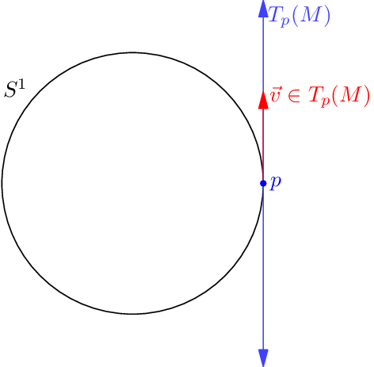

This one confused me for a long time, so I figured I should write this down before I forgot again.

Let $M$ be an abstract [smooth manifold](https://en.wikipedia.org/wiki/Differentiable_manifold#Definition).
We want to define the notion of a **tangent vector** to $M$ at a point $p \in M$.
With that, we can define the **tangent space** $T_p(M)$,
which will just be the (real) vector space of tangent vectors at $p$.

Geometrically, we know what this _should_ look like for our usual examples.
For example, if $M = S^1$ is a circle embedded in $\mathbb R^2$,
then the tangent vector at a point $p$ should just look like a vector running off tangent to the circle.

Similarly, given a sphere $M = S^2$,
the tangent space at a point $p$ along the sphere would look like plane tangent to $M$ at $p$.

However, the point of an abstract manifold is that we want to see the manifold as an _intrinsic object_,
in its own right, rather than as embedded in $\mathbb R^n$.
This can be thought of as analogous to the way that we think of a group as an
abstract object in its own right,
even though Cayley's Theorem tells us that any group is a subgroup of the permutation group.
(This wasn't always the case!
During the 19th century, a group was literally defined as a subset of $\text{GL}(n)$ or of $S_n$.
In fact Sylow developed his theorems without the word "group" Only much later
did the abstract definition of a group was given,
an abstract set $G$ which was independent of any _embedding_ into $S_n$, and an object in its own right.) So,
we would like our notion of a tangent vector to not refer to an ambient space,
but only to intrinsic properties of the manifold $M$ in question.

So how do we capture the notion of the tangent to a manifold referring just to the manifold itself?
Well, the smooth structure of the manifold lets us speak of smooth functions $f : M \rightarrow \mathbb R$.
In the embedded case, we can thus think of taking a _directional derivative_ along $\vec v$ (i.e.
some partial derivative). To give a concrete example,
suppose we have a smooth function $f : S^2 \rightarrow \mathbb R$ and a point $p$.
By the structure of a manifold, near the point $p$,
$f$ looks like a function on some neighborhood of the origin in
$\mathbb R^2 = T_p(M)$ So we are allowed to take the partial derivative of $f$
with respect to any of the vectors in $T_p(M)$.

For a fixed $v$ this partial derivative is a linear map $D : C^\infty(M) \rightarrow \mathbb R$.
It turns out this goes the other way: if you know what $D$ does to every smooth function,
then you can figure out which vector it's taking the partial derivative of.
This is the trick we use in order to create the tangent space.
Rather than trying to specify a vector $\vec v$ directly (which we can't do
because we don't have an ambient space), we instead look at _arbitrary_ derivative-like functions,
and associate them with a vector. More formally, we have the following.

> **Definition 1.** A **derivation** $D$ at $p$ is a linear map $D : C^\infty(M) \rightarrow \mathbb R$ (i.e.
> assigning a real number to every smooth $f$) satisfying the following Leibniz rule: for any $f$,
> $g$ we have the equality
> $$D(fg) = f(p) \cdot D(g) + g(p) \cdot D(f) \in \mathbb R.$$

This is just a "product rule". Then the tangent space is easy to define:

> **Definition 2.** A **tangent vector** is just a derivation at $p$,
> and the **tangent space** $T_p(M)$ is simply the set of all these tangent vectors.

In fact, one can show that the product rule for $D$ is equivalent to the following three conditions:

1.  $D$ is linear, meaning $D(af+bg) = a D(f) + b D(g)$.
2.  $D(1_M) = 0$, where $1_M$ is the constant function on $M$.
3.  $D(fg) = 0$ whenever $f(p) = g(p) = 0$.
    Intuitively, this means that if a function $h = fg$ vanishes to second order at $p$,
    then its derivative along $D$ should be zero.

This suggests a third equivalent definition: suppose we define
$$\mathfrak m_p \coloneqq \left\{ f \in C^\infty M \mid f(p) = 0 \right\}$$
to be the set of functions which vanish at $p$ (this is called the _maximal ideal_ at $p$). In that case,
$$\mathfrak m_p^2 = \left\{ \sum_i f_i \cdot g_i \mid f_i(p) = g_i(p) = 0 \right\}$$
is the set of functions vanishing to second order at $p$. Thus, a tangent vector is really just a linear map
$$\mathfrak m_p / \mathfrak m_p^2 \rightarrow \mathbb R.$$
In other words, the tangent space is actually the dual space of $\mathfrak m_p / \mathfrak m_p^2$;
for this reason, the space $\mathfrak m_p / \mathfrak m_p^2$ is defined as the
**cotangent space** (the dual of the tangent space).
This definition is even more abstract than the one with derivations above,
but it has the advantage (or so I'm told) that it can be transferred to other
settings (like algebraic varieties).

_EDIT (Oct 5 2015)_: Reproducing [this Reddit comment by
tactics](https://www.reddit.com/r/math/comments/3nht0b/constructing_the_tangent_and_cotangent_space/cvop71k),
The beauty of the definition given in this blog post is stuffed away into an easily-forgotten sentence.
This definition:

- Does not rely on any kind of parametrization, and
- It is defined only in terms of the ring of "regular functions" defined on the space.

The former is nice for philosophical reasons.
The latter is nice because we can pull in a lot of intuition about manifolds
into the study of algebraic varieties, and similarly,
we can inject a lot of ring theory into the study of manifolds.

With all these equivalent definitions,
the last thing I should do is check that this definition of tangent space
actually gives a vector space of dimension $n$.
To do this it suffices to show verify this for open subsets of $\mathbb R^n$,
which will imply the result for general manifolds $M$ (which are locally open subsets of $\mathbb R^n$).
Using some real analysis, one can prove the following result:

> **Theorem 3.** Suppose $M \subset \mathbb R^n$ is open and $0 \in M$. Then
>
> $$
> \begin{aligned}
> \mathfrak m_0 &= \{ \text{smooth functions } f \mid f(0) = 0 \} \\
> \mathfrak m_0^2 &= \{ \text{smooth functions } f \mid f(0) = 0, (\nabla f)_0 = 0 \}.
> \end{aligned}
> $$

In other words $\mathfrak m_0^2$ is the set of functions which vanish at $0$ and
such that all first derivatives of $f$ vanish at zero.

Thus, it follows that there is an isomorphism

$$
\mathfrak m_0 / \mathfrak m_0^2 \cong \mathbb R^n \quad\text{by}\quad f
\mapsto \left[ \frac{\partial f}{\partial x_1}(0), \dots, \frac{\partial f}{\partial x_n}(0) \right]
$$

and so the cotangent space, hence tangent space, indeed has dimension $n$.
