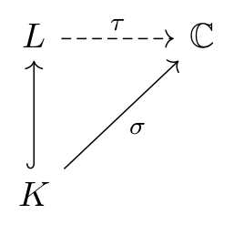
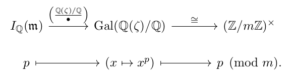
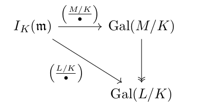

> I will tell you a story about the Reciprocity Law.
> After my thesis, I had the idea to define $L$-series for non-abelian extensions.
> But for them to agree with the $L$-series for abelian extensions, a certain isomorphism had to be true.
> I could show it implied all the standard reciprocity laws.
> So I called it the General Reciprocity Law and tried to prove it but couldn't, even after many tries.
> Then I showed it to the other number theorists, but they all laughed at it,
> and I remember Hasse in particular telling me it couldn't possibly be true.
>
> Still, I kept at it, but nothing I tried worked.
> Not a week went by --- _for three years!_ --- that I did not try to prove the Reciprocity Law.
> It was discouraging, and meanwhile I turned to other things.
> Then one afternoon I had nothing special to do, so I said, \`Well,
> I try to prove the Reciprocity Law again.' So I went out and sat down in the garden.
> You see, from the very beginning I had the idea to use the cyclotomic fields, but they never worked,
> and now I suddenly saw that all this time I had been using them in the wrong
> way --- and in half an hour I had it.
>
> --- Emil Artin

Algebraic number theory assumed (e.g.
the ANT chapters of [Napkin](http://www.mit.edu/~evanchen/napkin.html)).
In this post, I'm going to state some big theorems of global class field theory
and use them to deduce the Kronecker-Weber plus Hilbert class fields.
For experts: this is global class field theory, without ideles.

Here's the executive summary: let $K$ be a number field.
Then all abelian extensions $L/K$ can be understood using solely information intrinsic to $K$: namely,
the ray class groups (generalizing ideal class groups).

## 1. Infinite primes

Let $K$ be a number field of degree $n$.
We know what a prime ideal of $\mathcal O_K$ is, but we now allow for the so-called infinite primes,
which I'll describe using embeddings.
We know there are $n$ embeddings $\sigma : K \rightarrow \mathbb C$, which consist of

- $r$ real embeddings where $\mathop{\mathrm{im}}\sigma \subseteq \mathbb R$, and
- $s$ pairs of conjugate complex embeddings.

Hence $r+2s = n$. The first class of embeddings form the **real infinite primes**,
while the **complex infinite primes** are the second type.
We say $K$ is **totally real** (resp **totally complex**) if all its infinite primes are real (resp complex).

> **Example 1** **(Examples of infinite primes)**
>
> - $\mathbb Q$ has a single real infinite prime. We often write it as $\infty$.
> - $\mathbb Q(\sqrt{-5})$ has a single complex infinite prime, and no real infinite primes.
>   Hence totally complex.
> - $\mathbb Q(\sqrt{5})$ has two real infinite primes, and no complex infinite primes. Hence totally real.

The motivation from this actually comes from the theory of
[valuations](https://blog.evanchen.cc/2015/09/05/some-notes-on-valuations/).
Every prime corresponds exactly to a valuation;
the infinite primes correspond to the Archimedean valuations while the finite
primes correspond to the non-Archimedean valuations.

## 2. Modular arithmetic with infinite primes

A **modulus** is a formal product
$$\mathfrak m = \prod_{\mathfrak p} \mathfrak p^{\nu(\mathfrak p)}$$
where the product runs over all primes, finite and infinite.
(Here $\nu(\mathfrak p)$ is a nonnegative integer,
of which only finitely many are nonzero.) We also require that

- $\nu(\mathfrak p) = 0$ for any complex infinite prime $\mathfrak p$, and
- $\nu(\mathfrak p) \le 1$ for any real infinite prime $\mathfrak p$.

Obviously, every $\mathfrak m$ can be written as
$\mathfrak m = \mathfrak m_0\mathfrak m_\infty$ by separating the finite from the (real) infinite primes.

We say $a \equiv b \pmod{\mathfrak m}$ if

- If $\mathfrak p$ is a finite prime,
  then $a \equiv b \pmod{\mathfrak p^{\nu(\mathfrak p)}}$ means exactly what you think it should mean:
  $a-b \in \mathfrak p^{\nu(\mathfrak p)}$.
- If $\mathfrak p$ is a _real_ infinite prime $\sigma : K \rightarrow \mathbb R$,
  then $a \equiv b \pmod{\mathfrak p}$ means that $\sigma(a/b) > 0$.

Of course, $a \equiv b \pmod{\mathfrak m}$ means $a \equiv b$ modulo each prime power in $\mathfrak m$.
With this, we can define a generalization of the class group:

> **Definition 2.** Let $\mathfrak m$ be a modulus of a number field $K$.
>
> - Let $I_K(\mathfrak m)$ to be the set of all fractional ideals of $K$ which are
>   relatively prime to $\mathfrak m$, which is an abelian group.
> - Let $P_K(\mathfrak m)$ be the subgroup of $I_K(\mathfrak m)$ generated by
>
>   $$
>   \left\{ \alpha \mathcal O_K \mid \alpha \in K^\times \text{ and } \alpha
>   \equiv 1 \pmod{\mathfrak m} \right\}.
>   $$
>
>   This is sometimes called a "ray" of principal ideals.
>
> Finally define the **ray class group** of $\mathfrak m$ to be
> $C_K(\mathfrak m) = I_K(\mathfrak m) / P_K(\mathfrak m)$.

This group is known to always be finite. Note the usual class group is $C_K(1)$.

One last definition that we'll use right after Artin reciprocity:

> **Definition 3.** A **congruence subgroup** of $\mathfrak m$ is a subgroup $H$ with
> $$P_K(\mathfrak m) \subseteq H \subseteq I_K(\mathfrak m).$$
> Thus $C_K(\mathfrak m)$ is a group which contains a lattice of various quotients $I_K(\mathfrak m) / H$,
> where $H$ is a congruence subgroup.

This definition takes a while to get used to, so here are examples.

> **Example 4** **(Ray class groups in $\mathbb Q$)**
>
> Consider $K = \mathbb Q$ with infinite prime $\infty$. Then
>
> - If we take $\mathfrak m = 1$ then $I_\mathbb Q(1)$ is all fractional ideals,
>   and $P_\mathbb Q(1)$ is all principal fractional ideals.
>   Their quotient is the usual class group of $\mathbb Q$, which is trivial.
> - Now take $\mathfrak m = 8$. Thus
>   $I_\mathbb Q(8) \cong \left\{ \frac ab\mathbb Z \mid a/b \equiv 1,3,5,7 \pmod 8 \right\}$. Moreover
>
>   $$P_\mathbb Q(8) \cong \left\{ \frac ab\mathbb Z \mid a/b \equiv 1 \pmod 8 \right\}.$$
>   You might at first glance think that the quotient is thus $(\mathbb Z/8\mathbb Z)^\times$.
>   But the issue is that we are dealing with _ideals_: specifically, we have
>
>   $$7\mathbb Z = -7\mathbb Z \in P_\mathbb Q(8)$$
>   because $-7 \equiv 1 \pmod 8$. So _actually_, we get
>
>   $$
>   C_\mathbb Q(8) \cong \left\{ 1,3,5,7 \text{ mod } 8 \right\} / \left\{ 1,7
>   \text{ mod } 8 \right\} \cong (\mathbb Z/4\mathbb Z)^\times.
>   $$
>
> - Now take $\mathfrak m = \infty$. As before $I_\mathbb Q(\infty) = \mathbb Q^\times$.
>   Now, by definition we have
>
>   $$P_\mathbb Q(\infty) = \left\{ \frac ab \mathbb Z \mid a/b > 0 \right\}.$$
>   At first glance you might think this was $\mathbb Q_{>0}$,
>   but the same behavior with ideals shows in fact $P_\mathbb Q(\infty) = \mathbb Q^\times$.
>   So in this case, $P_\mathbb Q(\infty)$ still has all principal fractional ideals.
>   Therefore, $C_\mathbb Q(\infty)$ is still trivial.
>
> - Finally, let $\mathfrak m = 8\infty$.
>   As before $I_\mathbb Q(8\infty) \cong \left\{ \frac ab\mathbb Z \mid a/b \equiv 1,3,5,7 \pmod 8 \right\}$.
>   Now in this case:
>
>   $$
>   P_\mathbb Q(8\infty) \cong \left\{ \frac ab\mathbb Z \mid a/b \equiv 1 \pmod
>   8 \text{ and } a/b > 0 \right\}.
>   $$
>
>   This time, we really do have $-7\mathbb Z \notin P_\mathbb Q(8\infty)$:
>   we have $7 \not\equiv 1 \pmod 8$ and also $-8 < 0$.
>   So neither of the generators of $7\mathbb Z$ are in $P_\mathbb Q(8\infty)$. Thus we finally obtain
>
>   $$
>   C_\mathbb Q(8\infty) \cong \left\{ 1,3,5,7 \text{ mod } 8 \right\} / \left\{
>   1 \text{ mod } 8 \right\} \cong (\mathbb Z/8\mathbb Z)^\times
>   $$
>
>   with the bijection $C_\mathbb Q(8\infty) \rightarrow (\mathbb Z/8\mathbb Z)^\times$ given by $a\mathbb Z \mapsto
>   |a| \pmod 8$.
>
>   Generalizing these examples, we see that
>
>   $$
>   \begin{aligned} C_\mathbb Q(m) &= (\mathbb Z/m\mathbb Z)^\times / \{\pm 1\}
>   \\ C_\mathbb Q(m\infty) &= (\mathbb Z/m\mathbb Z)^\times. \end{aligned}
>   $$

## 3. Infinite primes in extensions

I want to emphasize that everything above is _intrinsic_ to a particular number field $K$.
After this point we are going to consider extensions $L/K$ but it is important
to keep in mind the distinction that the concept of modulus and ray class group
are objects defined solely from $K$ rather than the above $L$.

Now take a _Galois_ extension $L/K$ of degree $m$.
We already know prime ideals $\mathfrak p$ of $K$ break into a product of prime
ideals $\mathfrak P$ of $K$ in $L$ in a nice way, so we want to do the same thing with infinite primes.
This is straightforward: each of the $n$ infinite primes
$\sigma : K \rightarrow \mathbb C$ lifts to $m$ infinite primes $\tau : L \rightarrow \mathbb C$,
by which I mean the diagram

commutes.
Hence like before, each infinite prime $\sigma$ of $K$ has $m$ infinite primes
$\tau$ of $L$ which lie above it.

For a real prime $\sigma$ of $K$, any of the resulting $\tau$ above it are complex,
we say that the prime $\sigma$ **ramifies** in the extension $L/K$. Otherwise it is **unramified** in $L/K$.
An infinite prime of $K$ is always unramified in $L/K$.
In this way, we can talk about an unramified Galois extension $L/K$:
it is one where all primes (finite or infinite) are unramified.

> **Example 5** **(Ramification of $\infty$)**
>
> Let $\infty$ be the real infinite prime of $\mathbb Q$.
>
> - $\infty$ is ramified in $\mathbb Q(\sqrt{-5})/\mathbb Q$.
> - $\infty$ is unramified in $\mathbb Q(\sqrt{5})/\mathbb Q$.

Note also that if $K$ is totally complex then any extension $L/K$ is unramified.

## 4. Frobenius element and Artin symbol

Recall the following key result:

> **Theorem 6** **(Frobenius element)**
>
> Let $L/K$ be a _Galois_ extension.
> If $\mathfrak p$ is a prime unramified in $K$, and $\mathfrak P$ a prime above it in $L$.
> Then there is a unique element of $\mathop{\mathrm{Gal}}(L/K)$, denoted $\mathrm{Frob}_\mathfrak P$,
> obeying
>
> $$
> \mathrm{Frob}_\mathfrak P(\alpha) \equiv \alpha^{N\mathfrak p} \pmod{\mathfrak
> P} \qquad \forall \alpha \in \mathcal O_L.
> $$

> **Example 7** **(Example of Frobenius elements)**
>
> Let $L = \mathbb Q(i)$, $K = \mathbb Q$. We have $\mathop{\mathrm{Gal}}(L/K) \cong \mathbb Z/2\mathbb Z$.
>
> If $p$ is an odd prime with $\mathfrak P$ above it,
> then $\mathrm{Frob}_\mathfrak P$ is the unique element such that
> $$(a+bi)^p \equiv \mathrm{Frob}_\mathfrak P(a+bi) \pmod{\mathfrak P}$$
> in $\mathbb Z[i]$. In particular,
>
> $$
> \mathrm{Frob}_\mathfrak P(i) = i^p = \begin{cases} i & p \equiv 1 \pmod 4 \\ -i & p \equiv 3 \pmod 4.
> \end{cases}
> $$
>
> From this we see that $\mathrm{Frob}_\mathfrak P$ is the identity when
> $p \equiv 1 \pmod 4$ and $\mathrm{Frob}_\mathfrak P$ is complex conjugation when $p \equiv 3 \pmod 4$.

> **Example 8** **(Cyclotomic Frobenius element)**
>
> Generalizing previous example, let $L = \mathbb Q(\zeta)$ and $K = \mathbb Q$,
> with $\zeta$ an $m$-th root of unity.
> It's well-known that $L/K$ is unramified outside $\infty$ and prime factors of $m$.
> Moreover, the Galois group $\mathop{\mathrm{Gal}}(L/K)$ is $(\mathbb Z/m\mathbb Z)^\times$:
> the Galois group consists of elements of the form
> $$\sigma_n : \zeta \mapsto \zeta^n$$
> and $\mathop{\mathrm{Gal}}(L/K) = \left\{ \sigma_n \mid n \in (\mathbb Z/m\mathbb Z)^\times \right\}$.
>
> Then it follows just like before that if $p \nmid n$ is prime and $\mathfrak P$ is above $p$
> $$\mathrm{Frob}_\mathfrak P(x) = \sigma_p.$$

An important property of the Frobenius element is its order is related to the
decomposition of $\mathfrak p$ in the higher field $L$ in the nicest way possible:

> **Lemma 9** **(Order of the Frobenius element)**
>
> The Frobenius element $\mathrm{Frob}_\mathfrak P \in \mathop{\mathrm{Gal}}(L/K)$
> of an extension $L/K$ has order
> equal to the inertial degree of $\mathfrak P$, that is,
> $$\mathop{\mathrm{ord}} \mathrm{Frob}_\mathfrak P = f(\mathfrak P \mid \mathfrak p).$$
> In particular, $\mathrm{Frob}_\mathfrak P = \mathrm{id}$ if and only if
> $\mathfrak p$ splits completely in $L/K$.

_Proof:_ We want to understand the order of the map
$T : x \mapsto x^{N\mathfrak p}$ on the field $\mathcal O_K / \mathfrak P$.
But the latter is isomorphic to the splitting field of $X^{N\mathfrak P} - X$ in $\mathbb F_p$,
by Galois theory of finite fields.
Hence the order is $\log_{N\mathfrak p} (N\mathfrak P) = f(\mathfrak P \mid \mathfrak p)$. $\Box$

> **Exercise 10.** Deduce from this that the rational primes which split
> completely in $\mathbb Q(\zeta)$ are exactly those with $p \equiv 1 \pmod m$.
> Here $\zeta$ is an $m$-th root of unity.

The Galois group acts transitively among the set of $\mathfrak P$ above a given $\mathfrak p$, so that we have
$$\mathrm{Frob}_{\sigma(\mathfrak P)} = \sigma \circ (\mathrm{Frob}_{\mathfrak p}) \circ \sigma^{-1}.$$
Thus $\mathrm{Frob}_\mathfrak P$ is determined by its underlying $\mathfrak p$ up to conjugation.

In class field theory, we are interested in _abelian_ extensions,
(which just means that $\mathop{\mathrm{Gal}}(L/K)$ is Galois) in which case the theory becomes extra nice:
the conjugacy classes have size one.

> **Definition 11.** Assume $L/K$ is an _abelian_ extension.
> Then for a given unramified prime $\mathfrak p$ in $K$,
> the element $\mathrm{Frob}_\mathfrak P$ doesn't depend on the choice of $\mathfrak P$.
> We denote the resulting $\mathrm{Frob}_\mathfrak P$ by the **Artin symbol**.
> $$\left( \frac{L/K}{\mathfrak p} \right).$$

The definition of the Artin symbol is written deliberately to look like the Legendre symbol. To see why:

> **Example 12** **(Legendre symbol subsumed by Artin symbol)**
>
> Suppose we want to understand $(2/p) \equiv 2^{\frac{p-1}{2}}$ where $p > 2$ is prime. Consider the element
>
> $$
> \left( \frac{\mathbb Q(\sqrt 2)/\mathbb Q}{p\mathbb Z} \right) \in
> \mathop{\mathrm{Gal}}(\mathbb Q(\sqrt 2) / \mathbb Q).
> $$
>
> It is uniquely determined by where it sends $a$. But in fact we have
>
> $$
> \left( \frac{\mathbb Q(\sqrt 2)/\mathbb Q}{p\mathbb Z} \right) \left( \sqrt 2
> \right) \equiv \left( \sqrt 2 \right)^{p} \equiv 2^{\frac{p-1}{2}} \cdot \sqrt 2
> \equiv \left( \frac 2p \right) \sqrt 2 \pmod{\mathfrak P}
> $$
>
> where $\left( \frac 2p \right)$ is the usual Legendre symbol,
> and $\mathfrak P$ is above $p$ in $\mathbb Q(\sqrt 2)$.
> Thus the Artin symbol generalizes the quadratic Legendre symbol.

> **Example 13** **(Cubic Legendre symbol subsumed by Artin symbol)**
>
> Similarly, it also generalizes the cubic Legendre symbol.
> To see this, assume $\theta$ is primary in
> $K = \mathbb Q(\sqrt{-3}) = \mathbb Q(\omega)$ (thus
> $\mathcal O_K = \mathbb Z[\omega]$ is Eisenstein integers). Then for example
>
> $$
> \left( \frac{K(\sqrt[3]{2})/K}{\theta \mathcal O_K} \right) \left( \sqrt[3]{2}
> \right) \equiv \left( \sqrt[3]{2} \right)^{N(\theta)} \equiv
> 2^{\frac{N\theta-1}{3}} \cdot \sqrt 2 \equiv \left( \frac{2}{\theta} \right)_3 \sqrt[3]{2}.
> \pmod{\mathfrak P}
> $$
>
> where $\mathfrak P$ is above $p$ in $K(\sqrt[3]{2})$.

## 5. Artin reciprocity

Now, we further capitalize on the fact that $\mathop{\mathrm{Gal}}(L/K)$ is abelian.
For brevity, in what follows let $\mathop{\mathrm{Ram}}(L/K)$ denote the
primes of $K$ (either finite or infinite) which ramify in $L$.

> **Definition 14.** Let $L/K$ be an _abelian extension_ and let $\mathfrak m$
> be divisible by every prime in $\mathop{\mathrm{Ram}}(L/K)$.
> Then since $L/K$ is abelian we can extend the Artin symbol multiplicatively to a map
> $$\left( \frac{L/K}{\bullet} \right) : I_K(\mathfrak m) \twoheadrightarrow \mathop{\mathrm{Gal}}(L/K).$$
> This is called the **Artin map**, and it is surjective (for example by Chebotarev Density).

Since the map above is surjective,
we denote its kernel by $H_{L/K}(\mathfrak m) \subseteq I_K(\mathfrak m)$. Thus we have
$$\mathop{\mathrm{Gal}}(L/K) \cong I_K(\mathfrak m) / H(\mathfrak m).$$
We can now present the long-awaited Artin reciprocity theorem.

> **Theorem 15** **(Artin reciprocity)**
>
> Let $L/K$ be an abelian extension.
> Then there is a modulus $\mathfrak f = \mathfrak f(L/K)$,
> divisible by exactly the primes of $\mathop{\mathrm{Ram}}(L/K)$, with the following property:
> if $\mathfrak m$ is divisible by all primes of $\mathop{\mathrm{Ram}}(L/K)$
>
> $$
> P_K(\mathfrak m) \subseteq H_{L/K}(\mathfrak m) \subseteq I_K(\mathfrak m)
> \quad\text{if and only if}\quad \mathfrak f \mid \mathfrak m
> $$
>
> We call $\mathfrak f$ the **conductor** of $L/K$.

So the conductor $\mathfrak f$ plays a similar role to the discriminant
(divisible by exactly the primes which ramify), and when $\mathfrak m$ is divisible by the conductor,
$H(L/K, \mathfrak m)$ is a _congruence subgroup_.

Note that for example, if we pick $L$ such that
$H(L/K, \mathfrak m) \cong P_K(\mathfrak m)$ then Artin reciprocity means that there is an isomorphism
$$\mathop{\mathrm{Gal}}(L/K) \cong I_K(\mathfrak m) / P_K(\mathfrak m) \cong C_K(\mathfrak m).$$
More generally, we see that $\mathop{\mathrm{Gal}}(L/K)$ is always a subgroup
some subgroup $C_K(\mathfrak f)$.

> **Example 16** **(Cyclotomic field)**
>
> Let $\zeta$ be a primitive $m$-th root of unity. We show in this example that
>
> $$
> H_{\mathbb Q(\zeta) / \mathbb Q} (m\infty) = P_\mathbb Q(m\infty) = \left\{
> \frac ab \mathbb Z \mid a/b \equiv 1 \pmod m \right\}.
> $$
>
> This is the generic example of achieving the lower bound in Artin reciprocity.
> It also implies that $\mathfrak f(\mathbb Q(\zeta)/\mathbb Q) \mid m\infty$.
>
> It's well-known $\mathbb Q(\zeta)/\mathbb Q$ is unramified outside finite primes dividing $m$,
> so that the Artin symbol is defined on $I_K(\mathfrak m)$. Now the Artin map is given by
> 
> So we see that the kernel of this map is trivial,
> i.e.\ it is given by the identity of the Galois group,
> corresponding to $1 \pmod{m}$. Then $H = H_{L/K}(\mathfrak m)$ for a _unique_ abelian extension $L/K$.

Finally, such subgroups reverse inclusion in the best way possible:

> **Lemma 17** **(Inclusion-reversing congruence subgroups)**
>
> Fix a modulus $\mathfrak m$. Let $L/K$ and $M/K$ be abelian extensions and
> suppose $\mathfrak m$ is divisible by the conductors of $L/K$ and $M/K$. Then
> $$L \subseteq M \quad\text{if and only if}\quad H_{M/K}(\mathfrak m) \subseteq H_{L/K}(\mathfrak m)$$
> Here by $L \subseteq M$ we mean that $L$ is isomorphic to some subfield of $M$.

_Proof:_ Let us first prove the equivalence with $\mathfrak m$ fixed.
In one direction, assume $L \subseteq M$; one can check from the definitions that the diagram

commutes, because it suffices to verify this for prime powers,
which is just saying that Frobenius elements behave well with respect to restriction.
Then the inclusion of kernels follows directly.
The reverse direction is essentially the Takagi existence theorem. $\Box$

Note that we can always take $\mathfrak m$ to be the product of conductors here.

## 6. Consequences

With all this theory we can deduce the following two results.

> **Corollary 18** **(Kronecker-Weber theorem)**
>
> Let $L$ be an abelian extension of $\mathbb Q$.
> Then $L$ is contained in a cyclic extension $\mathbb Q(\zeta)$ where $\zeta$ is
> an $m$-th root of unity (for some $m$).

_Proof:_ Suppose $\mathfrak f(L/\mathbb Q) \mid m\infty$ for some $m$.
Then by the example from earlier we have the chain

$$
P_{\mathbb Q}(m\infty) = H(\mathbb Q(\zeta)/\mathbb Q, m\infty) \subseteq H(L/\mathbb Q,
m) \subseteq I_\mathbb Q(m\infty).
$$

So by inclusion reversal we're done. $\Box$

> **Corollary 19** **(Hilbert class field)**
>
> Let $K$ be any number field. Then there exists a unique abelian extension $E/K$
> which is unramified at all primes (finite or infinite) and such that
>
> - $E/K$ is the maximal such extension by inclusion.
> - $\mathop{\mathrm{Gal}}(E/K)$ is isomorphic to the class group of $E$.
> - A prime $\mathfrak p$ of $K$ splits completely in $E$ if and only if it is principal.
>
> We call $E$ the **Hilbert class field** of $K$.

_Proof:_ Apply the Takagi existence theorem with $\mathfrak m = 1$ to obtain an
unramified extension $E/K$ such that $H(E/K, 1) = P_K(1)$. We claim this works:

- To see it is maximal by inclusion,
  note that any other extension $M/K$ with this property has conductor $1$ (no primes divide the conductor),
  and then we have $P_K(1) = H(E/K, 1) \subseteq H(M/K, 1) \subseteq I_K(1)$,
  so inclusion reversal gives $M \subseteq E$.
- We have $\mathop{\mathrm{Gal}}(L/K) \cong I_K(1) / P_K(1) = C_K(1)$ the class group.
- The isomorphism in the previous part is given by the Artin symbol.
  So $\mathfrak p$ splits completely if and only if
  $\left( \frac{L/K}{\mathfrak p} \right) = \mathrm{id}$ if and only if
  $\mathfrak p$ is principal (trivial in $C_K(1)$).

This completes the proof. $\Box$

One can also derive quadratic and cubic reciprocity from Artin reciprocity;
see [this link for QR](http://math.stackexchange.com/a/265464/229197) and [this
link for CR](http://mathoverflow.net/a/234369/70654).
