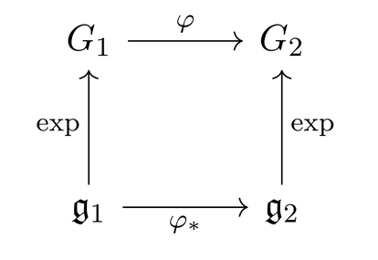

In Spring 2016 I was taking 18.757 Representations of Lie Algebras.
Since I knew next to nothing about either Lie groups or algebras,
I was forced to quickly learn about their basic facts and properties.
These are the notes that I wrote up accordingly.
Proofs of most of these facts can be found in standard textbooks, for example Kirillov.

## 1. Lie groups

Let $K = \mathbb R$ or $K = \mathbb C$, depending on taste.

> **Definition 1.** A **Lie group** is a group $G$ which is also a $K$-manifold;
> the multiplication maps $G \times G \rightarrow G$ (by
> $(g_1, g_2) \mapsto g_1g_2$) and the inversion map $G \rightarrow G$ (by
> $g \mapsto g^{-1}$) are required to be smooth.

A **morphism of Lie groups** is a map which is both a map of manifolds and a group homomorphism.

Throughout, we will let $e \in G$ denote the identity, or $e_G$ if we need further emphasis.

Note that in particular, every group $G$ can be made into a Lie group by
endowing it with the discrete topology. This is silly, so we usually require only focus on connected groups:

> **Proposition 2** **(Reduction to connected Lie groups)**
>
> Let $G$ be a Lie group and $G^0$ the connected component of $G$ which contains $e$.
> Then $G^0$ is a normal subgroup, itself a Lie group, and the quotient $G/G^0$ has the discrete topology.

In fact, we can also reduce this to the study of _simply connected_ Lie groups as follows.

> **Proposition 3** **(Reduction to simply connected Lie groups)**
>
> If $G$ is connected, let $\pi \colon \widetilde G \rightarrow G$ be its universal cover.
> Then $\widetilde G$ is a Lie group, $\pi$ is a morphism of Lie groups, and $\ker \pi \cong \pi_1(G)$.

Here are some examples of Lie groups.

> **Example 4** **(Examples of Lie groups)**
>
> - $\mathbb R$ under addition is a real one-dimensional Lie group.
> - $\mathbb C$ under addition is a complex one-dimensional Lie group (and a two-dimensional real Lie group)!
> - The unit circle $S^1 \subseteq \mathbb C$ is a real Lie group under multiplication.
> - $\operatorname{GL}(n, K) \subset K^{\oplus n^2}$ is a Lie group of dimension $n^2$.
>   This example becomes important for representation theory:
>   a **representation** of a Lie group $G$ is a morphism of Lie groups $G \rightarrow \operatorname{GL}(n, K)$.
> - $\operatorname{SL}(n, K) \subset \operatorname{GL}(n, K)$ is a Lie group of dimension $n^2-1$.

As geometric objects, Lie groups $G$ enjoy a huge amount of symmetry.
For example, any neighborhood $U$ of $e$ can be "copied over" to any other point
$g \in G$ by the natural map $gU$. There is another theorem worth noting, which is that:

> **Proposition 5.** If $G$ is a connected Lie group and $U$ is a neighborhood of the identity $e \in G$,
> then $U$ generates $G$ as a group.

## 2. Haar measure

Recall the following result and its proof from representation theory:

> **Claim 6.** For any finite group $G$, $\mathbb C[G]$ is semisimple;
> all finite-dimensional representations decompose into irreducibles.

_Proof:_ Take a representation $V$ and equip it with an arbitrary inner form $\left< -,-\right>_0$.
Then we can _average_ it to obtain a new inner form
$$\left< v, w \right> = \frac{1}{|G|} \sum_{g \in G} \left< gv, gw \right>_0.$$
which is $G$-invariant. Thus given a subrepresentation $W \subseteq V$ we can
just take its orthogonal complement to decompose $V$. $\Box$

We would like to repeat this type of proof with Lie groups.
In this case the notion $\sum_{g \in G}$ doesn't make sense,
so we want to replace it with an integral $\int_{g \in G}$ instead.
In order to do this we use the following:

> **Theorem 7** **(Haar measure)**
>
> Let $G$ be a Lie group. Then there exists a unique Radon measure $\mu$
> (up to scaling) on $G$ which is left-invariant, meaning
> $$\mu(g \cdot S) = \mu(S)$$
> for any Borel subset $S \subseteq G$ and "translate" $g \in G$.
> This measure is called the **(left) Haar measure**.

> **Example 8** **(Examples of Haar measures)**
>
> - The Haar measure on $(\mathbb R, +)$ is the standard Lebesgue measure which
>   assigns $1$ to the closed interval $[0,1]$.
>   Of course for any $S$, $\mu(a+S) = \mu(S)$ for $a \in \mathbb R$.
> - The Haar measure on $(\mathbb R \setminus \{0\}, \times)$ is given by
>
> $$\mu(S) = \int_S \frac{1}{|t|} dt.$$
> In particular, $\mu([a,b]) = \log(b/a)$. One sees the invariance under multiplication of these intervals.
>
> - Let $G = \operatorname{GL}(n, \mathbb R)$. Then a Haar measure is given by
>   $$\mu(S) = \int_S |\det(X)|^{-n} dX.$$
> - For the circle group $S^1$, consider $S \subseteq S^1$. We can define
>
> $$\mu(S) = \frac{1}{2\pi} \int_S d\varphi$$
> across complex arguments $\varphi$. The normalization factor of $2\pi$ ensures $\mu(S^1) = 1$.

Note that we have:

> **Corollary 9.** If the Lie group $G$ is compact, there is a unique Haar measure with $\mu(G) = 1$.

This follows by just noting that if $\mu$ is Radon measure on $X$, then $\mu(X) < \infty$.
This now lets us deduce that

> **Corollary 10** **(Compact Lie groups are semisimple)**
>
> $\mathbb C[G]$ is semisimple for any _compact_ Lie group $G$.

Indeed, we can now consider
$$\left< v,w\right> = \int_G \left< g \cdot v, g \cdot w\right>_0 dg$$
as we described at the beginning.

## 3. The tangent space at the identity

In light of the previous comment about neighborhoods of $e$ generating $G$,
we see that to get some information about the entire Lie group it actually
suffices to just get "local" information of $G$ at the point $e$ (this is one
formalization of the fact that Lie groups are super symmetric).

To do this one idea is to look at the **[tangent space](https://blog.evanchen.cc/2015/10/04/constructing-the-tangent-and-cotangent-space/)**.
Let $G$ be an $n$-dimensional Lie group (over $K$) and consider
$\mathfrak g = T_eG$ the tangent space to $G$ at the identity $e \in G$.
Naturally, this is a $K$-vector space of dimension $n$. We call it the **Lie algebra** associated to $G$.

> **Example 11** **(Lie algebras corresponding to Lie groups)**
>
> - $(\mathbb R, +)$ has a real Lie algebra isomorphic to $\mathbb R$.
> - $(\mathbb C, +)$ has a complex Lie algebra isomorphic to $\mathbb C$.
> - The unit circle $S^1 \subseteq \mathbb C$ has a real Lie algebra isomorphic to $\mathbb R$,
>   which we think of as the "tangent line" at the point $1 \in S^1$.

> **Example 12** **($\mathfrak{gl}(n, K)$)**
>
> Let's consider $\operatorname{GL}(n, K) \subset K^{\oplus n^2}$, an open subset of $K^{\oplus n^2}$.
> Its tangent space should just be an $n^2$-dimensional $K$-vector space.
> By identifying the components in the obvious way,
> we can think of this Lie algebra as just the set of all $n \times n$ matrices.
>
> This Lie algebra goes by the notation $\mathfrak{gl}(n, K)$.

> **Example 13** **($\mathfrak{sl}(n, K)$)**
>
> Recall $\operatorname{SL}(n, K) \subset \operatorname{GL}(n, K)$ is a Lie group of dimension $n^2-1$,
> hence its Lie algebra should have dimension $n^2-1$.
> To see what it is, let's look at the special case $n=2$ first: then
> $$\operatorname{SL}(2, K) = \left\{ \begin{pmatrix} a & b \\ c & d \end{pmatrix} \mid ad - bc = 1 \right\}.$$
> Viewing this as a polynomial surface $f(a,b,c,d) = ad-bc$ in $K^{\oplus 4}$, we compute
> $$\nabla f = \left< d, -c, -b, a \right>$$
> and in particular the tangent space to the identity matrix
> $\begin{pmatrix} 1 & 0 \\ 0 & 1 \end{pmatrix}$ is given by the orthogonal complement of the gradient
> $$\nabla f (1,0,0,1) = \left< 1, 0, 0, 1 \right>.$$
> Hence the tangent plane can be identified with matrices satisfying $a+d=0$. In other words, we see
> $$\mathfrak{sl}(2, K) = \left\{ T \in \mathfrak{gl}(2, K) \mid \operatorname{Tr} T = 0. \right\}.$$
> By repeating this example in greater generality, we discover
> $$\mathfrak{sl}(n, K) = \left\{ T \in \mathfrak{gl}(n, K) \mid \operatorname{Tr} T = 0. \right\}.$$

## 4. The exponential map

Right now, $\mathfrak g$ is just a vector space.
However, by using the group structure we can get a map from $\mathfrak g$ back into $G$.
The trick is "differential equations":

> **Proposition 14** **(Differential equations for Lie theorists)**
>
> Let $G$ be a Lie group over $K$ and $\mathfrak g$ its Lie algebra.
> Then for every $x \in \mathfrak g$ there is a _unique_ homomorphism
> $$\gamma_x \colon K \rightarrow G$$
> which is a morphism of Lie groups, such that
> $$\gamma_x'(0) = x \in T_eG = \mathfrak g.$$
> We will write $\gamma_x(t)$ to emphasize the argument $t \in K$ being thought of as "time".

Thus this proposition should be intuitively clear:
the theory of differential equations guarantees that $\gamma_x$ is defined and
unique in a small neighborhood of $0 \in K$.
Then, the group structure allows us to extend $\gamma_x$ uniquely to the rest of $K$,
giving a trajectory across all of $G$.
This is sometimes called a **one-parameter subgroup** of $G$,
but we won't use this terminology anywhere in what follows.

This lets us define:

> **Definition 15.** Retain the setting of the previous proposition.
> Then the **exponential map** is defined by
> $$\exp \colon \mathfrak g \rightarrow G \qquad\text{by}\qquad x \mapsto \gamma_x(1).$$

The exponential map gets its name from the fact that for all the examples I discussed before,
it is actually just the map $e^\bullet$.
Note that below, $e^T = \sum_{k \ge 0} \frac{T^k}{k!}$ for a matrix $T$;
this is called the matrix exponential.

> **Example 16** **(Exponential Maps of Lie algebras)**
>
> - If $G = \mathbb R$, then $\mathfrak g = \mathbb R$ too.
>   Then $\gamma_x(t) = tx \in \mathbb R$ (where $t \in \mathbb R$) is a morphism
>   of Lie groups $\gamma_x \colon \mathbb R \rightarrow G$. Hence
>   $$\exp \colon \mathbb R \rightarrow \underbrace{\mathbb R}_{=G} \qquad \exp(x) = \gamma_x(1) = x \in \mathbb R = G.$$
>   In other words, the exponential map is the identity.
> - Ditto for $\mathbb C$.
> - For $S^1$ and $x \in \mathbb R$,
>   the map $\gamma_x \colon \mathbb R \rightarrow S^1$ given by $t \mapsto e^{itx}$ works. Hence
>   $$\exp \colon \mathbb R \rightarrow S^1 \qquad \exp(x) = \gamma_x(1) = e^{it} \in S^1.$$
> - For $\mathop{\mathrm{GL}}(n, K)$,
>   the map $\gamma_X \colon K \rightarrow \mathop{\mathrm{GL}}(n, K)$ given by
>   $t \mapsto e^{tX}$ works nicely (now $X$ is a matrix).
>   (Note that we have to check $e^{tX}$ is actually invertible for this map to
>   be well-defined.) Hence the exponential map is given by
>   $$\exp \colon \mathfrak{gl}(n,K) \rightarrow \mathop{\mathrm{GL}}(n,K) \qquad \exp(X) = \gamma_X(1) = e^X \in \mathop{\mathrm{GL}}(n, K).$$
> - Similarly,
>   $$\exp \colon \mathfrak{sl}(n,K) \rightarrow \mathop{\mathrm{SL}}(n,K) \qquad \exp(X) = \gamma_X(1) = e^X \in \mathop{\mathrm{SL}}(n, K).$$
>   Here we had to check that if $X \in \mathfrak{sl}(n,K)$, meaning $\mathop{\mathrm{Tr}} X = 0$,
>   then $\det(e^X) = 1$. This can be seen by writing $X$ in an upper triangular basis.

Actually, taking the tangent space at the identity is a functor.
Consider a map $\varphi \colon G_1 \rightarrow G_2$ of Lie groups,
with lie algebras $\mathfrak g_1$ and $\mathfrak g_2$.
Because $\varphi$ is a group homomorphism, $G_1 \ni e_1 \mapsto e_2 \in G_2$.
Now, by manifold theory we know that maps $f \colon M \rightarrow N$ between
manifolds gives
[a linear map between the corresponding tangent spaces](<https://en.wikipedia.org/wiki/Pushforward_(differential)>),
say $Tf \colon T_pM \rightarrow T_{fp}N$.
For us we obtain a linear map
$$\varphi_\ast = T \varphi \colon \mathfrak g_1 \rightarrow \mathfrak g_2.$$
In fact, this $\varphi_\ast$ fits into a diagram

Here are a few more properties of $\exp$:

- $\exp(0) = e \in G$, which is immediate by looking at the constant trajectory $\phi_0(t) \equiv e$.
- $\exp'(x) = x \in \mathfrak g$, i.e.
  the total derivative $D\exp \colon \mathfrak g \rightarrow \mathfrak g$ is the identity.
  This is again by construction.
- In particular, by the inverse function theorem this implies that $\exp$ is a
  diffeomorphism in a neighborhood of $0 \in \mathfrak g$, onto a neighborhood of $e \in G$.
- $\exp$ commutes with the commutator. (By the above diagram.)

## 5. The commutator

Right now $\mathfrak g$ is _still_ just a vector space, the tangent space.
But now that there is map $\exp \colon \mathfrak g \rightarrow G$,
we can use it to put a new operation on $\mathfrak g$, the so-called _commutator_.

The idea is follows: we want to "multiply" two elements of $\mathfrak g$.
But $\mathfrak g$ is just a vector space, so we can't do that.
However, $G$ itself has a group multiplication, so we should pass to $G$ using $\exp$,
use the multiplication _in the group_ $G$ and then come back.

Here are the details. As we just mentioned, $\exp$ is a diffeomorphism near $e \in G$.
So for $x$, $y$ close to the origin of $\mathfrak g$, we can look at $\exp(x)$ and $\exp(y)$,
which are two elements of $G$ close to $e$.
Multiplying them gives an element still close to $e$, so its equal to $\exp(z)$ for some unique $z$,
call it $\mu(x,y)$.

One can show in fact that $\mu$ can be written as a Taylor series in two variables as
$$\mu(x,y) = x + y + \frac{1}{2} [x,y] + \text{third order terms} + \dots$$
where $[x,y]$ is a _skew-symmetric_ bilinear map, meaning $[x,y] = -[y,x]$.
It will be more convenient to work with $[x,y]$ than $\mu(x,y)$ itself, so we give it a name:

> **Definition 17.** This $[x,y]$ is called the **commutator** of $G$.

Now we know multiplication in $G$ is associative,
so this should give us some nontrivial relation on the bracket $[,]$. Specifically, since
$$\exp(x) \left( \exp(y) \exp(z) \right) = \left( \exp(x) \exp(y) \right) \exp(z).$$
we should have that $\mu(x, \mu(y,z)) = \mu(\mu(x,y), z)$, and this should tell us something.
In fact, the claim is:

> **Theorem 18.** The bracket $[,]$ satisfies the Jacobi identity
> $$[x,[y,z]] + [y,[z,x]] + [z,[x,y]] = 0.$$

_Proof:_ Although I won't prove it, the third-order terms (and all the rest)
in our definition of $[x,y]$ can be written out explicitly as well:
for example, for example, we actually have

$$
\mu(x,y) = x + y + \frac{1}{2} [x,y]
  + \frac{1}{12} \left( [x, [x,y]] + [y,[y,x]] \right)
  + \text{fourth order terms} + \dots.
$$

The general formula is called the **Baker-Campbell-Hausdorff formula**.

Then we can force ourselves to expand this using the first three terms of the
BCS formula and then equate the degree three terms.
The left-hand side expands initially as
$\mu\left( x, y + z + \frac{1}{2} [y,z] + \frac{1}{12} \left( [y,[y,z]] + [z,[z,y] \right) \right)$,
and the next step would be something ugly.

This computation is horrifying and painful,
so I'll pretend I did it and tell you the end result is as claimed. $\Box$

There is a more natural way to see why this identity is the "right one";
see [Qiaochu](https://qchu.wordpress.com/2011/02/26/the-quaternions-and-lie-algebras-i/).
However, with this proof I want to make the point that this Jacobi identity is not our decision:
instead, the Jacobi identity is **forced upon us** by associativity in $G$.

> **Example 19** **(Examples of commutators attached to Lie groups)**
>
> - If $G$ is an abelian group, we have $-[y,x] = [x,y]$ by symmetry and
>   $[x,y] = [y,x]$ from $\mu(x,y) = \mu(y,x)$.
>   Thus $[x,y] = 0$ in $\mathfrak g$ for any _abelian_ Lie group $G$.
> - In particular, the brackets for $G \in \{\mathbb R, \mathbb C, S^1\}$ are trivial.
> - Let $G = \operatorname{GL}(n, K)$. Then one can show that
>   $$[T,S] = TS - ST \qquad \forall S, T \in \mathfrak{gl}(n, K).$$
> - Ditto for $\operatorname{SL}(n, K)$.

In any case, with the Jacobi identity we can define an _general_ Lie algebra as
an intrinsic object with a Jacobi-satisfying bracket:

> **Definition 20.** A **Lie algebra** over $k$ is a $k$-vector space equipped
> with a skew-symmetric bilinear bracket $[,]$ satisfying the Jacobi identity.
>
> A **morphism of Lie algebras** and preserves the bracket.

Note that a Lie algebra may even be infinite-dimensional (even though we are
assuming $G$ is finite-dimensional, so that they will never come up as a tangent space).

> **Example 21** **(Associative algebra $\rightarrow$ Lie algebra)**
>
> Any associative algebra $A$ over $k$ can be made into a Lie algebra by taking
> the same underlying vector space, and using the bracket $[a,b] = ab - ba$.

## 6. The fundamental theorems

We finish this list of facts by stating the three "fundamental theorems" of Lie theory.
They are based upon the functor
$$\mathscr{L} \colon G \mapsto T_e G$$
we have described earlier, which is a functor

- from the category of Lie groups
- into the category of finite-dimensional Lie algebras.

The first theorem requires the following definition:

> **Definition 22.** A **Lie subgroup** $H$ of a Lie group $G$ is a subgroup $H$
> such that the inclusion map $H \hookrightarrow G$ is also an injective immersion.

A **Lie subalgebra** $\mathfrak h$ of a Lie algebra $\mathfrak g$ is a vector
subspace preserved under the bracket
(meaning that $[\mathfrak h, \mathfrak h] \subseteq \mathfrak h$).

> **Theorem 23** **(Lie I)**
>
> Let $G$ be a real or complex Lie group with Lie algebra $\mathfrak g$.
> Then given a Lie subgroup $H \subseteq G$, the map
> $$H \mapsto \mathscr{L}(H) \subseteq \mathfrak g$$
> is a bijection between Lie subgroups of $G$ and Lie subalgebras of $\mathfrak g$.

> **Theorem 24** **(The Lie functor is an equivalence of categories)**
>
> Restrict $\mathscr{L}$ to a functor
>
> - from the category of **simply connected** Lie groups over $K$
> - to the category of finite-dimensional Lie algebras over $K$.
>
> Then
>
> 1.  (Lie II) $\mathscr{L}$ is fully faithful, and
> 2.  (Lie III) $\mathscr{L}$ is essentially surjective on objects.

If we drop the "simply connected" condition, we obtain a functor which is faithful and exact, but not full:
non-isomorphic Lie groups can have isomorphic Lie algebras (one example is
$\operatorname{SO}(3)$ and $\operatorname{SU}(2)$).
