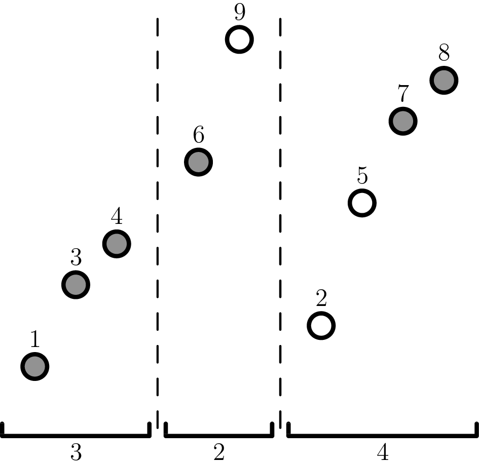

I recently had a [combinatorics paper](https://arxiv.org/abs/1708.01350)
appear in the [EJC](http://www.combinatorics.org/ojs/index.php/eljc/article/view/v24i4p4).
In this post I want to brag a bit by telling the "story" of this paper:
what motivated it, how I found the conjecture that I originally did,
and the process that eventually led me to the proof, and so on.

This work was part of the [Duluth REU 2017](http://www.d.umn.edu/~jgallian/REU.html),
and I thank Joe Gallian for suggesting the problem.

## 1. Background

Let me begin by formulating the problem as it was given to me.
First, here is the definition and notation for a "block-ascending" permutation.

> **Definition 1.** For nonnegative integers $a_1$, …,
> $a_n$ an $(a_1, \dots, a_n)$-_ascending permutation_ is a permutation on
> $\{1, 2, \dots, a_1 + \dots + a_n\}$ whose descent set is contained in
> $\{a_1, a_1+a_2, \dots, a_1+\dots+a_{n-1}\}$.

In other words the permutation ascends in blocks of length $a_1$, $a_2$, …, $a_n$,
and thus has the form
$$\pi = \pi_{11} \dots \pi_{1a_1} | \pi_{21} \dots \pi_{2a_2} | \dots | \pi_{n1} \dots \pi_{na_n}$$
for which $\pi_{i1} < \pi_{i2} < \dots < \pi_{ia_i}$ for all $i$.

It turns out that block-ascending permutations which also avoid an increasing
subsequence of certain length have nice enumerative properties.
To this end, we define the following notation.

> **Definition 2.** Let $\mathcal L_{k+2}(a_1, \dots, a_n)$ denote the set of
> $(a_1, \dots, a_n)$-ascending permutations which avoid the pattern $12 \dots (k+2)$.

(The reason for using $k+2$ will be explained later.)
In particular, $\mathcal L_{k+2}(a_1 ,\dots, a_n) = \varnothing$
if $\max \{a_1, \dots, a_n\} \ge k+2$.

> **Example 3.** Here is a picture of a permutation in $\mathcal L_7(3,2,4)$
> (but not in $\mathcal L_6(3,2,4)$, since one can see an increasing length $6$ subsequence shaded).
> We would denote it $134|69|2578$.



Now on to the results.
A [2011 paper by Joel Brewster Lewis (JBL)](http://math.sfsu.edu/fpsac/pdfpapers/dmAN0123.pdf)
proved (among other things) the following result:

> **Theorem 4** **(Lewis 2011)**
>
> The sets $\mathcal L_{k+2}(k,k,\dots,k)$ and
> $\mathcal L_{k+2}(k+1,k+1,\dots,k+1}$ are in bijection
> with Young tableau of shape $\left\langle (k+1)^n \right\rangle$.

> **Remark 5.** When $k=1$, this implies $\mathcal L_3(1,1,\dots,1)$,
> which is the set of $123$-avoiding permutations of length $n$, is in bijection with the Catalan numbers;
> so is $\mathcal L_3(2,\dots,2)$ which is the set of $123$-avoiding _zig-zag_ permutations.

Just before the Duluth REU in 2017,
[Mei and Wang](http://www.combinatorics.org/ojs/index.php/eljc/article/view/v24i1p6)
proved that in fact,
in Lewis' result one may freely mix $k$ and $k+1$'s.
To simplify notation,

> **Definition 6.** Let $I \subseteq \left\{ 1,\dots,n \right\}$.
> Then $\mathcal L(n,k,I)$ denotes $\mathcal L_{k+2}(a_1,\dots,a_n)$ where
> $$a_i = \begin{cases} k+1 & i \in I \\ k & i \notin I. \end{cases}$$

> **Theorem 7** **(Mei, Wang 2017)**
>
> The $2^n$ sets $\mathcal L(n,k,I)$ are also in bijection with Young tableau of shape $\left< (k+1)^n \right>$.

The proof uses the RSK correspondence,
but the authors posed at the end of the paper the following open problem:

> **Problem**
>
> Find a direct bijection between the $2^n$ sets $\mathcal L(n,k,I)$ above,
> not involving the RSK correspondence.

This was the first problem that I was asked to work on.
(I remember I received the problem on Sunday morning;
this actually matters a bit for the narrative later.)

At this point I should pause to mention that this $\mathcal L_{k+2}(\dots)$ notation is my own invention,
and did not exist when I originally started working on the problem.
Indeed, all the results are restricted to the case where $a_i \in \{k,k+1\}$ for each $i$,
and so it was unnecessary to think about other possibilities for $a_i$:
Mei and Wang's paper use the notation $\mathcal L(n,k,I)$.
So while I'll continue to use the $\mathcal L_{k+2}(\dots)$ notation in the blog post for readability,
it will make some of the steps more obvious than they actually were.

## 2. Setting out

Mei and Wang's paper originally suggested that rather than finding a bijection
$\mathcal L(n,k,I) \rightarrow \mathcal L(n,k,J)$ for any $I$ and $J$, it would suffice to biject
$$\mathcal L(n,k,I) \rightarrow \mathcal L(n,k,\varnothing)$$
and then compose two such bijections.
I didn't see why this should be much easier, but it didn't seem to hurt either.

As an example, they show how to do this bijection with $I = \{1\}$ and $I = \{n\}$.
Indeed, suppose $I = \{1\}$. Then $\pi_{11} < \pi_{12} < \dots < \pi_{1(k+1)}$
is an increasing sequence of length $k+1$ right at the start of $\pi$.
So $\pi_{1(k+1)}$ had better be the largest element in the permutation:
otherwise later in $\pi$ the biggest element would complete an ascending permutation of length $k+2$ already!
So removing $\pi_{1(k+1)}$ gives a bijection between
$\mathcal L(n,k,\{1\}) \rightarrow \mathcal L(n,k,\varnothing)$.

But if you look carefully, this proof does essentially nothing with the later blocks.
The exact same proof gives:

> **Proposition 8.** Suppose $1 \notin I$. Then there is a bijection
> $$\mathcal L(n,k,I \cup \{1\}) \rightarrow \mathcal L(n,k,I)$$
> by deleting the $(k+1)$-st element of the permutation (which must be largest one).

Once I found this proposition I rejected the initial suggestion of specializing
$\mathcal L(n,k,I) \rightarrow \mathcal L(n,k,\varnothing)$.
The "easy case" I had found told me that I could take a set $I$ and delete the single element $1$ from it.
So empirically, my intuition from this toy example told me that it would be
easier to find bijections $\mathcal L(n,k,I) \rightarrow \mathcal L(n,k,I')$
whee $I'$ and $I$ were only "a little different",
and hope that the resulting bijection only changed things a little bit (in the
same way that in the toy example, all the bijection did was delete one element).
So I shifted to trying to find small changes of this form.

## 3. The fork in the road

### 3.1. Wishful thinking

I had a lucky break of wishful thinking here.
In the notation $\mathcal L_{k+2}(a_1, \dots, a_n)$ with $a_i \in \{k,k+1\}$,
I had found that one could replace $a_1$ with either $k$ or $k+1$ freely.
(But this proof relied heavily on the fact the block really being on the far
left.) So what other changes might I be able to make?

There were two immediate possibilities that came to my mind.

- **Deletion**: We already showed $a_1$ could be changed from $k+1$ to $k$ for any $i$.
  If we can do a similar deletion with $a_i$ for any $i$, not just $i=1$, then we would be done.
- **Swapping**: If we can show that two adjacent $a_i$'s could be swapped, that would be sufficient as well.
  (It's also possible to swap non-adjacent $a_i$'s,
  but that would cause more disruption for no extra benefit.)

Now, I had two paths that both seemed plausible to chase after. How was I supposed to know which one to pick?
(Of course, it's possible neither work, but you have to start somewhere.)

Well, maybe the correct thing to do would have to just try both.
But it was Sunday afternoon by the time I got to this point.
Granted, it was summer already,
but I knew that come Monday I would have doctor appointments and other trivial errands to distract me,
so I decided I should pick one of them and throw the rest of the day into it.
But that meant I had to pick one.

(I confess that I actually already had a prior guess:
the deletion approach seemed less likely to work than the swapping approach.
In the deletion approach, if $i$ is somewhere in the middle of the permutation,
it seemed like deleting an element could cause a lot of disruption.
But the swapping approach preserved the total number of elements involved,
and so seemed more likely that I could preserve structure. But really I was just grasping at straws.)

### 3.2. Enter C++

Yeah, I cheated. Sorry.

Those of you that know anything about my style of math know that I am an algebraist by nature --- sort of.
It's more accurate to say that I depend on having concrete examples to function.
True, I can't do complexity theory for my life,
but I also haven't been able to get the hang of algebraic geometry,
despite having tried to learn it three or four times by now. But enumerative combinatorics? OH LOOK EXAMPLES.

Here's the plan: let $k=3$. Then using a C++ computer program:

- Enumerate all the permutations in $S = \mathcal L_{k+2}(3,4,3,4)$.
- Enumerate all the permutations in $A = \mathcal L_{k+2}(3,3,3,4)$.
- Enumerate all the permutations in $B = \mathcal L_{k+2}(3,3,4,4)$.

If the deletion approach is right, then I would hope $S$ and $A$ look pretty similar.
On the flip side, if the swapping approach is right, then $S$ and $B$ should look close to each other instead.

It's moments like this where my style of math really shines.
I don't have to make decisions like the above off gut-feeling: do the "data science" instead.

### 3.3. A twist of fate

Except this isn't actually what I did, since there was one problem.
Computing the longest increasing subsequence of a length $N$ permutation takes $O(N \log N)$ time,
and there are $N!$ or so permutations.
But when $N = 3+4+3+4=14$, we have $N! \cdot N \log N \approx 3 \cdot 10^{12}$,
which is a pretty big number.
Unfortunately, my computer is not really that fast,
and I didn't really have the patience to implement the "correct" algorithms to bring the runtime down.

The solution? Use $N = 1+4+3+2 = 10$ instead.

In a deep irony that I didn't realize at the time,
it was this moment when I introduced the $\mathcal L_{k+2}(a_1, \dots, a_n)$ notation,
and for the first time allowed the $a_i$ to not be in $\{k,k+1\}$.
My reasoning was that since I was only doing this for heuristic reasons,
I could instead work with $S = \mathcal L_{k+2}(2,4,3,2)$ and probably not
change much about the structure of the problem, while replacing $N = 2 + 4 + 3 + 2 = 11$,
which would run $1000$ times faster.
This was okay since all I wanted to do was see how much changing the "middle" would disrupt the structure.

And so the new plan was:

- Enumerate all the permutations in $S = \mathcal L_{k+2}(1,4,3,2)$.
- Enumerate all the permutations in $A = \mathcal L_{k+2}(1,3,3,2)$.
- Enumerate all the permutations in $B = \mathcal L_{k+2}(1,3,4,2)$.

I admit I never actually ran the enumeration with $A$,
because the route with $S$ and $B$ turned out to be even more promising than I expected.
When I compared the empirical data for the sets $S$ and $B$,
I found that the number of permutations with any particular triple $(\pi_1, \pi_9, \pi_{10})$ were equal.
In other words, the **outer blocks were preserved**: the bijection
$$\mathcal L_{k+2}(1,4,3,2) \rightarrow \mathcal L_{k+2}(1,3,4,2)$$
does not tamper with the outside blocks of length $1$ and $2$.

This meant I was ready to make the following conjecture. Suppose $a_i = k$, $a_{i+1} = k+1$.
There is a bijection

$$
\mathcal L_{k+2}(a_1, \dots, a_i, a_{i+1}, \dots, a_n)
  \rightarrow \mathcal L_{k+2}(a_1, \dots, a_{i+1}, a_{i}, \dots, a_n)
$$

which only involves rearranging the elements of the $i$-th and $(i+1)$-st blocks.

## 4. Rooting out the bijection

At this point I was in a quite good position.
I had pinned down the problem to a finding a particular bijection that I was confident had to exist,
since it was showing up to the empirical detail.

Let's call this mythical bijection $\mathbf W$. How could I figure out what it was?

### 4.1. Hunch: $\mathbf W$ preserves order-isomorphism

Let me quickly introduce a definition.

> **Definition 9.** We say two words $a_1 \dots a_m$ and $b_1 \dots b_m$ are
> _order-isomorphic_ if $a_i < a_j$ if and only $b_i < b_j$.
> Then order-isomorphism gives equivalence classes,
> and there is a canonical representative where the letters are $\{1,2,\dots,m\}$;
> this is called a _reduced_ word.

> **Example 10.** The words $13957$, $12846$ and $12534$ are order-isomorphic; the last is reduced.

Now I guessed one more property of $\mathbf W$: this $\mathbf W$ should order-isomorphism.

What do I mean by this? Suppose in one context $139 | 57$ changed to $39 | 157$;
then we would expect that in another situation we should have $124 | 68$ changing to $24 | 168$.
Indeed, we expect $\mathbf W$ (empirically) to not touch surrounding outside blocks,
and so it would be very strange if $\mathbf W$ behaved differently due to
far-away numbers it wasn't even touching.

So actually I'll just write
$$\mathbf W(123|45) = 23|145$$
for this example, reducing the words in question.

### 4.2. Keep cheating

With this hunch it's possible to cheat with C++ again. Here's how.

Let's for concreteness suppose $k=2$ and the particular sets
$$\mathcal L_{k+2}(1,3,2,1) \rightarrow \mathcal L_{k+2}(1,2,3,1).$$
Well, it turns out if you look at the data:

- The only element of $\mathcal L_{k+2}(1,3,2,1)$ which starts with $2$ and
  ends with $5$ is $2|147|36|5$.
- The only element of $\mathcal L_{k+2}(1,2,3,1)$ which starts with $2$ and
  ends with $5$ is $2|47|136|5$.

So that means that $147 | 36$ is changed to $47 | 136$. Thus the empirical data shows that
$$\mathbf W(135|24) = 35|124.$$
In general, it might not be that clear cut.
For example, if we look at the permutations starting with $2$ and $4$, there is more than one.

- $2 | 1 5 7 | 3 6 | 4$ and $2 | 1 6 7 | 3 5 | 4$ are both in $\mathcal L_{k+2}(1,3,2,1)$.
- $2 | 5 7 | 1 3 6 | 4$ and $2 | 6 7 | 1 3 5 | 4$ are both in in $\mathcal L_{k+2}(1,2,3,1)$.

Thus
$$\mathbf W( \{135|24, 145|23\} ) = \{35|124, 45|123\}$$
but we can't tell which one goes to which (although you might be able to guess).

Fortunately, there is _lots of data_.
This example narrowed $135|24$ down to two values,
but if you look at other places you might have different data on $135|24$.
Since we think $\mathbf W$ is behaving the same "globally",
we can piece together different pieces of data to get narrower sets.
Even better, $\mathbf W$ is a bijection, so once we match either of $135|24$ or $145|23$,
we've matched the other.

You know what this sounds like? Perfect matchings.

So here's the experimental procedure.

- Enumerate all permutations in $\mathcal L_{k+2}(2,3,4,2)$ and $\mathcal L_{k+2}(2,4,3,2)$.
- Take each possible tuple $(\pi_1, \pi_2, \pi_{10}, \pi_{11})$,
  and look at the permutations that start and end with those particular four elements.
  Record the reductions of $\pi_3\pi_4\pi_5|\pi_6\pi_7\pi_8\pi_9$ and
  $\pi_3\pi_4\pi_5\pi_6|\pi_7\pi_8\pi_9$ for all these permutations.
  We call these _input words_ and _output words_, respectively.
  Each output word is a "candidate" of $\mathbf W$ for a input word.
- For each input word $a_1a_2a_3|b_1b_2b_3b_4$ that appeared,
  take the intersection of all output words that appeared.
  This gives a bipartite graph $G$, with input words being matched to their candidates.
- Find perfect matchings of the graph.

And with any luck that would tell us what $\mathbf W$ is.

### 4.3. Results

Luckily, the bipartite graph is quite sparse, and there was only one perfect matching.

```
246|1357 => 2467|135
247|1356 => 2457|136
256|1347 => 2567|134
257|1346 => 2357|146
267|1345 => 2367|145
346|1257 => 3467|125
347|1256 => 3457|126
356|1247 => 3567|124
357|1246 => 1357|246
367|1245 => 1367|245
456|1237 => 4567|123
457|1236 => 1457|236
467|1235 => 1467|235
567|1234 => 1567|234
```

If you look at the data, well, there are some clear patterns.
Exactly one number is "moving" over from the right half, each time.
Also, if $7$ is on the right half, then it always moves over.

Anyways, if you stare at this for an hour, you can actually figure out the exact rule:

> **Claim 11.** Given an input $a_1a_2a_3|b_1b_2b_3b_4$,
> move $b_{i+1}$ if $i$ is the largest index for which $a_i < b_{i+1}$,
> or $b_1 = 1$ if no such index exists.

And indeed, once I have this bijection,
it takes maybe only another hour of thinking to verify that this bijection works as advertised,
thus solving the original problem.

Rather than writing up what I had found,
I celebrated that Sunday evening by playing [Wesnoth](http://wesnoth.org/) for 2.5 hours.

## 5. Generalization

### 5.1. Surprise

On Monday morning I was mindlessly feeding inputs to the program I had worked on
earlier and finally noticed that in fact $\mathcal L_6(1,3,5,2)$ and
$\mathcal L_6(1,5,3,2)$ also had the same cardinality. Huh.

It seemed too good to be true, but I played around some more, and sure enough,
the cardinality of $\mathcal L_{k+2}(a_1, \dots, a_n)$ seemed to only depend on the order of the $a_i$'s.
And so at last I stumbled upon the final form the conjecture,
realizing that all along the assumption $a_i \in \{k,k+1\}$ that I had been working with was a red herring,
and that the bijection was really true in much vaster generality. There is a bijection

$$
\mathcal L_{k+2}(a_1, \dots, a_i, a_{i+1}, \dots, a_n)
\rightarrow \mathcal L_{k+2}(a_1, \dots, a_{i+1}, a_{i}, \dots, a_n)
$$

which only involves rearranging the elements of the $i$-th and $(i+1)$-st blocks.

It also meant I had more work to do,
and so I was now glad that I hadn't written up my work from yesterday night.

### 5.2. More data science

I re-ran the experiment I had done before,
now with $\mathcal L_7(2,3,5,2) \rightarrow \mathcal L_7(2,5,3,2)$.
(This was interesting, because the $8$ elements in question could now have
either longest increasing subsequence of length $5$, or instead of length $6$.)

The data I obtained was:

```
246|13578 => 24678|135
247|13568 => 24578|136
248|13567 => 24568|137
256|13478 => 25678|134
257|13468 => 23578|146
258|13467 => 23568|147
267|13458 => 23678|145
268|13457 => 23468|157
278|13456 => 23478|156
346|12578 => 34678|125
347|12568 => 34578|126
348|12567 => 34568|127
356|12478 => 35678|124
357|12468 => 13578|246
358|12467 => 13568|247
367|12458 => 13678|245
368|12457 => 13468|257
378|12456 => 13478|256
456|12378 => 45678|123
457|12368 => 14578|236
458|12367 => 14568|237
467|12358 => 14678|235
468|12357 => 12468|357
478|12356 => 12478|356
567|12348 => 15678|234
568|12347 => 12568|347
578|12346 => 12578|346
678|12345 => 12678|345
```

Okay, so it looks like:

- exactly two numbers are moving each time, and
- the length of the longest run is preserved.

Eventually, I was able to work out the details, but they're more involved than I want to reproduce here.
But the idea is that you can move elements "one at a time": something like

$$
\mathcal L_{k+2}(7,4) \rightarrow \mathcal L_{k+2}(6,5)
  \rightarrow \mathcal L_{k+2}(5,6) \rightarrow \mathcal L_{k+2}(4,7)
$$

while preserving the length of increasing subsequences at each step.

So, together with the easy observation from the beginning, this not only resolves the original problem,
but also gives an elegant generalization. I had now proved:

> **Theorem 12.** For any $a_1$, …, $a_n$, the cardinality
> $$\left| \mathcal L_{k+2}(a_1, \dots, a_n) \right|$$
> does not depend on the order of the $a_i$'s.

## 6. Discovered vs invented

Whenever I look back on this, I can't help thinking just how incredibly lucky I got on this project.

There's this perpetual debate about whether mathematics is discovered or invented.
I think it's results like this which make the case for "discovered".
I did not really construct the bijection $\mathbf W$ myself:
it was "already there" and I found it by examining the data.
In another world where $\mathbf W$ did not exist,
all the creativity in the world wouldn't have changed anything.

So anyways, that's the behind-the-scenes tour of my favorite combinatorics paper.
