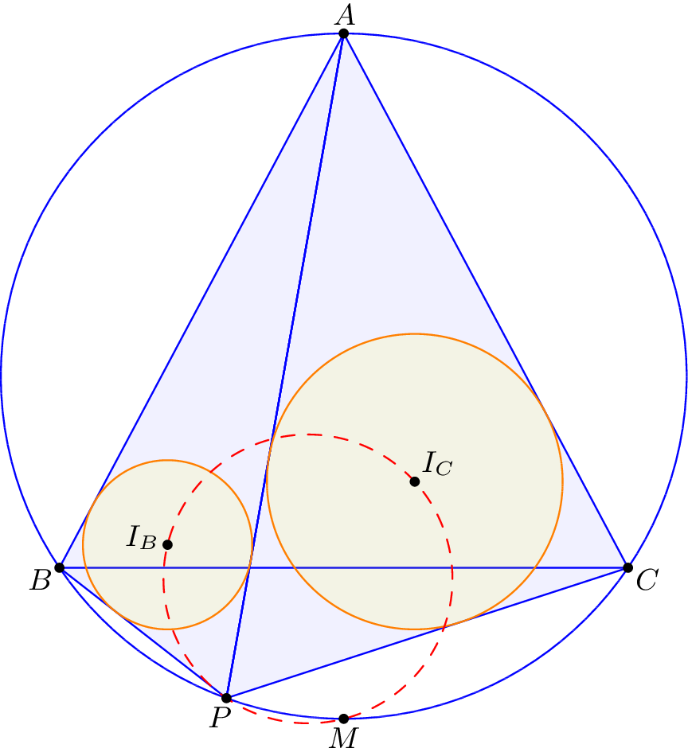
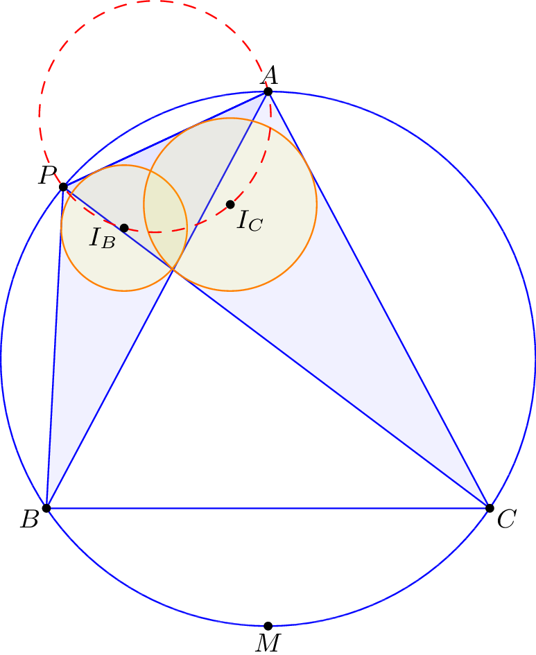
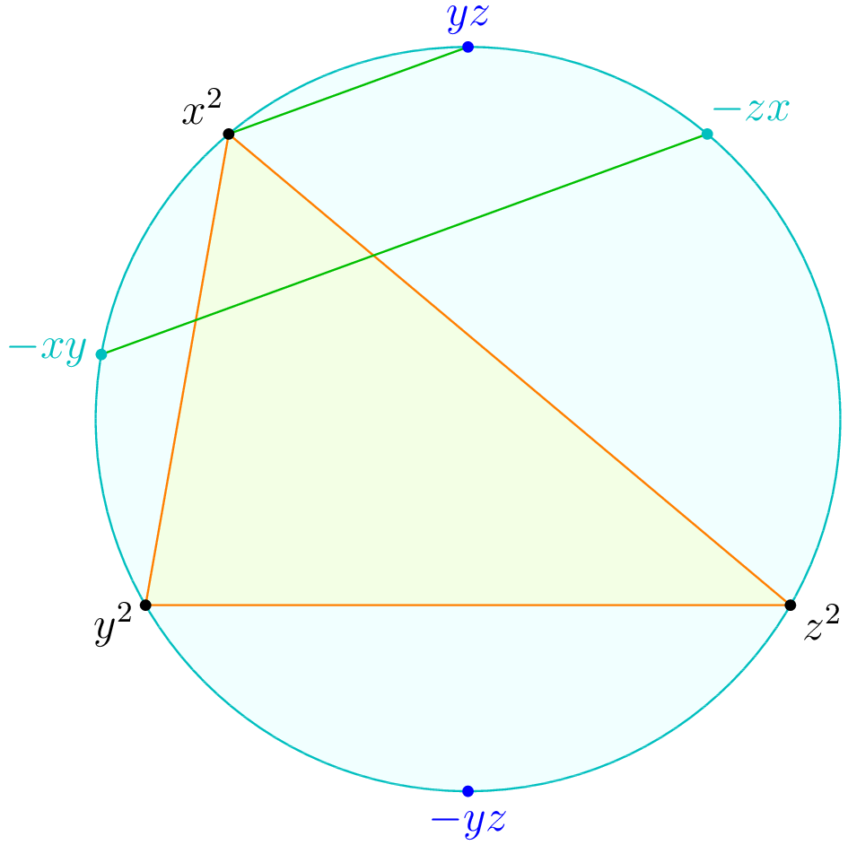
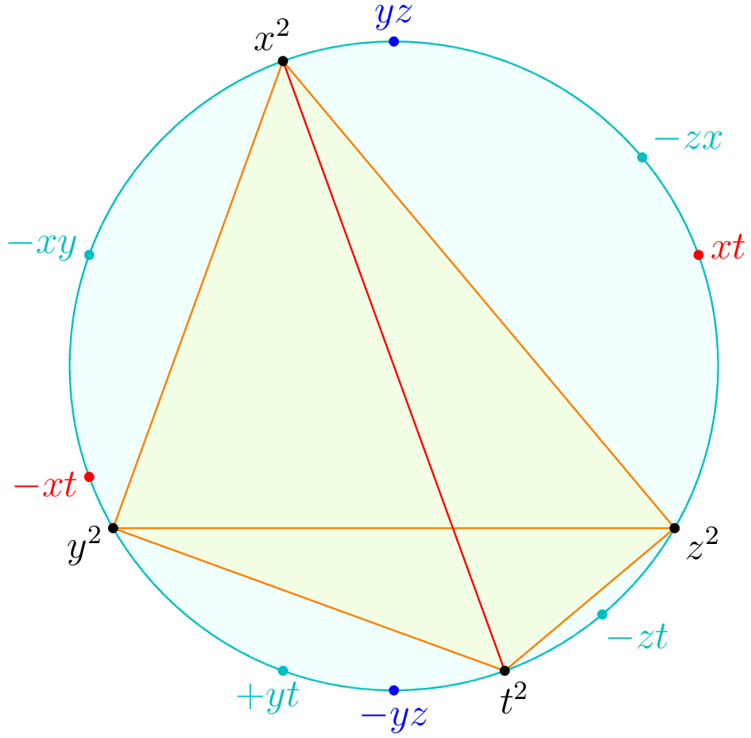
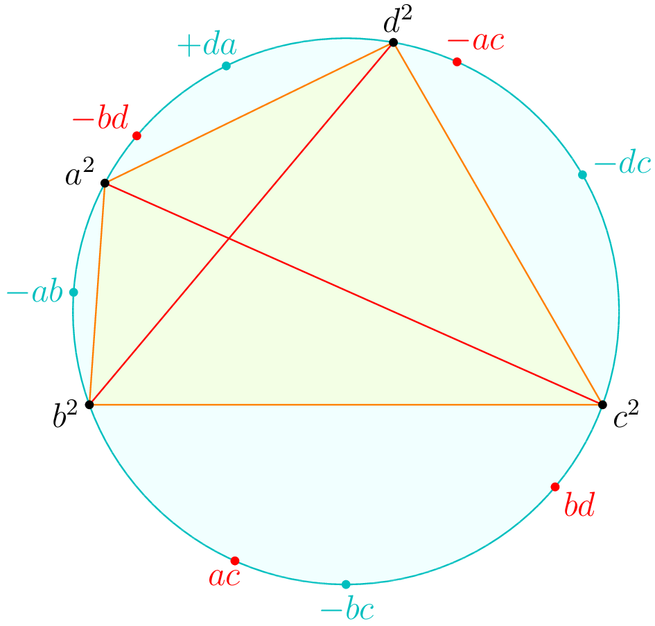

## 1. Synopsis

One of the major headaches of using complex numbers in olympiad geometry
problems is dealing with square roots.
In particular, it is nontrivial to express the incenter of a triangle inscribed
in the unit circle in terms of its vertices.

The following lemma is the standard way to set up the arc midpoints of a triangle.
It appears for example as part (a) of Lemma 6.23.

> **Theorem 1** **(Arc midpoint setup for a triangle)**
>
> 
> Let $ABC$ be a triangle with circumcircle $\Gamma$ and let $M_A$, $M_B$, $M_C$
> denote the arc midpoints of $\widehat{BC}$ opposite $A$, $\widehat{CA}$ opposite $B$,
> $\widehat{AB}$ opposite $C$.
>
> Suppose we view $\Gamma$ as the unit circle in the complex plane.
> Then _there exist_ complex numbers $x$, $y$, $z$
> such that $A = x^2$, $B = y^2$, $C = z^2$, and
> $$M_A = -yz, \quad M_B = -zx, \quad M_C = -xy.$$

[Theorem 1](#thmtriangle) is often used in combination with the following lemma,
which lets one assign the incenter the coordinates $-(xy+yz+zx)$ in the above notation.

> **Lemma 2** **(The incenter is the orthocenter of opposite arc midpoints)**
>
> Let $ABC$ be a triangle with circumcircle $\Gamma$ and let $M_A$, $M_B$,
> $M_C$ denote the arc midpoints of $\widehat{BC}$ opposite $A$, $\widehat{CA}$ opposite $B$,
> $\widehat{AB}$ opposite $C$.
> Then the incenter of $\triangle ABC$ coincides with the orthocenter of $\triangle M_A M_B M_C$.

Unfortunately, the proof of [Theorem 1](#thmtriangle) in my textbook is wrong,
and I cannot find a proof online (though I hear that _Lemmas in Olympiad Geometry_ has a proof).
So in this post I will give a correct proof of [Theorem 1](#thmtriangle),
which will hopefully also explain the mysterious introduction of the minus signs in the theorem statement.
In addition I will give a version of the theorem valid for quadrilaterals.

## 2. A Word of Warning

I should at once warn the reader that [Theorem 1](#thmtriangle) is an _existence result_,
and thus must be applied carefully.

To see why this matters, consider the following problem, which appeared as problem 1 of the 2016 JMO.

> **Example 3** **(JMO 2016, by Zuming feng)**
>
>  The isosceles triangle $\triangle ABC$, with $AB=AC$,
> is inscribed in the circle $\omega$.
> Let $P$ be a variable point on the arc $BC$ that does not contain $A$,
> and let $I_B$ and $I_C$ denote the incenters of triangles $\triangle ABP$ and $\triangle ACP$, respectively.
> Prove that as $P$ varies, the circumcircle of triangle $\triangle PI_{B}I_{C}$ passes through a fixed point.

By experimenting with the diagram,
it is not hard to guess that the correct fixed point is the midpoint of arc $\widehat{BC}$,
as seen in the figure below.
One might be tempted to write $A = x^2$, $B = y^2$, $C = z^2$, $P = t^2$
and assert the two incenters are $-(xy+yt+xt)$ and $-(xz+zt+xt)$,
and that the fixed point is $-yz$.

]

This is a mistake!
If one applies [Theorem 1](#thmtriangle) twice,
then the choices of "square roots" of the common vertices $A$ and $P$ may not be compatible.
In fact, they _cannot_ be compatible,
because the arc midpoint of $\widehat{AP}$ opposite $B$ is different from the
arc midpoint of $\widehat{AP}$ opposite $C$.

In fact, I claim this is not a minor issue that one can work around.
This is because the claim that the circumcircle of $\triangle P I_B I_C$ passes
through the midpoint of arc $\widehat{BC}$ is false if $P$ lies on the arc on the same side as $A$!
In that case it actually passes through $A$ instead.
Thus the truth of the problem really depends on the fact that the quadrilateral $ABPC$ is _convex_,
and any attempt with complex numbers must take this into account to have a chance of working.

]

## 3. Proof of the theorem for triangles

Fix $ABC$ now, so we require $A = x^2$, $B = y^2$, $C = z^2$.
There are $2^3 = 8$ choices of square roots $x$, $y$, $z$ we can take (differing by a sign);
we wish to show one of them works.

We pick an arbitrary choice for $x$ first.
Then, of the two choices of $y$, we pick the one such that $-xy = M_C$.
Similarly, for the two choices of $z$, we pick the one such that $-xz = M_B$.
Our goal is to show that under these conditions, we have $M_A = -yz$ again.

]

The main trick is to now consider the arc midpoint $\widehat{BAC}$, which we denote by $L$.
It is easy to see that:

> **Lemma 4** **(The isosceles trapezoid trick)**
>
>  We have
> $\overline{AL} \parallel \overline{M_B M_C}$ (both are perpendicular to the $\angle A$ bisector).
> Thus $A L M_B M_C$ is an isosceles trapezoid, and so $ A \cdot L = M_B \cdot M_C $.

Thus, we have
$$L = \frac{M_B M_C}{A} = \frac{(-xz)(-xy)}{x^2} = +yz.$$
Thus
$$M_A = -L = -yz$$
as desired.

From this we can see why the minus signs are necessary.

> **Exercise 5.** Show that [Theorem 1](#thmtriangle) becomes false if we try to use $+yz$, $+zx$,
> $+xy$ instead of $-yz$, $-zx$, $-xy$.

## 4. A version for quadrilaterals

We now return to the setting of a convex quadrilateral $ABPC$ that we encountered in [Example 3](#prjmo).
Suppose we preserve the variables $x$, $y$, $z$ that we were given from [Theorem 1](#thmtriangle),
but now add a fourth complex number $t$ with $P = t^2$. How are the new arc midpoints determined?
The following theorem answers this question.

> **Theorem 6** **($xytz$ setup)**
>
>  Let $ABPC$ be a convex quadrilateral inscribed in the
> unit circle of the complex plane.
> Then we can choose complex numbers $x$, $y$, $z$, $t$ such that $A = x^2$, $B = y^2$, $C = z^2$,
> $P = t^2$ and:
>
> - The opposite arc midpoints $M_A$, $M_B$, $M_C$ of triangle $ABC$ are given by $-yz$, $-zx$, $-xy$,
>   as before.
> - The midpoint of arc $\widehat{BP}$ not including $A$ or $C$ is given by $+yt$.
> - The midpoint of arc $\widehat{CP}$ not including $A$ or $B$ is given by $-zt$.
> - The midpoint of arc $\widehat{ABP}$ is $-xt$ and the midpoint of arc $\widehat{ACP}$ is $+xt$.

This setup is summarized in the following figure.

]

Note that unlike [Theorem 1](#thmtriangle),
the four arcs cut out by the sides of $ABCP$ do not all have the same sign (I
chose $\widehat{BP}$ to have coordinates $+yt$).
This asymmetry is inevitable (see if you can understand why from the proof below).

_Proof:_ We select $x$, $y$, $z$ with [Theorem 1](#thmtriangle).
Now, pick a choice of $t$ such that $+yt$ is the arc midpoint of $\widehat{BP}$ not containing $A$ and $C$.
Then the arc midpoint of $\widehat{CP}$ not containing $A$ or $B$ is given by
$$\frac{z^2}{-yz} \cdot (+yt) = -zt.$$
On the other hand, the calculation of $-xt$ for the midpoint of
$\widehat{ABP}$ follows by applying [Lemma 4](#lemtrapezoid) again (applied to triangle $ABP$).
The midpoint of $\widehat{ACP}$ is computed similarly. $\Box$

In other problems, the four vertices of the quadrilateral may play more
symmetric roles and in that case it may be desirable to pick a setup in which
the four vertices are labeled $ABCD$ in order.
By relabeling the letters in [Theorem 6](#thmxyzt) one can prove the following alternate formulation.

> **Corollary 7.** Let $ABCD$ be a convex quadrilateral inscribed in the unit circle of the complex plane.
> Then we can choose complex numbers $a$, $b$, $c$, $d$ such that $A = a^2$, $B = b^2$, $C = c^2$,
> $D = d^2$ and:
>
> - The midpoints of $\widehat{AB}$, $\widehat{BC}$, $\widehat{CD}$,
>   $\widehat{DA}$ cut out by the sides of $ABCD$ are $-ab$, $-bc$, $-cd$, $+da$.
> - The midpoints of $\widehat{ABC}$ and $\widehat{BCD}$ are $+ac$ and $+bd$.
> - The midpoints of $\widehat{CDA}$ and $\widehat{DAB}$ are $-ac$ and $-bd$.

]

To test the newfound theorem, here is a cute easy application.

> **Example 8** **(Japanese theorem for cyclic quadrilaterals)**
>
> In a cyclic quadrilateral $ABCD$, the incenters of $\triangle ABC$, $\triangle BCD$, $\triangle CDA$,
> $\triangle DAB$ are the vertices of a rectangle.
