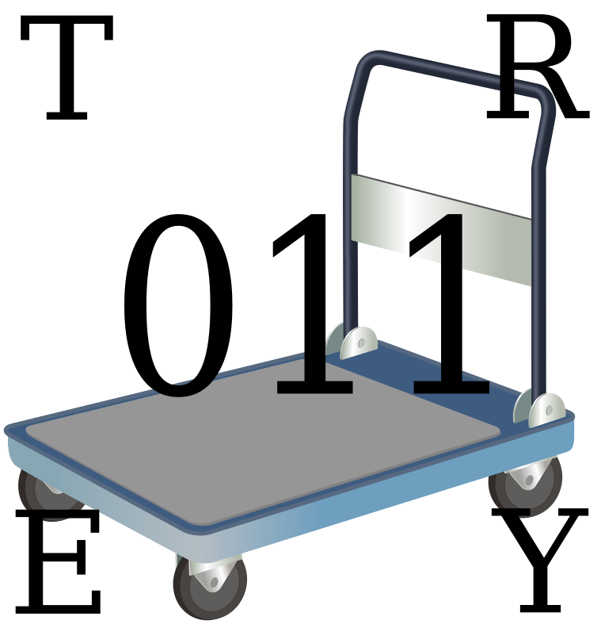
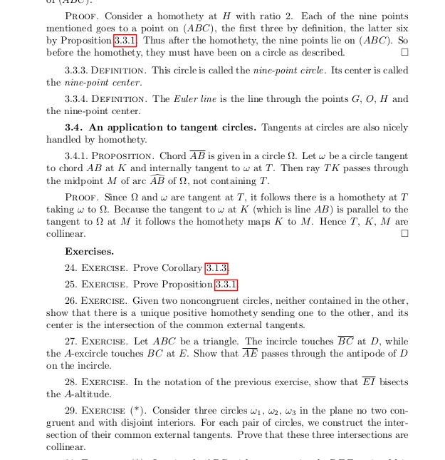

**tl;dr** I parodied my own book,
[download the new version here.](http://web.evanchen.cc/textbooks/tr011ey.pdf)

People often complain to me about how olympiad geometry
is just about knowing a bunch of configurations or theorems.
But it recently occurred to me that when you actually get down to its core,
the amount of specific knowledge that you need to do well in olympiad geometry is very little.
In fact I'm going to come out and say:
**I think all the theory of mainstream IMO geometry would not last even a one-semester college course**.

So to stake my claim, and celebrate April Fool's Day,
I decided to **actually do it**.
What would olympiad geometry look like if it was taught at a typical college?
To find out, I present to you the course notes for:

[**Undergrad Math 011: a firsT yeaR coursE in geometrY**](http://web.evanchen.cc/textbooks/tr011ey.pdf)

It's 36 pages long, title page, preface, and index included.
So, there you go. It is also the kind of thing I would never want to read,
and the exercises are awful, but what does that matter?

(I initially wanted to post this file as an April Fool's gag,
but became concerned that one would not have to be too gullible
to believe these were actual course notes and then attempt to work through them.)
