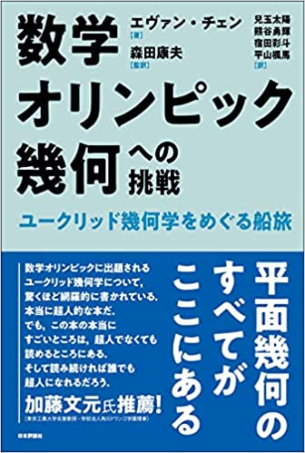

I'm happy to thank 日本評論社 and their team (Fuma Hirayama, Yuki Kumagae, Taiyo Kodama, Ayato Shukuta,
among others) for making the Japanese translation a reality.
As well as tripling the length of the errata PDF :)

This marks the second translation of the EGMO textbook (a Chinese translation
was published a while ago as well by Harbin Institute of Technology). Both linked below:

- **Japanese** translation at [nippyo.co.jp](https://www.nippyo.co.jp/shop/book/8967.html) and [amazon.co.jp](https://www.amazon.co.jp/dp/4535789789).
  ISBN-10: 4535789789 / ISBN-13: 978-4535789784.
- **Chinese** translation at [abebooks](https://www.abebooks.com/Euclidean-Geometry-Mathematical-OlympiadChinese-Edition-MEI/31089552348/bd)
  and [amazon](https://www.amazon.com/Euclidean-Geometry-Mathematical-Olympiad-Chinese/dp/7560395880).
  ISBN-10: 7560395880 / ISBN-13: 978-7560395883.
