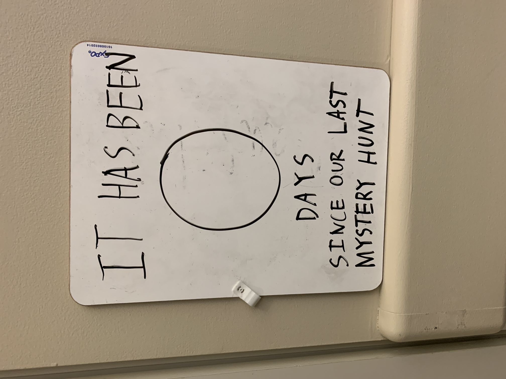
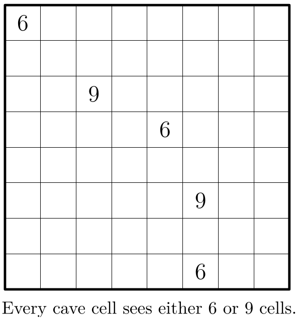
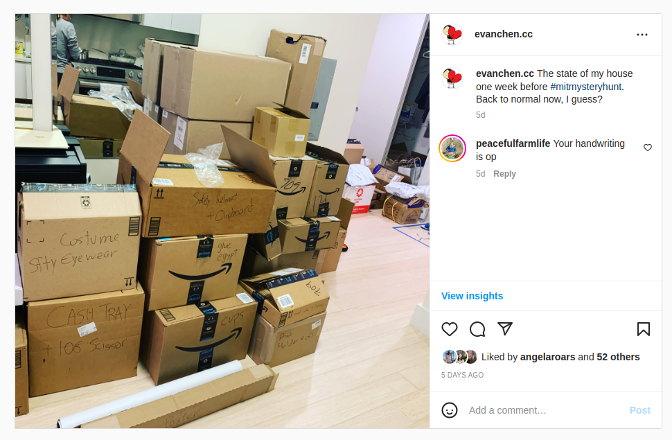
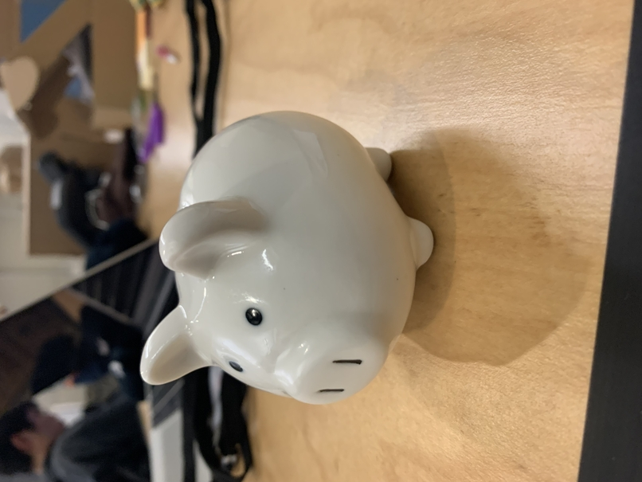

This is a retro-post for the [Mystery Hunt 2023](https://interestingthings.museum/),
for which I played a somewhat minor role on the organizing team (teammate).
You can play at [interestingthings.museum](https://interestingthings.museum/).

There is an ongoing list of write-ups about the hunt being kept at
[puzzles.wiki](https://www.puzzles.wiki/wiki/MIT_Mystery_Hunt_2023),
and you may also be interested in the
[reddit AMA from teammate](https://www.reddit.com/r/mysteryhunt/comments/10iq756/ama_we_are_the_members_of_teammate_the_writing).

## Puzzle shoutout list

### Favorite puzzles

The obligatory list.

- [Hall of Innovation round](https://interestingthings.museum/rounds/innovation)
- [You're Telling Me (Atrium)](https://interestingthings.museum/puzzles/youre-telling-me)
- [Showcase (Atrium)](https://interestingthings.museum/puzzles/showcase)
- [Lost to Time (Basement)](https://puzzlefactory.place/basement/lost-to-time)
- [5D Barred Diagramless with Multiverse Time Travel
  (Böotes)](https://puzzlefactory.place/puzzles/5d-barred-diagramless-with-multiverse-time-travel)
- [Subterranean Secrets (Basement)](https://puzzlefactory.place/basement/subterranean-secrets),
  but this puzzle required being on-campus

### Puzzles I am an author on

- [Much Ado About Nothing (Atrium)](https://interestingthings.museum/puzzles/much-ado-about-nothing)
- [Diagramless (Office)](https://puzzlefactory.place/office/diagramless), with Lumia Neyo.
- [Circuit (Basement)](https://puzzlefactory.place/basement/circuit), with Jacqui Fashimpaur.
- [Zambonis (Office)](https://puzzlefactory.place/office/zambonis), with Catherine Wu, Nicholai Dimov,
  and Steven Silverman
- [4D Geo (Wyrm)](https://puzzlefactory.place/puzzles/4d-geo), with Austin Lei, Moor Xu, and Nathan Wong
- [Flooded Caves (Wyrm)](https://puzzlefactory.place/puzzles/flooded-caves),
  with Alex Gotsis and Cameron Montag

## Also a cog in the machine

One of the editors-in-chief from 2021 was also teammate this year,
and in [his recap on Fort&Forge he wrote](https://fortenf.org/e/2023/01/18/mystery-hunt-2023.html):

> I recall telling Brian (one of our directors) that weekly newsletters were a
> great way to keep less active members of the team en gaged with hunt, only to
> find myself getting all of my information about hunt from these newsletters.
> As much as I tried to pay attention to what was going on, it was only when I
> arrived in Boston this past week to help out in person that I fully understood
> the structure of what we’d built.

… which is basically what happened to me as well, to a lesser scale.
I went from being a fairly enthusiastic writer in 2021
to a here-are-a-few-token-puzzles minion in 2023.
I just didn't have new ideas, in part because I used up a lot of ideas in 2021,
and in part because my life in 2022 was a hot mess for personal reasons.

Better luck next time, I guess, if there is a next time.

On the bright side, I got to learn how to use grilops,
and had way too much fun setting the logic-puzzle step of
[Flooded Caves](https://puzzlefactory.place/puzzles/flooded-caves).
Here's the first version of the 6/9 caves puzzle (that got nerfed like heck
because it turns out to be way too hard to do by hand):

### The puzzle-writing cycle

During the AMA I realized I didn't explain last year what the cycle
of writing a Mystery Hunt puzzle looked like,
so I'm reproducing my
[answer from reddit](https://www.reddit.com/r/mysteryhunt/comments/10iq756/comment/j5g7gul)
as I figured it'd be of interest:

We used [Puzzup](https://github.com/Palindrome-Puzzles/puzzup) to manage the
puzzle-writing process. The list of statuses that a puzzle can be in is
enumerated in[^slight] [status.py](https://github.com/Palindrome-Puzzles/puzzup/blob/main/puzzle_editing/status.py);
here is an overview

- **Initial idea**: Authors submit an idea through the website.
- **Idea in development**: Editors get assigned to the puzzle, and talk
  through with the author until there's enough of a coherent plan/prototype to
  start really writing.
- **Awaiting answer**: Editors assign an answer from the answer pool.
- **Writing**: Author works on the draft of the puzzle until it's in a ready
  state.
- **Testsolving**/**Revising**: Puzzle goes through testsolve-revise cycle. In
  general, we require every puzzle to have two _clean_ testsolves, so that's
  the minimum number of testsolve sessions each puzzle will normally go
  through, but if the puzzle changes a lot (e.g. the initial draft was too
  hard or broken in some way) then there may be more. Each testsolver also
  rates each puzzle on a scale of 1-6 for fun and difficulty and provides
  feedback.
- **Needs solution**: Author types up the solution completely, including
  things like break-ins or author notes or whatever.
- **Postproduction**: Puzzle and solution are reformatted into beautiful
  typescript/HTML/etc. to work with the website. (This is often done by
  someone other than the author.)
- **Factchecking**: Someone goes through the puzzle with a fine-tooth combo
  looking for things like typos, mistakes, inconsistent formatting, a11y
  issues like alt text, etc

[^slight]:
    The set of statuses for teammate was slightly different,
    this is the 2022 list.

The amount of time this takes varies a ton from puzzle to puzzle (I imagine in
a `stddev > mean` kind of way), mostly depending on how hard/complex the
puzzle is.

## Back to MIT

Hunt was in person again after three years!
And it was so different from 2021 as a result.

The hardest part of this was a lot more work, and hence a lot more stress.
At some point, I started bringing a heart plushie to campus with me
for emotional support throughout the weekend.

It turns out teammate only has a handful of members who were still
current MIT students, which meant I generally had to float around HQ
a lot in case of some unexpected situation that needed an MIT ID card,
like locked doors, or Athena printing, or needing to talk to MIT CAC, etc.
I took the morning shift, so I ended up sleeping from 8pm-5am most days
of the hunt, then coming to campus to unlock the Bush room at 6am.
And then, since I wasn't deeply involved with hunt or tech,
while on call at HQ I was mostly confined to answering hint requests and the
like for most of the day while more critical work was being done by the
tech leads, editors-in-chief, and so on.
So I ended up doing the field-puzzles-check
(make sure all the location-specific puzzles are intact)
multiple times as an excuse to get out of the HQ, which was a lot of fun
(I found myself jealous I didn't get to do Subterranean Secrets as a solver).

I also got designated as the delivery point in Boston for packages,
so there was a week when my entire home was just overflowing with packages.
Which I actually didn't mind, because it was so cool watching
all the props and physical puzzles and coins and so on trickle in.
But it meant I had a lot of carrying stuff to do once the weekend came.
Like three of the five monitors in the final runaround. :)

Of course, the hunt _itself_ felt amazing in person.
It's been too long since I got to see the opening skit,
or the crowd of solvers at wrap-up,
or to barge in on teams chastising them for ruining Mystery Hunt.

But the best part of being in person was definitely getting to finally see all
my teammate's beautiful faces, some after many years, and many for the first
time. I think this alone made all the extra work worth it, many times over.

(Also, the inflatable pickaxe from opening was really fun to swing around.)

## Yes, the hunt was too hard, we know

Keeping this short because I don't want to keep beating the extremely dead horse.
The one thing I want to add is:
I'm not convinced the issue was solely at the level of individual puzzles.
Indeed, our testsolve process looked (to me) basically the same as in 2021.

Because there is no one person that testsolves every puzzle in the hunt,
or even close. In an ideal world, you could do full-hunt testsolves,
but we are simply too far from that ideal world in terms of the number
of person-hours from unspoiled participants to pull this off.
In other words, most individual puzzles I saw felt defensible
(with the disclaimer I also have only seen a small fraction of the puzzles),
and the problem was that the puzzles were _on average_ too hard.

I think in hindsight, what would have helped was to be more vigilant
at the scope of _entire rounds_ about intended difficulty,
rather than blaming individual feeder puzzles.
Repeating from one of the
[threads on Reddit](https://www.reddit.com/r/mysteryhunt/comments/10iq756/comment/j5h005a/)
about the design of the Museum (the opening act):

> We internally had labels for the round an answer was in, but the Museum was
> made of 5 rounds and the ordering of those rounds in the Museum hadn't been
> determined yet. My sense is that each of the 5 rounds ended up with similar
> difficulty, which didn't leave great options for which one to present first
> once it was time to decide unlock order. …
> In retrospect it would have been better to lock in the Museum round order
> earlier, or designate one round as specifically "this is the round teams will
> see first, make sure it is especially easy for Act 1".

And that's how
[Much Ado About Nothing](https://interestingthings.museum/puzzles/much-ado-about-nothing)
ended up on the intro round,
much to my horror when I found out on Friday morning.

There's a quote from Chris Petey I really like that goes:
_the most competent people, with weak processes, will screw up_.
It's not enough to say "teammate's editors should've known better":
the Atrium round was in trouble long before the feeders were ever written.

## Ending thoughts

Many hugs. Much love. Thank you teammate.

