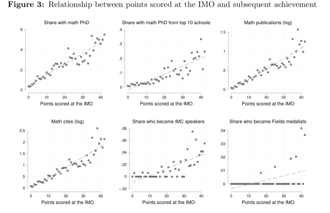
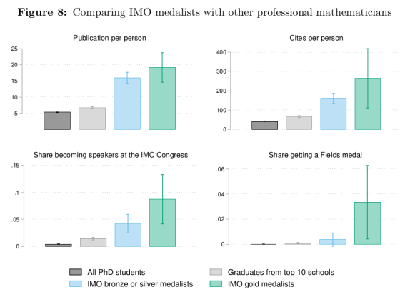
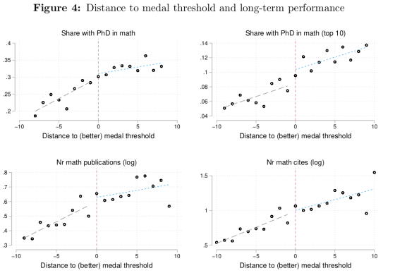

There's a recent working paper by economists [Ruchir
Agarwal](https://www.imf.org/en/Publications/Publications-By-Author?author=Ruchir++Agarwal&name=Ruchir%20%20Agarwal)
and [Patrick Gaule](https://www.imf.org/en/Publications/Publications-By-Author?author=Patrick++Gaule&name=Patrick%20%20Gaule) which
I think would be of much interest to this readership:
a systematic study of IMO performance versus success as a mathematician later on.

[Here is a link to the working paper](https://www.imf.org/~/media/Files/Publications/WP/2018/wp18268.ashx).

Despite the click-baity title and dreamy introduction about the Millennium Prizes,
the rest of the paper is fascinating, and the figures section is a gold mine.
Here are two that stood out to me:

There's also one really nice idea they had,
which was to investigate the effect of getting one point less than a gold medal,
versus getting exactly a gold medal.
This is a pretty clever way to account for the effect of the prestige of the IMO,
since "IMO gold" sounds so much better on a CV than "IMO silver" even though in
any given year they may not differ so much.
To my surprise, the authors found that "being awarded a better medal appears to
have no additional impact on becoming a professional mathematician or future knowledge production".
I included the relevant graph below here.

The data used in the paper spans from IMO 1981 to IMO 2000.
This is before the rise of Art of Problem Solving and the Internet
(and the IMO was smaller back then, anyways),
so I imagine these graphs might look different if we did them in 2040
using IMO 2000 - IMO 2020 data,
although I'm not even sure whether I expect the effects to be larger or smaller.

(As usual: I do not mean to suggest that non-IMO participants cannot do well in math later.
This is so that I do not get flooded with angry messages [like last
time](/mantra).)
