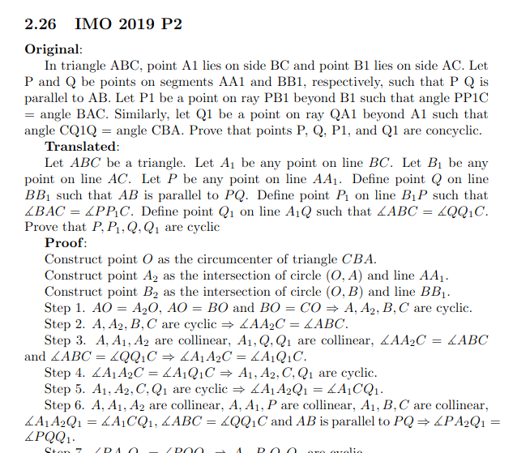
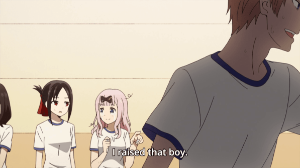

Here's a mix of several publicity-related things I'd like to broadcast.

## AlphaGeometry

A lot of you have already heard the buzz about the
[AlphaGeometry news](https://deepmind.google/discover/blog/alphageometry-an-olympiad-level-ai-system-for-geometry/)
and [Nature paper](https://www.nature.com/articles/s41586-023-06747-5).
(I've known about this paper for a while now,
so I'm glad I can finally talk about it!)

I managed to snag a cameo in the DeepMind post where I wrote

> AlphaGeometry's output is impressive because it's both verifiable and clean.
> Past AI solutions to proof-based competition problems have sometimes been
> hit-or-miss (outputs are only correct sometimes and need human checks).
> AlphaGeometry doesn't have this weakness: its solutions have
> machine-verifiable structure. Yet despite this, its output is still
> human-readable. One could have imagined a computer program that solved
> geometry problems by brute-force coordinate systems: think pages and pages of
> tedious algebra calculation. AlphaGeometry is not that. It uses classical
> geometry rules with angles and similar triangles just as students do.

I want to point out that those of you with geometry training
can actually read (and verify by hand) the proofs for yourselves in the
[Supplementary Info section of the
paper](https://static-content.springer.com/esm/art%3A10.1038%2Fs41586-023-06747-5/MediaObjects/41586_2023_6747_MOESM1_ESM.pdf).
As I promised, _they're not coordinate bashes_!
It's all cyclic quadrilaterals, angle chasing, similar triangles
(that is, first few chapters of EGMO).

The other thing you'll see right away is that it's not ChatGPT type output,
but more like a two-column proof that can be 100% verified mechanically.
As I understand the overall strategy for solving was to use two systems:

1.  Use the neural net / language models to brainstorm some ideas for auxiliary
    points to construct (these are the 0–3 steps at the start that say
    "Construct so-and-so"),
2.  Use a symbolic deduction engine to do the angle chasing and so on (these are
    the steps numbered Step 1, Step 2, …

So there's less LLM in this paper than you might expect.
That was in my opinion the main breakthrough: the idea you can combine
both the newer neural net technology with the lower-level deduction system
rather than try to rely on just one system alone.

## OTIS Mock AIME 2024 has concluded

The OTIS Mock AIME 2024 has concluded. I probably spent way too much time on the
final report, which you can find in the links below:

- [2024 problems](/exams/OTIS-Mock-AIME-2024.pdf)
- [2024 solutions, statistics, and comments](/exams/sols-OTIS-Mock-AIME-2024.pdf)

This Friday evening I'll also livestream a presentation of the problems and
solutions and add that link into the report over the weekend.

## Program/camp announcements

- Female and non-binary high school students can now apply to
  [Athemath](https://athemath.org/) for Spring 2024.
  The deadline is 27 Jan 2024 at 11:59pm Eastern time.
  The spring session for this year looks to be a lot larger and broader in
  scope than in past years; see
  [the catalog](https://athemath.org/html/catalog/catalog-4.html).

  Meanwhile, [G2](https://www.g2mathprogram.org/home) has also announced its
  dates for 20 Jul - 2 Aug 2024 at Mass Tech.
  Their application will run from 23 Feb to 31 Mar.

- Applications for [SPARC 2024](https://www.sparc.camp/apply) are now open.
  The deadline is 11 Feb 2024 at 11:59pm Eastern time.

## TST Leadership

Last Sunday night I announced internally that after TSTST 2024 I will finally be
fully handing off the leadership for setting the USA team selection tests
to Andrew Gu, Gopal Goel, and Luke Robitaille.
This transition process has already been underway for a few years
(in which I made almost no important decisions and
mostly helped ferry along logistics and onboard new names),
and at this point I finally feel confident officially retiring.
I expect no one will notice any changes in the TST problems and solutions
besides the solution packet now having 3 names instead of 4 in the author line.

Here's an excerpt from the internal announcement that I want to share:

(begin quote)

A bit of backstory for the younger folks on how we got here. I've been training
students for math olympiads for a long time now, so it never felt quite right I
was also so deeply involved in setting the exam. But many years ago the USA TST
system was not self-sufficient. There was no mailing list, no selection process,
and not enough contributors or problem proposals…

Ten years later the scene is totally different. We have a well-developed review
timeline and process, together with tireless, super-energetic crowd of
volunteers (that's you!) to provide the inputs. I suppose this is how a parent
feels when their child has finally grown old enough to leave home and fly free.

It has been an honor to serve this community. Thank you.

(end quote)
