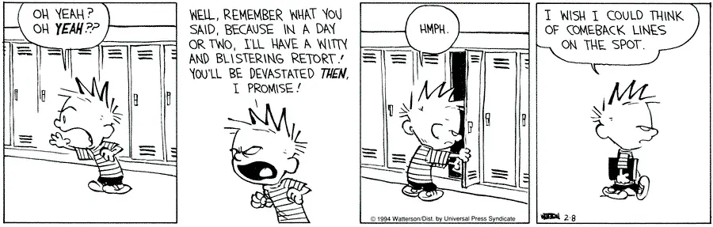

The [2026 American Masters in Math](/amm-2026)
took place from May 22 to 24, 2026.

On the whole it went better than I expected.
Because from the insider view, working with OMEGA reminded me a bit of…
okay, let me make up an analogy.
You know how [AlphaGo](https://w.wiki/R6aZ)
often wins its games by just a few points, but always wins?

This AMM reminded me of that.
Things often happened at the last possible moment,
yet still technically in time.[^sw]
So things _seemed_ haphazard on the inside,
and I was quite stressed most of May.
But somehow in the end it all worked.

[^sw]: Scores when?

It's also hard for me to overstate how much of AMM 2026 rested on Yia's shoulders.
Up until April or so, it felt that Yia was singlehandedly
doing everything except the exam problems.
(She did _eventually_ get help: I thank Hong Liu, Kathy Lin, Walter Stromquist,
and Jeffrey Yu, for example.)
A lot of parents thanked me for running AMM,
but I really felt I wasn't the most important organizer, not even close.

Anyway, here are some quick thoughts in my head.

## The problems turned out well

I was happy with the way the problems turned out,
both in terms of attractiveness and difficulty distribution.
Problems 2 and 3 were a bit tougher than I expected;
problems 4 and 5 a bit easier,
but there were a lot of points given out on 2a and 3a
and so overall I felt we did pretty well on the difficulty gradient.

During the AMM 2026 event, I gave a short presentation showing
a bit of behind-the-scenes of the problem-writing process
and the solutions we had in mind.
I've now [uploaded those slides here](./media/amm2026-testrvw.pdf).
Some highlights:

- We basically had the first draft of the test after less than 3 weeks.
  I'm grateful that next year's test development schedule will
  follow a normal pace because I never want that kind of timeline again.
- AMM2 was our experimental "bit of real analysis problem".
  The original version of the problem was much more technical,
  where each $x \in \mathbb{R}$ could have a different (finite) period,
  and the problem was to determine all possible period assignments.
  We eventually just made all the periods divide $2026$
  so that the statement wasn't so bulky,
  without really losing any content in the solution.
  Since P2 still ended up being a bit tougher than we wanted,
  that was definitely the right call.
- I still find it hilarious how many primes get used up in AMM 3.

And on the topic of last-minute:
I started writing the slides 7 minutes before the presentation started.
That's also a record for me.

## Events

In my last post I advertised AMM would be 4.5 hours exam and 15-20 hours festival.
That's what happened; we had a lot of events on Sunday.
We actually had even more potentially lined up,
and had to cut some out to keep the schedule from being too overwhelming.

I'm a bit sad I actually didn't get to see most of the events besides helping
run [the OMEGA puzzle hunt](https://hunt.omegausa.org/)
(for which working with Wil Zambole was phenomenal).
Happily, what I've heard through the grapevine has been pretty positive.

## Review sessions

Review sessions were the big question-mark experiment for AMM 2026.
Even by the Sunday of the event,
I think nobody really knew what the review sessions were going to be like
or how they were going to turn out.
We even had issues with reviewers not knowing which problem they'd been
assigned to for the sessions
(since it didn't always match the problem they graded).

But scheduling snafu aside, it seems the review sessions worked.
We found that people were often interested in having solutions explained
to them for problems they didn't finish,
or just chatting about math and life later on.

Now I think OMEGA has a much better idea of how to run these.
So I'm hoping next year's review sessions we'll be more prepared,
and do even better.

## I'm still not a good speaker

During the event I got called into some fireside chats
and podcasts and whatnot, where I got to <s>cosplay as a wise adult</s>
speak to big audiences about my thoughts.

I always feel out of place because I'm actually not a great speaker.
I'm usually too pessimistic. I ramble a lot.
And I tend to get nervous and start speaking so quickly
that even native English speakers can't keep up.[^stop]

[^stop]:
    I've actually had mentors who would stop me after the first minute
    of a presentation to tell me to get ahold of myself.

But the most frustrating thing is that
**when speaking, I never get everything right**.
There's always things I wish I'd said differently
that I'm still kicking myself for the next day.
Kind of like Calvin with comeback lines:

AMM 2026 was no exception.
If you're curious to know what answers I want to change,
here are two that I still remember weeks later:

### "What are we missing?"

Richard Rusczyk asked us the question "what are we missing?" in the ecosystem.
I think I mumbled something unintelligible about proofs.

But really the answer I wish I had given was: "**what do we even have?**".
Because when you really look at it, I feel like, it's pretty hard to _not_ see the gaps.
It's really the opposite of startup world where you need insight
to identify a problem that nobody else sees.

- The AMC/AIME/USAMO series exists, but, well… since you're reading this blog,
  I think I'll just hand you a [blank piece of paper](https://w.wiki/R6PK).

- We know that math is _way_ more interesting when you have proofs
  instead of problems that just ask for a number.
  And yet there are few opportunities for typical high schoolers
  to get feedback on proofs on anything remotely resembling a regular basis.[^ai]
  There's like, [USEMO](https://web.evanchen.cc/usemo.html)
  and [USAMTS](https://usamts.org/) and [BAMO](https://www.bamo.org/), I guess.
  (And AMM!)
  But this is like, a few times a year by default.
  I genuinely don't know what to tell students or parents who ask me
  how they can get feedback when learning how to write proofs.[^np]

- Applying for math summer camps is a nightmare these days;
  supply $\ll$ demand.
  Here's a quote I remember seeing from one organizer:

  > I think that all of the summer programs are acutely aware of how abysmally
  > low our admittance rates are, and we are hoping to help foster more programs
  > to fit the high demand for attendance. Unfortunately, many of us have upper
  > limits on program capacity and keep having unforeseeable jumps in
  > application numbers annually. For my part (and I think many others in the
  > summer math program world would agree), I would love it if the math program
  > community had enough opportunities to provide a good fit for everyone who
  > wants to spend their summer doing math. But there aren't that many of us and
  > currently there's much higher demand than we can serve.

- We don't even really have that many good classes during the school year.
  I run [OTIS](https://web.evanchen.cc/otis.html) for the top contest kids,
  and [AoPS has their catalog](https://artofproblemsolving.com/school).
  But what if, say, you want to go to a physical classroom,
  and work with a mentor in real life?
  Well, [hope you live near a math circle that's still running](https://mathcircles.org/map).[^berkeley]

- Almost all these things happen outside typical schools,
  which are not only irrelevant but often [actively harmful](/silver).
  If you want to really study math deeply in high school,
  you often end up living two lives.

(… Did I mention I tend to be overly pessimistic?)

[^ai]:
    Maybe this is something AI can eventually help with?
    So far in cases I've tested, it's not reliable enough yet.

[^np]:
    I just link them to
    [my handout](https://web.evanchen.cc/handouts/NaturalProof/NaturalProof.pdf) instead.

[^berkeley]:
    I was very sad to hear what happened
    to the [Berkeley Math Circle](https://www.dailycal.org/news/campus/academics/macarthur-fellows-olympiad-gold-medalists-grieve-loss-of-berkeley-math-circle/article_554b04ce-0c05-41cf-b0df-75ed42732e6e.html).

### Phillips Exeter Academy

During the podcast, Zuming talked a bit about how it's really okay if you
go to a "normal" school instead of HYPSM or whatever.
That would have been a good chance for me to talk about my Exeter story,
where getting rejected from Exeter turned out to be one of the best things
that happened to me in high school. But I didn't interject in time.

The Exeter story is probably going to be its own blog post later.
I'll link it back here once that's done.

## My favorite moment of AMM

I remember walking back from the Holey Moley venue,
and hearing one participant say to her friend, "life is really good right now".
That meant a lot to me.

In my [post introducing AMM](/amm-2026), I quoted Linus Torvalds,
talking about how I wanted AMM 2026 to be small[^size]: do one thing well.
Like Linus, I don't consider myself a visionary;
I don't even have a one-year plan, let alone a five-year plan.
My work style has always been to just build small things that solve immediate
needs with fast feedback cycles.[^research]
Seeing how much the participants enjoyed the event was what closed the
feedback cycle for AMM 2026 for me.

## Thanks

And of course, thanks to the many of you that signed my 30th birthday card
that I received while helping run the closing ceremony.
It was a nice touch.

[^size]:
    Actually I'm glad we only had ~200 contestants.
    I'm not sure we could have handled 400, despite venue capacity.

[^research]:
    That was one of the things I disliked about math research.
    For open problems, feedback cycles are often slow.
