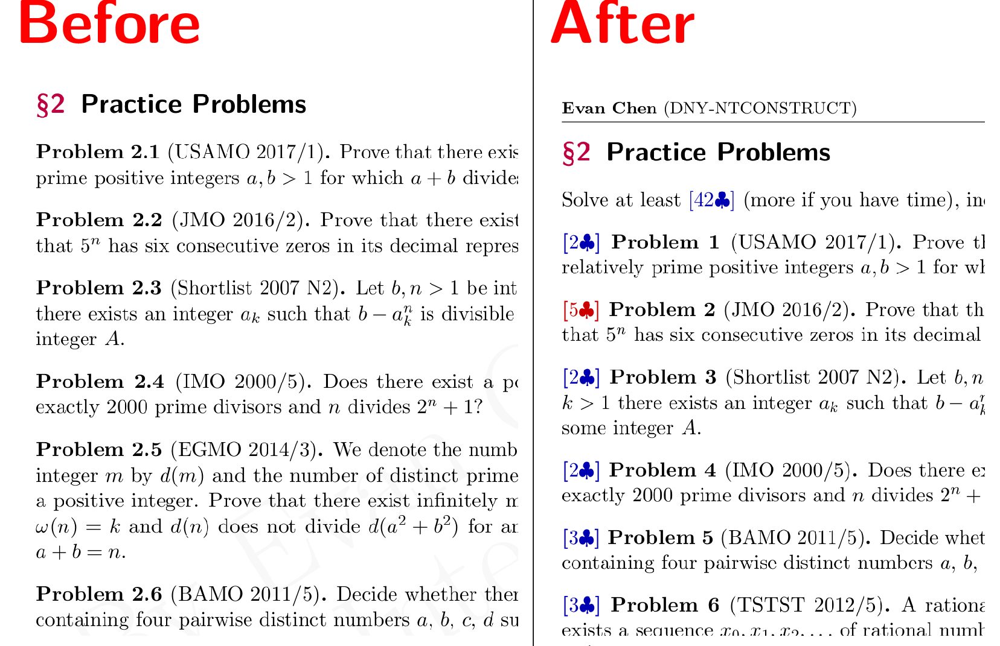

> It's not uncommon for technical books to include an admonition from the author
> that readers must do the exercises and problems. I always feel a little peculiar when I read such warnings.
> Will something bad happen to me if I don't do the exercises and problems? Of course not.
> I'll gain some time, but at the expense of depth of understanding. Sometimes that's worth it.
> Sometimes it's not.
>
> --- Michael Nielsen, [Neural Networks and Deep Learning][nndl]

[nndl]: http://neuralnetworksanddeeplearning.com/exercises_and_problems.html

## 1. Synopsis

I spent the first few days of my recent winter vacation transitioning all the
problem sets for [my students](http://web.evanchen.cc/otis.html) from a
"traditional" format to a "point-based" format. Here's a before and after.

Technical specification:

- The traditional problem sets used to consist of a list of 6-9 olympiad problems of varying difficulty,
  for which you were expected to solve all problems over the course of two weeks.
- The new point-based problem sets consist of 10-15 olympiad problems, each weighted either 2, 3, 5,
  or 9 points, and an explicit target goal for that problem set.
  There's a spectrum of how many of the problems you need to solve depending on
  the topic and the version (I have multiple difficulty versions of many sets),
  but as a rough estimate the goal is maybe 60%-75% of the total possible points on the problem set.
  Usually, on each problem set there are 2-4 problems which I think are especially nice or important,
  and I signal this by coloring the problem weight in red.

In this post I want to talk a little bit about what motivated this change.

## 2. The old days

I guess for historical context I'll start by talking about why I _used_ to have a traditional format,
although I'm mildly embarrassed at now, in hindsight.

When I first started out with designing my materials, I was actually basically always _short_ on problems.
Once you really get into designing olympiad materials, good problems begin to feel like tangible goods.
Most problems I put on a handout are ones I've done personally, because otherwise,
how are you supposed to know what the problem is like?
This means I have to actually solve the problem, type up solution notes,
and then decide how hard it is and what that problem teaches.
This might take anywhere from 30 minutes to the entire afternoon, _per problem_.
Now imagine you need 150 such problems to run a year's curriculum,
and you can see why the first year was so stressful.
(I was very fortunate to have paid much of this cost in high school;
I still remember many of the problems I did back as a student.)

So it seemed like a waste if I spent a lot of time vetting a problem and then my students didn't do it,
and as practical matter I didn't have enough materials yet to have much leeway anyways.
I told myself this would be fine: after all, if you couldn't do a problem,
all you had to do was tell me what you've tried, and then I'd walk you through the rest of it.
So there's no reason why you couldn't finish the problem sets, right? (Ha. Ha. Ha.)

Now my problem bank has gotten much deeper, so I don't have that excuse anymore.[^excuse]

[^excuse]:
    The other reason I used traditional problem sets at first was that I wanted
    to force the students to at least try the harder problems.
    This is actually my main remaining concern about switching to point-based problem sets:
    you could in principle always ignore the 9-point problems at the end.
    I tried to compensate for this by either marking some 9's in red,
    or else making it difficult to reach the goal without solving at least one 9.
    I'm not sure this is enough.

## 3. Agonizing over problem eight

But I'll tell you now that even before I decided to switch to points,
one of the biggest headaches was always whether to add in that an eighth problem
that was really nice but also difficult.
(When I first started teaching,
my problem sets were typically seven problems long.) If you looked at the TeX
source for some of my old handouts,
you'll see lots of problems commented out with a line saying "too long already".

Teaching OTIS made me appreciate the amount of power I have on the other side of
a mentor-student relationship.
Basically, when I design a problem set, I am making decisions on behalf of the student:
"these are the problems that I think you should work on".
Since my kids are all great students that respect me a lot, they will basically do whatever I tell them to.

That means I used to spend many hours agonizing over that eighth problem or whether to punt it.
Yes, they'll learn a lot if they solve (or don't solve) it,
but it will also take them another two or three hours on top of everything else they're already doing
(OTIS, school, trumpet, track, dance, social, blah blah blah).
Is it worth those extra hours? Is it not?
I've lost sleep over whether I made the right choice on the nights I ended up adding that last hard problem.

But in hindsight the right answer all along was to just let the students decide for themselves,
because unlike your average high-school math teacher in a room of decked-out slackers,
I have the best students in the world.

## 4. The morning I changed my mind

As I got a deeper database this year and commented more problems out,
I started thinking about point-based problem sets.
But I can tell you the exact moment when I decided to switch.

On the morning of Sunday November 5,
I had a traditional problem set on my desk next to a [point-based
one](http://math.mit.edu/classes/18.785/2017fa/ProblemSet8.pdf).
In both cases I had figured out how to do about half the problems required.
I noticed that the way the half-full glass of water looked was quite different between them.
In the first case, I was freaking out about the other half of the problems I hadn't solved yet.
In the second case, I was trying to decide which of the problems would be the most fun to do next.

Then I realized that OTIS was running on the traditional system,
and what I had been doing to my students all semester!
So instead of doing either problem set I began the first prototypes of the points system.

## 5. Count up

I'm worried I'll get misinterpreted as arguing that students shouldn't work hard.
This is not really the point.
If you read the specification at the beginning carefully,
the number of problems the students are solving is actually roughly the same in both systems.

It might be more psychological than anything else:
**I want my kids to count how many problems they've solved, not how many problems they haven't solved**.
Every problem you solve makes you better. Every problem you try and don't solve makes you better, too.
But a problem you didn't have time to try doesn't make you worse.

I'll admit to being _mildly pissed off_ at high school for having built this
particular mindset into all my kids.
The straight-A students sitting in calculus BC aren't counting how many
questions they've answered correctly when checking grades. They're counting how many points they lost.
The implicit message is that if you don't do nearly all the questions,
you're a _bad person_ because you didn't try hard enough and you _won't learn
anything this way_ and _shame on you_ and…

That can't possibly be correct. Imagine two calculus teachers A and B using the same textbook.
Teacher A assigns 15 questions of homework a week, teacher B assigns 25 questions.
All of teacher A's students are _failing_ by B's standards.
Fortunately, that's not actually how the world works.

For this reason I'm glad that all the olympiad kids report their performance as
"I solved problems 1,2,4,5" rather than "I missed problems 3,6".

## 6. There are no stupid or lazy questions

The other wrong assumption I had about traditional problem sets was the bit
about asking for help on problems you can't solve.
It turns out getting students to ask for help is a struggle.
So one other hope is that with the point-based system is that if a student tries a problem, can't solve it,
and is too shy to ask, then they can switch to a different problem and read the solution later on.
No need to get me involved with every single missed problem any more.

But anyways I have a hypothesis why asking for help seems so hard (though there
are probably other reasons too).

You've all heard the teachers who remind students to always ask questions during lectures[^snapchat],
because it means someone else has the same question.
In other words: don't be afraid to ask questions just because you're afraid you'll look dumb,
because "**there are no [stupid questions](https://artofproblemsolving.com/articles/stupid-questions)**".

[^snapchat]:
    But if my question is "I zoned out for the last five minutes because I was
    responding to my friends on snapchat, what just happened?",
    I don't think most professors would take too kindly.
    So it's not true literally all questions are welcome in lectures.

But I've **rarely heard anyone say the same thing about problem sets**.

As I'm writing this, I realize that this is actually the reason I've never been
willing to go to office hours to ask my math professors for help on homework problems I'm stuck on.
It's _not_ because I'm worried my professors will think I'm dumb.
It's because **I'm worried they'll think I didn't try hard enough** before I
gave up and came to them for help, or even worse, that I just care about my grade.
You've all heard the [freshman biology](https://ocw.mit.edu/courses/biology/7-012-introduction-to-biology-fall-2004/)
TA's complain about those kids that just come and ask them to check all their pset answers one by one,
or that come to argue about points they got docked, or what-have-you.
I didn't want to be that guy.

Maybe this shaming is intentional if the class you're teaching is full of
slackers that don't work unless you crack the whip.[^3091]
But if you are teaching a math class that's half MOPpers,
I _seriously_ don't think we need guilt-trips for these kids whenever they can't solve a USAMO3.

[^3091]:
    As an example, the [3.091](http://web.mit.edu/3.091/) class policies
    document includes [FAQ]({static}/media/3091.png)
    such as "that sounds like a lot of work, is there a shortcut?",
    "but what do I need to learn to pass the tests?", and "but I just want to pass the tests…".
    Also an entire paragraph explaining why skipping the final exam makes you a terrible person,
    including reasons such as "how you do anything is how you do everything",
    "students earning A's are invited to apply as tutors/graders",
    and "in college it's up to you to take responsibility for your academic career", and so on ad nauseum.

So for all my students, here's my version of the message:
**there are no stupid questions, and there are no lazy questions**.
