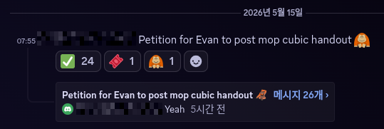

## Cubics

Last summer I taught a lecture at [MOP](https://web.evanchen.cc/mop.html)
about curves of degree higher than $2$.
I finally posted the
[handout from that lecture](https://web.evanchen.cc/handouts/cubics/cubics.pdf)
on my website, because a lot of students have been asking me repeatedly,
and one of my students went so far as to start a petition.

I am of course flattered and grateful for the enthusiasm.
But there was a reason I didn't post it.

## Theater

That reason comes down to the
[following quote from my 2023 post](/otis):

> You'll notice that I've started using words like "delivery" or "performance",
> and that's deliberate. To do lectures well, you need to rehearse things
> like not saying "um", choosing really flashy or shiny topics,
> managing blackboard space, keeping an audience engaged,
> and cutting out content to streamline the presentation
> (whereas in writing, you can e.g. put digressions in footnotes).

As the story goes, I finally agreed to teach a few slots for MOP 2025
(after a few years of not teaching any classes).
So I needed to come up with a classroom activity that would last 90 minutes,
would be memorable and engaging, make for a good story, etc.

The Cubics class was exactly what I described in my quote.
Almost nobody had studied this particular material before.
It has a small, narrow scope that fits in a 90-minute lecture.
I had prepared a narrative that made it flow into a nice chalk talk.[^handout]
And it's fun and flashy and lets students write home about how you learned
a bit of algebraic geometry and used it to trivialize Pascal's theorem.

[^handout]:
    In fact, for an in-person lecture,
    you actually want the handout to be a skeleton without details,
    so people pay attention to the speaker.
    Posting this handout required me to
    [add back in the deliberately omitted information][diff].

[diff]: https://github.com/vEnhance/web.evanchen.cc/commit/8c7285c9e5c233158ab24c5deb72124ed0d59f88

That means I had a selfish reason to not post it:
that would make it difficult to use the lecture again in future years of MOP,
because the spoilers would kill the theatrical aspect.
Movies work best when everyone is seeing it for the first time together.
It's like how Darth Vader's famous line "I am your father"
[only works if you haven't been spoiled yet][movie].

## Letting go

Well, it turns out I'm not teaching at MOP anymore, so eh. Whatever.
We can just spoil everyone 🤷

My [2023 post](/otis) had another lesson that's relevant:
when you have strong students, you can err on the side of empowering them.
Worst-case it's a study break for most of the students.
That's probably fine.

[movie]: https://www.reddit.com/r/StarWars/comments/yfqnvh/for_those_was_you_who_got_to_see_this_in_theaters/
